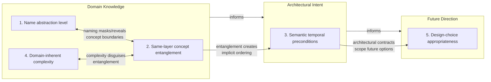
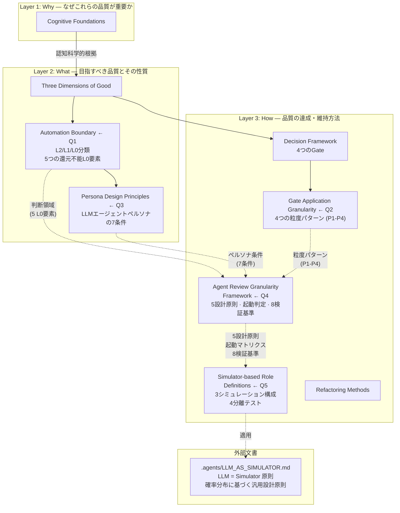

# Code Quality Definition: What "Good" Means

This document defines what "good code" means. It serves as a decision-making framework for refactoring work in any codebase. When evaluating whether a change improves code, consult this document.　This is a living document. Update it as understanding evolves.

## Why This Document Exists

Martin Fowler defines refactoring as "changing the internal structure of software to make it easier to understand and modify, without changing its external behavior." But what does "easier to understand" mean concretely? What makes code "easier to modify"? This document answers those questions, grounded in cognitive science research and software engineering principles, so that refactoring decisions are principled rather than aesthetic.

The key insight from Ward Cunningham's original technical debt metaphor: debt arises not from writing sloppy code, but from the gap between our current understanding and what the code reflects. As we learn more about the problem, the code should evolve to reflect that understanding. This document captures that understanding in a reusable form.

## How This Document Is Organized

Understanding "good code" requires perspectives from multiple disciplines. This document synthesizes them into three layers and two cross-cutting themes.

### Three Layers

The definition of "good" is built in three layers, each answering a different question:

| Layer             | Question                                        | Content in This Document                                                                              |
| ----------------- | ----------------------------------------------- | ----------------------------------------------------------------------------------------------------- |
| **Layer 1: Why**  | Why do certain code qualities matter?           | Cognitive Foundations — grounded in cognitive science research on how humans read and understand code |
| **Layer 2: What** | What qualities should code have?                | The Three Dimensions of Good — principles synthesized from 12+ software quality frameworks            |
| **Layer 3: How**  | How do we achieve and maintain those qualities? | Decision Framework + Refactoring Methods — actionable processes for evaluating and performing changes |

Layer 1 provides the evidence base. Layer 2 defines the target. Layer 3 provides the means. Each layer builds on the one below it: the cognitive science (Layer 1) justifies the quality principles (Layer 2), which inform the practical methods (Layer 3).

### Two Cross-cutting Themes

Two themes cut across all three layers:

**Theme 1: Perspective — whose view defines "good"?**

Code is read, written, changed, and maintained by different people (or AI) at different times. "Good" depends on whose perspective you take:

- **The writer** optimizes for speed of expression — but code is read far more often than written
- **The reader** optimizes for comprehension — this is the primary audience (see "Who Reads Code")
- **The changer** optimizes for safe modification — the code must support change without surprise
- **The maintainer** optimizes for long-term sustainability — today's convenience must not become tomorrow's burden

Rich Hickey's "Simple vs Easy" distinction is central here: "easy" serves the writer (familiar, convenient, nearby), while "simple" serves everyone else (untangled, one concept per unit, independently understandable). When writer-convenience and reader-comprehension conflict, favor the reader.

**Theme 2: Invariants — principles that hold across all methods**

Regardless of which refactoring method or quality framework you apply, certain principles remain constant:

- **Small steps**: Every change should be small enough to verify. Large changes are sequences of small changes.
- **Behavior preservation**: Refactoring must not change observable behavior. If behavior changes, it is not a refactoring — it is a rewrite.
- **Always deployable**: The codebase should be in a deployable state after every change. Never "break things now, fix later."
- **Two hats** (Fowler): Either you are adding functionality or you are improving structure. Never both simultaneously.
- **Patterns emerge, not imposed** (Kerievsky): Abstraction should emerge from observed repetition (Rule of Three), not from anticipated future needs.

## Who Reads Code

Code is written once but read many times. The "readers" of any codebase include:

1. **The future maintainer** (likely the original author, weeks or months later, with faded context)
2. **AI assistants** (Claude, Copilot, etc.) asked to modify or extend the code, constrained by context windows
3. **New contributors** encountering the codebase for the first time

All three share a common constraint: **limited working memory**. Humans hold 4 +/- 1 chunks in working memory (Cowan, 2001). AI assistants have finite context windows. New contributors have no prior schema for the codebase.

"Good code" is code that respects these constraints.

## Cognitive Foundations

The principles in this document are not aesthetic preferences. They are grounded in how humans process code.

### Working Memory Is the Bottleneck

Human working memory holds approximately 4 chunks without rehearsal (Cowan, 2001). Every parameter, state variable, and abstraction layer that must be held in mind simultaneously competes for these slots. When the limit is exceeded, comprehension degrades and errors increase.

Practical consequence: A function with 14 parameters cannot be understood as a whole. A component with 7 state variables plus 4 refs requires the reader to track 11 items simultaneously.

### Chunking Requires Convention

Experienced developers compress familiar patterns into single chunks. A "factory pattern" or "event listener registration" is one chunk, not dozens of lines. But this compression only works when code follows recognizable conventions (Soloway & Ehrlich, 1984).

Critical finding: When code violates programming discourse rules (conventions), the comprehension advantage of experienced developers over novices disappears. "Clever" unconventional code neutralizes expertise.

Practical consequence: Idiomatic code is not about aesthetics. It is about enabling cognitive compression. Follow the patterns established in the codebase and its ecosystem's conventions.

### Nested Structures Are Expensive

Research (Int'l Journal of STEM Education, 2023) shows that nested structures impose three simultaneous cognitive demands: fast encoding of inner levels, robust maintenance of outer levels, and selective updating across levels. This is why deeply nested code is disproportionately harder to understand than flat code of the same logical complexity.

Practical consequence: Prefer early returns, guard clauses, and extraction over nesting. Each level of nesting multiplies cognitive cost, not adds to it.

### Context Switching Destroys Focus

Recovery from a context switch takes an average of 23 minutes (Gloria Mark, UC Irvine). Attention residue from the previous context persists for 30-60 minutes (Sophie Leroy). Every file the reader must open, every abstraction they must look up, every distant definition they must find is a context switch.

Practical consequence: Code that can be understood without leaving the current file is strictly better than code that requires navigating to other files. Locality of information matters.

### Beacons Guide Comprehension

Experienced developers use "beacons" -- recognizable surface features that signal the code's purpose (Brooks, 1983; Wiedenbeck, 1986). A swap operation signals sorting. An `onDelta` callback signals event handling. Clear beacons accelerate understanding; absent or misleading beacons force slow, line-by-line reading.

Practical consequence: Function names, variable names, and structural patterns should immediately signal intent. The reader should be able to form a correct hypothesis about what code does before reading the implementation.

## The Three Dimensions of "Good"

"Good" is not a single axis. It has three independent dimensions. Improving one without considering the others can make the code worse overall.

### Dimension 1: Cognitive Fit -- Can the reader hold it in their head?

This dimension asks: can a single developer (or AI assistant) understand this unit of code without external aids, scrolling, or file navigation?

Principles:

- **Fits in working memory**: The number of concepts that must be simultaneously tracked is within human limits (roughly 4-7 items). This applies to: parameters of a function, state variables of a hook, responsibilities of a component, nesting depth.

- **Locally comprehensible**: Understanding a piece of code does not require reading other files. The information needed to understand what the code does is either present or obvious from naming.

- **Conventional**: The code follows patterns recognizable to someone experienced in the project's language and framework. A reader experienced in the ecosystem should be able to predict the structure of common abstractions. The code enables chunking.

- **Beacon-rich**: Names, patterns, and structure immediately signal intent. The reader can form a correct hypothesis before reading the implementation details.

Sources: Miller (1956), Cowan (2001), Soloway & Ehrlich (1984), Brooks (1983), Wiedenbeck (1986), "Code That Fits in Your Head" (Mark Seemann)

### Dimension 2: Structural Integrity -- Does the structure support change?

This dimension asks: when the requirements change (and they will, per Lehman's First Law), does the code structure make the change local or does it ripple across the system?

Principles:

- **Single responsibility**: Each unit (module, class, function) has one reason to change. If the display logic changes, only the display module changes. If the data format changes, only the data handling changes.

- **Low coupling**: Units depend on minimal, well-defined interfaces. Changing one unit does not force changes in unrelated units. Data drilling across multiple layers is a coupling smell.

- **High cohesion**: Everything within a unit is related to the same concept. A module that manages both presentation and data fetching has low cohesion.

- **Low viscosity**: Making the "right" change is easier than making the "wrong" change (Green & Petre's Cognitive Dimensions). The code structure should make it natural to add new features in the right place rather than bolting them onto existing components.

- **Simple, not Easy**: Following Rich Hickey's distinction -- prefer code where concepts are not entangled (simple) over code where everything is conveniently in one place (easy). Easy produces fast initial velocity but decelerating long-term progress. Simple produces slower initial velocity but sustained long-term progress.

Sources: SOLID (Martin), Simple Made Easy (Hickey), Cognitive Dimensions (Green & Petre), Lehman's Laws, CUPID (North)

### Dimension 3: Evolutionary Fitness -- Can the code sustain development over time?

This dimension asks: does the codebase support sustained development velocity, or does each change become harder than the last?

Principles:

- **Testable**: Every unit can be tested in isolation without elaborate setup. If testing requires mocking the entire application, the unit is too coupled. Tests serve as the safety net that makes refactoring possible (Feathers, 2004).

- **Habitable**: The codebase is a place where developers can work comfortably (Gabriel). This means: predictable file locations, consistent patterns, no traps or surprises. A new contributor should be able to find where to make a change within minutes.

- **Entropy-resistant**: The structure actively resists degradation. New features have an obvious, correct place to go. The "Pit of Success" principle: doing the right thing should be the easiest path. When adding a new variant to an existing feature, the developer should not have to touch 5 files.

- **Incrementally improvable**: The Boy Scout Rule can be applied without risk. Small improvements can be made safely during normal development, preventing the accumulation of entropy.

Sources: Working Effectively with Legacy Code (Feathers), Patterns of Software (Gabriel), Pit of Success (Mariani), Lehman's Laws, Software Entropy

## Automation Boundary

The three dimensions define what "good" means. But not all quality attributes can be assessed the same way. Some can be measured by automated tools; others require human or AI judgment. This section maps the boundary between the two, so that tooling and review effort are directed where they have the most impact.

### Three Levels of Detectability

Every quality attribute falls into one of three levels based on how reliably automated metrics can assess it:

| Level                       | Definition                                                                                                                                                                                                    | Role of Human/AI Judgment                                                    |
| --------------------------- | ------------------------------------------------------------------------------------------------------------------------------------------------------------------------------------------------------------- | ---------------------------------------------------------------------------- |
| **L2: Direct detection**    | Quantitative metrics measure the attribute directly. Thresholds produce actionable results with low false-positive rates.                                                                                     | Exception handling only (e.g., confirming that high complexity is essential) |
| **L1: Proxy detection**     | Indirect metrics suggest the attribute's presence or absence. Signal-to-noise ratio varies; results narrow down candidates but cannot confirm.                                                                | Final judgment on candidates surfaced by metrics                             |
| **L0: Detection-resistant** | The attribute cannot be meaningfully detected from code's surface structure. The information required for judgment exists outside the code — in domain specifications, architectural intent, or future plans. | Primary judge. No metric input to rely on.                                   |

### Level Map by Dimension

#### Dimension 1: Cognitive Fit

| Attribute                        | Level | Metric / Proxy                                                         | Example                                                                                                                                     |
| -------------------------------- | ----- | ---------------------------------------------------------------------- | ------------------------------------------------------------------------------------------------------------------------------------------- |
| Working memory load              | L2    | Cognitive complexity (SonarSource), parameter count, nesting depth     | A function with 14 parameters exceeds working memory limits — metric flags it directly                                                      |
| Beacon accuracy                  | L1    | Name-prefix vs. implementation mismatch (type + control flow analysis) | `getUser()` mutates database state — `get` prefix implies no side effects; static analysis detects the mismatch                             |
| Beacon domain alignment          | L1\*  | Domain glossary lookup (\* requires glossary to exist)                 | Insurance domain uses `calculateAmount` instead of `calculatePremium` — glossary lookup catches the term mismatch                           |
| Beacon pattern signaling         | L1    | Known-pattern template vs. naming mismatch                             | Code follows Observer structure but uses `notify()` instead of conventional `onXxx()` naming — template matching detects the gap            |
| Beacon abstraction level         | L0    | —                                                                      | `processData` is too abstract, but determining the _right_ level requires understanding the function's responsibility in its domain context |
| Conventionality (linter-covered) | L2    | Linter rules (eslint-plugin-react-hooks, etc.)                         | Using `useState` outside a component body — linter catches this directly                                                                    |
| Conventionality (beyond linter)  | L0    | —                                                                      | "Custom hooks should encapsulate side-effect logic" is an ecosystem convention but no linter rule enforces it                               |

#### Dimension 2: Structural Integrity

| Attribute                          | Level | Metric / Proxy                                        | Example                                                                                                                                                                                                      |
| ---------------------------------- | ----- | ----------------------------------------------------- | ------------------------------------------------------------------------------------------------------------------------------------------------------------------------------------------------------------ |
| Coupling                           | L1    | Afferent/efferent coupling (Ca/Ce), instability index | Module has Ce=12 — metric flags high outgoing dependencies, but whether each dependency is necessary requires design understanding                                                                           |
| Cohesion                           | L1    | LCOM (Lack of Cohesion of Methods)                    | High LCOM score in a utility module — metric flags it, but utility modules are intentionally low-cohesion by design                                                                                          |
| Dependency cycles                  | L2    | Cycle detection in dependency graph                   | Module A → B → C → A — tooling detects the cycle directly                                                                                                                                                    |
| Cross-layer entanglement           | L1    | Import heterogeneity analysis                         | A React component imports both `react` and `prisma` — cross-layer imports suggest layer mixing                                                                                                               |
| Same-layer concept entanglement    | L0    | —                                                     | Authentication logic and profile display logic coexist in one component. Both use the `User` type, so imports appear homogeneous. Only domain boundary understanding reveals the entanglement                |
| Temporal entanglement (structural) | L1    | Static analysis of null-checks, initialization order  | Accessing `config.value` before `initialize()` — null-safety analysis detects the structural precondition                                                                                                    |
| Temporal entanglement (semantic)   | L0    | —                                                     | `configure()` must be called before `start()`, but both functions accept the same types and neither crashes without the other — the ordering requirement is a semantic contract invisible to static analysis |
| Shared mutable state entanglement  | L1    | State access pattern analysis (write/read tracking)   | Module-level variable written in `handleLogin()` and read in `renderProfile()` — mutation tracking identifies the implicit coupling                                                                          |

#### Dimension 3: Evolutionary Fitness

| Attribute                          | Level | Metric / Proxy                                                               | Example                                                                                                                                                                                                      |
| ---------------------------------- | ----- | ---------------------------------------------------------------------------- | ------------------------------------------------------------------------------------------------------------------------------------------------------------------------------------------------------------ |
| Test coverage                      | L2    | Line/branch/function coverage                                                | 30% branch coverage on payment module — metric reports the gap directly                                                                                                                                      |
| Test quality                       | L0    | —                                                                            | 100% line coverage but all assertions are `expect(result).toBeDefined()` — coverage metric cannot distinguish meaningful assertions from trivial ones                                                        |
| Habitability                       | L1    | File placement consistency, naming pattern regularity                        | Test files exist in both `__tests__/`, `src/test/`, and root — inconsistency metric flags the scattered pattern                                                                                              |
| Entropy resistance                 | L1    | Change file count trend per feature (git history), shotgun surgery frequency | Adding a new API endpoint required changing 12 files last month vs. 4 files six months ago — trend analysis detects the degradation                                                                          |
| Technical-constraint complexity    | L1    | Comment marker detection (`workaround`, `hack`, `FIXME`, `polyfill`)         | `// workaround for Safari bug #12345` — marker search identifies known technical debt                                                                                                                        |
| Historical-accumulation complexity | L1    | Churn × complexity (hotspot analysis), git blame author distribution         | A 400-line function with 15 authors over 2 years — hotspot analysis flags accumulated complexity                                                                                                             |
| Domain-inherent complexity         | L0    | —                                                                            | Tax calculation with 47 conditional branches. The specification itself requires this branching — no metric can determine whether the complexity is reducible                                                 |
| Design-choice detection            | L1    | Reference count analysis                                                     | A generic `Repository<T>` class instantiated with only `Repository<User>` — single-instantiation detection flags the potentially premature abstraction                                                       |
| Design-choice judgment             | L0    | —                                                                            | The single-instantiation `Repository<T>` exists because the team plans to add `Repository<Order>` next quarter — whether the abstraction is premature depends on future direction that no metric can predict |

### The Irreducible L0: Five Elements Requiring Human/AI Judgment

After decomposing all L0 attributes, five elements remain that cannot be further reduced to proxy-detectable components. These are the judgment areas where automated metrics provide no useful input.

| #   | Element                                  | Required Knowledge                                     | Why Detection Fails                                                                                                                                                                                                                                                                                                        |
| --- | ---------------------------------------- | ------------------------------------------------------ | -------------------------------------------------------------------------------------------------------------------------------------------------------------------------------------------------------------------------------------------------------------------------------------------------------------------------- |
| 1   | **Name abstraction level** (1b)          | Domain: what is this code's responsibility?            | `processData` is too abstract, but the _right_ name depends on what the function means in its domain. A payments module should use `settleTransaction`, not `processData` — but this requires knowing the domain vocabulary and the function's role within it.                                                             |
| 2   | **Same-layer concept entanglement** (2b) | Domain: where are the concept boundaries?              | Authentication and profile management both operate on `User` entities. Whether they belong in one module or two depends on whether "user identity" and "user profile" are independent domain concepts — a question only domain knowledge can answer.                                                                       |
| 3   | **Semantic temporal preconditions** (2c) | Architecture: what contracts exist between operations? | `configure()` must precede `start()`, but both accept valid inputs independently. The ordering requirement is a semantic contract — e.g., `start()` reads configuration state that `configure()` sets, but the state itself is always initialized to a valid default. No type error or null-access reveals the constraint. |
| 4   | **Domain-inherent complexity** (3a)      | Domain: is the specification itself this complex?      | A premium calculation with 47 branches may simply reflect 47 regulatory rules. Or it may conflate premium calculation with risk assessment. Only comparing the code against the domain specification can determine which.                                                                                                  |
| 5   | **Design-choice appropriateness** (3d)   | Future: what changes are planned?                      | A `PaymentStrategyFactory` with one strategy is either premature abstraction or forward-looking design. The distinction depends entirely on whether new payment methods are planned — information that exists in roadmaps, not in code.                                                                                    |

### Relationships Among the Irreducible L0 Elements

The five elements are not independent. They cluster into three groups by the type of external knowledge required, and these groups form a dependency chain.



**Domain Knowledge** is foundational. Without understanding the problem domain, neither architectural intent nor future direction can be evaluated:

- Elements 1 and 2 are tightly coupled: naming choices (1) can mask or reveal concept boundaries (2). Naming a module `UserService` hides the entanglement of authentication and profile logic. Renaming to `AuthService` and `ProfileService` makes the boundary question explicit. Similarly, element 4 interacts with element 2: domain complexity can disguise concept entanglement. A 200-line function mixing premium calculation with risk assessment may appear as "the domain is just complex" when in fact two separable domain concepts are entangled.

**Architectural Intent** builds on domain knowledge. The semantic preconditions in element 3 often arise as consequences of concept entanglement (element 2): when authentication and profile management share a module, implicit ordering dependencies between them become invisible because the state they share is module-internal.

**Future Direction** builds on architectural intent. Whether a design choice is premature (element 5) can only be judged against planned changes, which themselves reflect architectural decisions grounded in domain understanding.

**Implication for Q4 (persona design)**: The dependency chain means that a persona responsible for domain knowledge judgment must exist and must inform other judgment areas. A persona judging design-choice appropriateness (element 5) without access to domain knowledge (elements 1, 2, 4) cannot function effectively.

## Persona Design Principles

The Automation Boundary section established that L0 judgments require human or AI personas as primary judges. This section defines the conditions under which such personas function effectively, distinguishing between human cognitive mechanisms and their LLM agent counterparts.

### Why Personas Work: Three Cognitive Mechanisms

Research identifies three mechanisms that explain why prompts like "Would a senior engineer say this is overcomplicated?" improve judgment quality:

#### Mechanism 1: Self-distancing

Kross et al. (2014) found that third-person thinking improves judgment by creating psychological distance from ego-protective reasoning.

- **First person** ("Am I overcomplicating this?") triggers self-defense. A developer who spent two days designing an abstraction layer is biased toward justifying that investment.
- **Third person** ("Would a senior engineer say this is overcomplicated?") creates distance from that emotional investment, enabling more objective evaluation.

Trope & Liberman's Construal Level Theory (2010) adds a second effect: greater psychological distance promotes higher-level, more abstract thinking. A developer evaluating their own code tends to focus on implementation details ("Is this variable name good?"). Adopting a senior engineer persona shifts attention to structural concerns ("Is this responsibility division appropriate?"). This is directly relevant to L0 judgments, which are structural by nature.

#### Mechanism 2: Single-focus effect

Gawande's _Checklist Manifesto_ (2009) demonstrated an inverse U-shaped relationship between checklist length and compliance rate. Beyond approximately 7 items, compliance drops sharply — consistent with working memory limits (Cowan, 2001).

A single question ("Is this overcomplicated?") achieves near-100% compliance. The judgment criteria are implicitly encoded in the persona rather than explicitly enumerated. A 20-item code review checklist distributes attention across all items, reducing detection rate for each individual item.

However, this has a cost: a single question maximizes **detection rate** but reduces **diagnostic precision**. "Overcomplicated" could mean a Cognitive Fit problem (too many things to hold in mind), a Structural Integrity problem (changing this ripples across the system), or an Evolutionary Fitness problem (this pattern doesn't scale). The single-focus prompt cannot distinguish which.

#### Mechanism 3: Perspective integration

Theme 1 of this document defines four perspectives: writer, reader, changer, maintainer. A "senior engineer" persona integrates all four into one. The effectiveness of this integration depends on the task:

| Task                                    | Integration effect                                                     | Example                                                                                                                                                                         |
| --------------------------------------- | ---------------------------------------------------------------------- | ------------------------------------------------------------------------------------------------------------------------------------------------------------------------------- |
| **Screening** (detect problems)         | Effective — one question catches most issues                           | "Is this overcomplicated?" detects that a 200-line React component with 14 props and 7 state variables has problems                                                             |
| **Diagnosis** (classify and root-cause) | Information is lost — cannot distinguish which perspective is violated | The same component: is it a reader problem (too many things to track), a changer problem (modifications ripple), or a maintainer problem (no obvious place for new features)?   |
| **Prescription** (decide what to do)    | Insufficient — different perspectives suggest different actions        | Reader perspective suggests extracting a parameter object; changer perspective suggests splitting responsibilities; maintainer perspective suggests rethinking the architecture |

### From Human Cognition to LLM Agents

The three mechanisms above are grounded in human cognitive science. LLM agents have fundamentally different cognitive architectures. Each mechanism must be re-examined for LLM applicability — and recent empirical research reveals that the mapping is not straightforward.

#### Self-distancing → Explicit criteria (not persona names)

LLMs have no ego, so self-defense bias does not exist. The natural hypothesis is that persona prompts shift the output distribution toward patterns associated with the persona in training data. However, **empirical research challenges this assumption**:

- Zheng et al. (2024) tested 162 personas across 4 LLM families on 2,410 factual questions. **Persona prompts did not consistently improve performance** over no-persona baselines. The persona's gender, type, and domain had some effect, but identifying the "optimal persona" was no better than random selection.
- Basil, Mollick et al. (2025) evaluated 6 models on graduate-level science and engineering questions. **Domain-expert personas (e.g., "you are a physics expert") had no significant effect** on performance. Even mismatched expert personas produced only marginal differences.
- Kim et al. (2024) showed that role-play prompts are a "double-edged sword" — an ensemble of role-play and neutral prompts (Jekyll & Hyde framework) improved accuracy by 9.98% on GPT-4 across 12 reasoning datasets, but **individual personas did not reliably outperform neutral prompts**.

**Important caveat**: These studies focused on factual accuracy and reasoning tasks. Code quality judgment is an evaluative task where the "correct answer" depends on context and criteria. No empirical study has specifically tested persona effects on code review quality. The evidence therefore does not prove personas are useless for code quality — but it does prove that **persona names alone are insufficient**.

**Key difference from initial analysis**: The original framing ("pattern activation") overstated the effect. The evidence supports a weaker claim: personas may prime the model toward certain evaluation styles, but the primary driver of judgment quality is **explicit criteria specification**, not the persona label.

**Design implication**: Do not rely on persona names. Explicitly describe the judgment criteria. Instead of "evaluate as a senior engineer," specify "evaluate whether each module has a single reason to change, whether dependencies flow in one direction, and whether the naming reflects domain vocabulary." The persona name may serve as a weak primer, but the criteria do the actual work.

#### Single-focus → Instruction adherence limit (with empirical bounds)

LLMs lack the 4±1 working memory constraint, but exhibit instruction-following degradation that is now well-characterized empirically:

- **IFScale (Jaroslawicz et al., 2025)** scaled from 10 to 500 instructions and identified three degradation patterns:
  - **Threshold decay**: Reasoning models (o3, Gemini 2.5 Pro) maintain near-perfect performance up to ~150 instructions, then drop sharply
  - **Linear decay**: GPT-4.1, Claude Sonnet 4 — steady decline proportional to instruction count
  - **Exponential decay**: GPT-4o, Llama 4 Scout — rapid early decline
  - Even the best-performing models achieved only **68% accuracy at 500 instructions**
  - **Primacy bias is universal**: instructions presented earlier in the prompt are followed more reliably than later ones. Under high cognitive load, error types shift from "incorrect modifications" to "omissions" — the model simply skips instructions

- **InFoBench (Qin et al., ACL 2024)** decomposed complex instructions into atomic requirements. GPT-4 achieved only **~80% compliance on simple, unambiguous instructions**; smaller models fell below 50%.

- **The Instruction Gap (2025)** showed that in enterprise RAG scenarios, long knowledge snippets compete with instructions for attention, causing compliance with brand voice requirements, response format rules, and content boundaries to degrade significantly.

Additionally, **positional effects** compound the problem:

- **Lost in the Middle (Liu et al., TACL 2024)** demonstrated a U-shaped performance curve: information at the beginning and end of context is utilized effectively, while **middle-positioned information is significantly underutilized**. This holds even for models explicitly trained for long contexts.
- **Found in the Middle (Hsieh et al., 2024)** traced this to inherent attention bias in transformer architectures. Calibration techniques improved RAG performance by up to 15 points.

**Key difference from initial analysis**: The initial framing correctly identified the phenomenon but lacked quantitative bounds. We now know: Claude-family models exhibit linear decay; primacy bias is universal; and positional effects mean that instruction placement matters, not just instruction count.

**Design implications**:

1. Limit evaluation criteria per agent — fewer criteria means higher adherence per criterion
2. Place the most critical criteria at the **beginning** of the prompt (primacy bias)
3. When injecting domain knowledge, place it at the **beginning or end** of context, not the middle (U-shaped utilization)
4. The exact per-model threshold should be determined experimentally, but the principle is empirically validated

#### Perspective integration → Phase separation (with multi-agent evidence)

For humans, switching between perspectives incurs a context-switch cost (~23 minutes recovery per Gloria Mark). Integrating perspectives into one persona avoids this cost. For LLMs, context switching is nearly free — and multi-agent research provides evidence for the benefits of decomposition:

- **MetaGPT (Hong et al., ICLR 2024)** encoded standard operating procedures into prompt sequences with specialized roles (Product Manager, Architect, Engineer). Achieved **100% task completion rate** with an executability score of 3.9/4.0, compared to ChatDev's 2.1/4.0. A critical design choice: agents communicate via **structured documents and diagrams** rather than free-form dialogue, preventing irrelevant information and omissions.
- **ChatDev (Qian et al., ACL 2024)** used chat-based coordination among specialized agents (analyst, coder, tester). Quality scores improved from 0.1523 to 0.3953 compared to baselines. Self-collaboration showed 30-47% improvement in pass@1 over single-agent approaches.

**Key difference**: The primary advantage of integration (avoiding context-switch cost) does not apply to LLMs. The multi-agent evidence shows that role decomposition with structured communication **measurably improves quality**.

**Design implication**: LLM agents should prefer decomposed personas over integrated ones. Run screening, diagnosis, and prescription as separate phases — or assign them to separate agents in a team. MetaGPT's finding that structured artifacts outperform free-form dialogue is particularly relevant for Agent Teams design.

#### Additional constraint: External feedback requirement

Research on LLM self-evaluation reveals a fundamental limitation not present in the human cognition analysis:

- **Huang et al. (ICLR 2024)** demonstrated that **LLMs cannot self-correct reasoning without external feedback**. "Intrinsic self-correction" — where a model evaluates and improves its own output — actually **degrades performance** on reasoning tasks. The core issue: LLMs cannot reliably assess the correctness of their own answers.
- **Zheng et al. (NeurIPS 2023)** showed that GPT-4 as a judge achieves **80%+ agreement with human preferences** — comparable to human-human agreement. However, this involves judging **other models' outputs**, not self-evaluation. Position bias, verbosity bias, and self-enhancement bias were identified as limitations.

**Design implication**: A single agent should not both generate and evaluate code quality judgments. The screening agent's findings should be validated by a separate diagnosis agent, not self-reviewed. This reinforces the phase separation condition and adds a new constraint: **cross-agent validation** — each judgment phase should be performed by a different agent than the one that produced the artifact being judged.

### Seven Conditions for Effective LLM Agent Personas

Synthesizing the cognitive mechanisms and empirical evidence above, an LLM agent persona functions effectively when all seven conditions are met:

| #   | Condition                                | Definition                                                                                                                                                                      | Empirical basis                                                                                                                                                                              | What happens when violated                                                                                                             | Example                                                                                                                                                                                                    |
| --- | ---------------------------------------- | ------------------------------------------------------------------------------------------------------------------------------------------------------------------------------- | -------------------------------------------------------------------------------------------------------------------------------------------------------------------------------------------- | -------------------------------------------------------------------------------------------------------------------------------------- | ---------------------------------------------------------------------------------------------------------------------------------------------------------------------------------------------------------- |
| 1   | **Explicit criteria over persona names** | Judgment criteria are defined explicitly in the prompt. Persona names serve at most as weak primers — the criteria, not the persona label, drive judgment quality               | Zheng et al. (2024): 162 personas showed no consistent improvement. Basil et al. (2025): expert personas had no significant effect on factual tasks                                          | The LLM applies generic evaluation, missing project-specific quality issues. Persona name creates false confidence in judgment quality | "Evaluate as a senior engineer" (ineffective per research) vs. "Evaluate whether each module has a single reason to change and naming reflects domain vocabulary" (effective — explicit criteria)          |
| 2   | **Instruction adherence limit**          | The number of simultaneous evaluation criteria per agent is kept below the model's adherence degradation threshold. Critical criteria are placed at the beginning of the prompt | IFScale (2025): linear decay for Claude models; universal primacy bias; 68% accuracy ceiling at 500 instructions                                                                             | Important criteria are silently omitted (not incorrectly applied — literally skipped) as instruction count increases                   | An agent with 15 evaluation criteria omits the check for side-effect-free `get*` functions because it was the 12th instruction — primacy bias deprioritized it                                             |
| 3   | **Phase separation**                     | Screening (detect), diagnosis (classify), and prescription (recommend action) are executed as separate phases or by separate agents                                             | ChatDev (ACL 2024): 30-47% quality improvement with role decomposition. MetaGPT (ICLR 2024): structured communication outperforms dialogue                                                   | Problems are detected but misclassified, leading to incorrect remediation                                                              | A single agent detects "this component is too complex" and recommends splitting responsibilities (structural fix), when the actual issue is too many parameters (cognitive fix — extract parameter object) |
| 4   | **Cross-agent validation**               | Each judgment phase is performed by a different agent than the one that produced the artifact being judged. No agent self-evaluates its own output                              | Huang et al. (ICLR 2024): intrinsic self-correction degrades reasoning performance. Zheng et al. (NeurIPS 2023): cross-model evaluation achieves 80%+ human agreement                        | A single agent generates and self-validates code quality judgments, producing plausible but unchecked conclusions                      | A screening agent flags 5 issues, then self-validates "yes, these are all real problems" — missing that 2 were false positives a separate diagnosis agent would have caught                                |
| 5   | **Scope directive**                      | The evaluation scope (function / module / system) is specified directly as a parameter, not indirectly through persona abstraction level                                        | (Derived from construal level theory adaptation — no direct LLM study, but consistent with instruction adherence research showing explicit directives outperform implicit ones)              | The agent evaluates at the wrong abstraction level                                                                                     | An agent tasked with evaluating architectural coupling instead reports on variable naming quality within individual functions                                                                              |
| 6   | **Knowledge injection design**           | For each L0 element, the required external knowledge is identified and injected at the **beginning or end** of context (not the middle), at appropriate granularity             | Liu et al. (TACL 2024): U-shaped utilization curve — middle-positioned information significantly underutilized. Hsieh et al. (2024): attention calibration improves performance by 15 points | The agent has the necessary knowledge in context but fails to utilize it because of positional attention bias                          | Domain specification injected in the middle of a long system prompt is effectively ignored; the agent judges `calculatePremium` without referencing the regulation rules that were provided                |
| 7   | **Structured communication**             | Agents communicate via structured artifacts (documents, typed reports, checklists) rather than free-form dialogue                                                               | MetaGPT (ICLR 2024): structured documents achieved 3.9/4.0 executability vs. ChatDev's dialogue-based 2.1/4.0                                                                                | Free-form dialogue between agents introduces irrelevant information and omissions, degrading coordination quality                      | A screening agent sends a diagnosis agent a prose paragraph describing issues; the diagnosis agent misses one issue. A structured report with typed fields (location, dimension, severity) prevents this   |

### Connection to Irreducible L0 Elements

The seven conditions have specific implications for each L0 element:

| L0 Element                         | Required conditions                                             | Knowledge to inject (placement: beginning or end of context)                                             |
| ---------------------------------- | --------------------------------------------------------------- | -------------------------------------------------------------------------------------------------------- |
| 1. Name abstraction level          | Explicit criteria + Knowledge injection                         | Domain glossary, module responsibility definitions                                                       |
| 2. Same-layer concept entanglement | Phase separation + Cross-agent validation + Knowledge injection | Domain model with concept boundaries (e.g., "user identity" vs. "user profile" are independent concepts) |
| 3. Semantic temporal preconditions | Scope directive + Knowledge injection                           | Architecture decision records, API contracts, operation ordering specifications                          |
| 4. Domain-inherent complexity      | Knowledge injection (critical) + Cross-agent validation         | Domain specification — the agent must compare code branching against specification requirements          |
| 5. Design-choice appropriateness   | Knowledge injection + Phase separation                          | Product roadmap, planned feature additions, architectural evolution strategy                             |

### Empirical References for This Section

- Zheng, M. et al. (2024). "When 'A Helpful Assistant' Is Not Really Helpful: Personas in System Prompts Do Not Improve Performances of Large Language Models." arXiv:2311.10054v3.
- Basil, S., Mollick, E.R. et al. (2025). "Playing Pretend: Expert Personas Don't Improve Factual Accuracy." SSRN:5879722.
- Kim et al. (2024). "Persona is a Double-Edged Sword." OpenReview.
- Jaroslawicz, D. et al. (2025). "How Many Instructions Can LLMs Follow at Once?" (IFScale). arXiv:2507.11538.
- Qin et al. (2024). "InFoBench: Evaluating Instruction Following Ability in Large Language Models." ACL Findings.
- Liu, N. et al. (2024). "Lost in the Middle: How Language Models Use Long Contexts." TACL.
- Hsieh et al. (2024). "Found in the Middle: Calibrating Positional Attention Bias Improves Long Context Utilization." arXiv:2406.16008.
- Hong et al. (2024). "MetaGPT: Meta Programming for a Multi-Agent Collaborative Framework." ICLR.
- Qian et al. (2024). "ChatDev: Communicative Agents for Software Development." ACL.
- Huang, J. et al. (2024). "Large Language Models Cannot Self-Correct Reasoning Yet." ICLR.
- Zheng, L. et al. (2023). "Judging LLM-as-a-Judge with MT-Bench and Chatbot Arena." NeurIPS.

## Decision Framework

When evaluating whether a refactoring improves the code, apply these questions in order:

### Gate 1: Does it preserve behavior?

If the refactoring changes observable behavior, it is not a refactoring. Stop. Write tests first to characterize the current behavior (Feathers' characterization tests), then refactor.

### Gate 2: Does it reduce cognitive load?

After the change, can a developer understand the modified code with less mental effort? Specifically:

- Are there fewer things to hold in mind simultaneously?
- Is the nesting shallower?
- Are the names more intention-revealing?
- Can the code be understood without navigating to other files?

If the refactoring moves complexity from one place to another without reducing it (e.g., extracting a function that is only called once and requires understanding the extraction site plus the extracted function), it may not be an improvement.

### Gate 3: Does it improve structural integrity?

After the change:

- Does each unit have fewer reasons to change?
- Are the dependencies between units simpler?
- Is it easier to make the next change in the right place?

### Gate 4: Does it support sustained development?

After the change:

- Is the code easier to test?
- Is there an obvious place for new features?
- Can a new contributor find their way?

### When NOT to refactor

- **YAGNI**: Do not refactor toward a hypothetical future requirement. Refactor to make the current code better, not to prepare for changes that may never come.
- **Diminishing returns**: Do not refactor code that is rarely changed. Prioritize code with high change frequency (hot paths).
- **Refactoring to patterns prematurely**: Patterns should emerge from the code's needs (Kerievsky), not be imposed. If the duplication count is below 3, extraction may be premature.

## Gate Application Granularity

The Decision Framework defines _what_ to judge at each gate. This section defines _at what scope_ to judge — the granularity at which each gate should be applied. Granularity is not fixed; it varies by gate and by the type of change being evaluated.

### Gate 1: Behavior Preservation — Granularity

#### Five types of behavior to preserve

"Preserve behavior" is not a single check. Different types of behavior require different verification scopes:

| Behavior type                                                        | Scope                      | Verification method                       | Example                                                     |
| -------------------------------------------------------------------- | -------------------------- | ----------------------------------------- | ----------------------------------------------------------- |
| **Value preservation** — pure function I/O                           | Function                   | Unit tests                                | `calculateTax(income)` returns the same value               |
| **Side-effect preservation** — state changes, I/O                    | Function + state readers   | Unit tests + mock verification            | `saveUser()` writes the same data to the database           |
| **Contract preservation** — type signatures, APIs                    | Interface level            | Type checking + contract tests            | `UserService.getById()` argument and return types unchanged |
| **Non-functional preservation** — performance, memory                | Module + execution path    | Benchmarks, profiling                     | Extract Function adds function call overhead on a hot path  |
| **Order preservation** — event firing order, initialization sequence | Module + event subscribers | Integration tests + sequence verification | `onMount` → `onFetch` → `onRender` order unchanged          |

#### Scope varies by refactoring operation

| Operation                            | Gate 1 scope                                  | Reason                                                                                                     |
| ------------------------------------ | --------------------------------------------- | ---------------------------------------------------------------------------------------------------------- |
| Rename Variable                      | Within function                               | Value preservation only. No external behavior change                                                       |
| Extract Function                     | Function + all callers                        | Both the extracted function and the original must maintain the same behavior. Callers have a new call site |
| Move Function                        | Old module + new module + all dependents      | Import path changes propagate to all dependents. Contract preservation required                            |
| Change Interface                     | Interface + all implementations + all callers | Contract change affects every implementation and usage site. Widest scope                                  |
| Replace Inheritance with Composition | Entire class hierarchy + all usage sites      | Delegation patterns change; implicit ordering (super call order) may shift                                 |

#### Gate 1 granularity structure

The granularity is a function of two variables:

```
Gate 1 scope = f(refactoring operation type, behavior type to preserve)

Minimum: within function (Rename Variable × value preservation)
Maximum: system-wide (Change Interface × contract preservation)
Practical default: changeset + test suite execution
```

Where tests exist, Gate 1 is L2 (automated). Where tests do not exist, the decision of _which behavior types to characterize_ is an L0 judgment — it requires understanding what the code's callers depend on.

### Gate 2: Cognitive Load Reduction — Granularity

#### Three components of cognitive load require different scopes

Applying cognitive load theory (Sweller, 1988) to code review:

| Load component                                   | Definition                                                                    | Evaluation scope                      | Example                                                                                                 |
| ------------------------------------------------ | ----------------------------------------------------------------------------- | ------------------------------------- | ------------------------------------------------------------------------------------------------------- |
| **Intrinsic load** — inherent domain difficulty  | Conceptual complexity of the domain. Exists regardless of code representation | Changed function itself               | Tax calculation with 47 conditional branches is inherently complex (L0: domain-inherent complexity)     |
| **Extraneous load** — unnecessary cognitive cost | Unnecessary burden imposed by code's representation and structure             | Changed function + naming + structure | `processData` forces the reader to infer meaning. A single-letter variable `d` provides no context      |
| **Germane load** — beneficial learning cost      | Burden that contributes to pattern recognition and schema building            | Module-level convention patterns      | A React custom hook following the `useXxx` pattern has learning cost but builds reusable mental schemas |

Refactoring should reduce **extraneous load** only. Intrinsic load is irreducible (domain complexity). Germane load should not be reduced (it aids pattern learning).

#### Directional 1-hop: which neighbors to include depends on the operation

| Direction                                     | Include when                                           | Reason                                                                                      | Example                                                                                                                                        |
| --------------------------------------------- | ------------------------------------------------------ | ------------------------------------------------------------------------------------------- | ---------------------------------------------------------------------------------------------------------------------------------------------- |
| **Callers**                                   | Extract Function, parameter change, return type change | Call sites gain a new abstraction or signature change, altering the caller's cognitive load | Extracting `validatePayment()` from `processOrder()` — readers of `processOrder()` must now understand the new abstraction                     |
| **Callees**                                   | Inline Function, function merging                      | The merge target absorbs callee context, increasing its cognitive load                      | Inlining `validatePayment()` into `processOrder()` — `processOrder()` now directly contains validation logic                                   |
| **Siblings** (same-level functions in module) | Rename, pattern change                                 | Naming or pattern inconsistency within a module affects readability of other functions      | `getUser`, `fetchProfile`, `loadSettings` — three verbs for the same operation. Renaming `getUser` to `fetchUser` improves sibling consistency |
| **Type-sharing peers**                        | Type definition change, Parameter Object introduction  | Functions sharing a type are affected when the type changes                                 | Adding a field to `UserDTO` means every function receiving `UserDTO` must account for the new field                                            |

#### Transfer vs. reduction: how to distinguish

When evaluating Extract Function and similar decomposition operations:

| Verdict         | Condition                                                                 | Detection method                                                                                                |
| --------------- | ------------------------------------------------------------------------- | --------------------------------------------------------------------------------------------------------------- |
| **Reduction**   | Total cognitive load across changed function + 1-hop neighbors decreases  | L2: sum of cognitive complexity before/after. But "abstraction comprehension cost" is invisible to metrics (L0) |
| **Transfer**    | One side decreases, the other increases by the same amount. Net unchanged | L2: sum unchanged but distribution shifted. L0: whether the extracted unit is independently comprehensible      |
| **Degradation** | Total increases (abstraction overhead > decomposition benefit)            | L2: sum increases. L0: naming quality of the extracted function determines whether the overhead is justified    |

Key insight: L2 metrics can measure cognitive complexity sum changes, but the **cost of adding a new abstraction** does not appear in metrics. This cost depends on L0 judgment (is the name's abstraction level appropriate? = Beacon quality).

#### Gate 2 granularity structure

```
Gate 2 scope = changed function + directional 1-hop

Direction selection:
  Extract  → callers required, callees optional
  Inline   → callees required, callers optional
  Rename   → callers + siblings required
  Type change → all type-sharing peers

Judgment:
  L2 (automated): complexity sum comparison before/after
  L0 (judgment):  abstraction cost, naming appropriateness, concept independence
```

### Gate 3: Structural Integrity — Granularity

#### Six types of dependency define the 1-hop boundary

"1-hop in the dependency graph" depends on which dependencies are included:

| Dependency type         | Detection method                         | Include in 1-hop?                 | Example                                                                                 |
| ----------------------- | ---------------------------------------- | --------------------------------- | --------------------------------------------------------------------------------------- |
| **Static import**       | Import statement analysis (L2)           | Always                            | `import { UserService } from './services'`                                              |
| **Runtime (DI)**        | DI container configuration analysis (L1) | When feasible                     | `container.resolve(UserService)` — not visible in imports                               |
| **Event-based**         | Event name grep (L1)                     | Should include (easy to miss)     | `eventBus.emit('user:created')` → subscribers are implicitly dependent                  |
| **Shared state**        | State access pattern analysis (L1)       | Include                           | All modules reading/writing the `user` slice of a global store                          |
| **Contract (type/API)** | Type definition reference tracking (L2)  | On interface changes              | All classes implementing `interface UserRepository`                                     |
| **Semantic**            | Not detectable (L0)                      | Include via L0 judgment as needed | `AuthService` and `ProfileService` implicitly depend on the same "user session" concept |

#### Coupling direction determines the evaluation perspective

| Coupling direction      | Evaluation question                                 | Scope                             | Improvement criterion                                        |
| ----------------------- | --------------------------------------------------- | --------------------------------- | ------------------------------------------------------------ |
| **Afferent (incoming)** | Does this change force dependents to change?        | Changed module + all dependents   | Fewer forced changes in dependents (reduced shotgun surgery) |
| **Efferent (outgoing)** | Does this change increase coupling to dependencies? | Changed module + all dependencies | Fewer dependencies, or migration to stable interfaces        |
| **Circular**            | Is the cycle resolved?                              | All modules in the cycle          | Cycle shortened or eliminated                                |

#### Each structural evaluation axis requires a different scope

| Evaluation axis         | Required scope                                 | Reason                                                                                                                                                                                                        |
| ----------------------- | ---------------------------------------------- | ------------------------------------------------------------------------------------------------------------------------------------------------------------------------------------------------------------- |
| Coupling (Ca/Ce) change | Module + all-direction 1-hop                   | Coupling is a between-module relationship. Seeing only one side is insufficient                                                                                                                               |
| Cohesion (LCOM) change  | Within module                                  | Cohesion is an intra-module relationship                                                                                                                                                                      |
| Dependency direction    | Module + 1-hop + stability metadata per module | Unstable modules should depend on stable ones (Stable Dependencies Principle). Judging direction requires Ca/Ce of neighbors                                                                                  |
| Circular dependency     | Entire cycle (variable length)                 | Cannot confirm resolution without seeing the full cycle. 3-module cycle → scope of 3; 10-module cycle → scope of 10                                                                                           |
| Single Responsibility   | Module + change history                        | "Reasons to change" are invisible in code alone. Git history reveals "this module was changed for N different reasons" (L1: temporal coupling analysis). What constitutes "one responsibility" is L0 judgment |

#### Gate 3 granularity structure

```
Gate 3 scope = varies by evaluation axis

Coupling:       module + all-direction 1-hop (static + runtime + shared state)
Cohesion:       within module
Direction:      module + 1-hop + stability metadata
Cycles:         entire cycle (variable length, auto-determined by cycle detection)
Responsibility: module + git history (L0: what is "one responsibility")

Dependency detection:
  L2 (automated): static imports, type references
  L1 (proxy):     DI config, event names, shared state access
  L0 (judgment):  semantic dependencies (implicit shared concepts)
```

### Gate 4: Sustained Development — Granularity

Gate 4 differs from Gates 1-3: it cannot be evaluated at a single granularity. It decomposes into three evaluation stages, each with its own scope and evaluation frequency.

#### Stage 1: Per-change evaluation (function/module level)

Applied on every changeset, at the same frequency as Gates 1-3.

| Sub-attribute             | Scope              | Evaluation question                                                                                  | Example                                                                                                                                     |
| ------------------------- | ------------------ | ---------------------------------------------------------------------------------------------------- | ------------------------------------------------------------------------------------------------------------------------------------------- |
| **Test writability**      | Function           | Are the test target's inputs and outputs clear? Can arrange-act-assert be written straightforwardly? | A pure function with no side effects is easy to test. A function depending on global state is difficult                                     |
| **Setup complexity**      | Module             | How many mocks/stubs are needed to execute a test?                                                   | Testing `UserService` requires mocking `DatabaseConnection`, `Logger`, `EventBus`, `CacheManager` — 4 mocks indicates high setup complexity |
| **Test maintenance cost** | Module + test code | How many test files break when the production code is refactored?                                    | Tests asserting on implementation details (`expect(mock).toHaveBeenCalledWith(...)`) break on every internal change                         |
| **"No surprises"**        | Module             | Does the code violate reader expectations?                                                           | `getUser()` mutates a cache as a side effect. The `get` prefix implies read-only behavior                                                   |

#### Stage 2: Periodic evaluation (module + similar module comparison)

Applied periodically (e.g., per sprint or milestone), comparing the changed module against similar existing modules.

| Sub-attribute                  | Scope                    | Evaluation question                               | Example                                                                                                                       |
| ------------------------------ | ------------------------ | ------------------------------------------------- | ----------------------------------------------------------------------------------------------------------------------------- |
| **Naming pattern consistency** | Module + similar modules | Do similar modules use consistent naming?         | API handlers: `getUsers`, `fetchProducts`, `loadOrders` — three different verbs for the same operation across similar modules |
| **Error handling consistency** | Module + similar modules | Are error handling patterns predictable?          | One module uses try-catch, another uses Result types, a third delegates exceptions upward — three patterns                    |
| **Pattern reusability**        | Module + similar modules | Can existing patterns be reused for new features? | Copying `UserController` patterns to create `ProductController` with minimal changes → high reusability                       |

#### Stage 3: Milestone evaluation (system level)

Applied at major milestones or when architectural decisions are being made.

| Sub-attribute                        | Scope                   | Evaluation question                                                       | Example                                                                                                                  |
| ------------------------------------ | ----------------------- | ------------------------------------------------------------------------- | ------------------------------------------------------------------------------------------------------------------------ |
| **File placement predictability**    | System                  | Can a first-time contributor predict where to find a given type of code?  | Components in `src/components/`, hooks in `src/hooks/`, tests co-located as `*.test.tsx` — consistent pattern            |
| **Pit of Success degree**            | System                  | Is the correct approach the easiest approach?                             | Lint rules guide new components to the correct directory vs. any directory works but only one is architecturally correct |
| **Change file count trend**          | System (git history)    | Is the number of files touched per feature addition increasing over time? | New API endpoint: 4 files six months ago, 12 files now → entropy increasing                                              |
| **Degradation signal detectability** | Changeset + git history | Can structural degradation be detected early?                             | A churn × complexity dashboard surfaces hotspots before they become critical                                             |

#### Gate 4 granularity structure

```
Gate 4 scope = three stages with different frequencies

Stage 1 (per change):   function/module level
  Test writability, setup complexity, maintenance cost, "no surprises"

Stage 2 (per sprint):   module + similar module comparison
  Naming consistency, error handling consistency, pattern reusability

Stage 3 (per milestone): system level
  File placement, Pit of Success, change file count trend, degradation signals
```

### Granularity Patterns: Summary for Q4

Four patterns emerge from the gate-by-gate analysis:

| Pattern                                    | Definition                                                                                                                                                        | Used by                                                                           |
| ------------------------------------------ | ----------------------------------------------------------------------------------------------------------------------------------------------------------------- | --------------------------------------------------------------------------------- |
| **P1: Change point only**                  | Only the changed function/variable                                                                                                                                | Gate 1 (Rename), Gate 2 (intrinsic load), Gate 4 Stage 1 (test writability)       |
| **P2: Change point + directional 1-hop**   | Changed point + direct neighbors determined by operation type (callers for Extract, callees for Inline, siblings for Rename, type-sharing peers for type changes) | Gate 1 (Extract/Move), Gate 2 (extraneous load), Gate 3 (coupling/cohesion)       |
| **P3: Module + similar module comparison** | Target module compared against similar existing modules for pattern consistency                                                                                   | Gate 4 Stage 2 (naming/error handling/pattern consistency)                        |
| **P4: System-wide**                        | Entire codebase structure and trends                                                                                                                              | Gate 3 (circular dependencies), Gate 4 Stage 3 (habitability, entropy resistance) |

### Granularity Selection Principles

**Principle 1: Granularity follows the gate's judgment nature.** Binary judgments (Gate 1) need changeset scope. Degree judgments (Gate 2) need the minimum scope to detect load transfer. Relationship judgments (Gate 3) need inter-module scope. Trend judgments (Gate 4) need temporal scope.

**Principle 2: 1-hop direction is determined by the refactoring operation type.** Extract → callers. Inline → callees. Rename → siblings. Not all directions need inclusion for every operation.

**Principle 3: Gate 4 operates at three frequencies, not one.** Stage 1 per change, Stage 2 per sprint, Stage 3 per milestone. This is unlike Gates 1-3 which are all applied per change.

**Principle 4: L0 judgment scope matches L2 metric scope.** When L2 metrics flag a function, L0 judgment evaluates that function + 1-hop. Mismatched granularity (metrics point to a function, judgment evaluates the system) should be avoided.

**Principle 5: The refactoring operation type is an input parameter that determines granularity.** Rather than choosing granularity manually, the operation type (Extract, Inline, Rename, Move, etc.) automatically selects the appropriate scope for each gate via the operation-to-scope mappings defined above.

## Agent Review Granularity Framework

The preceding sections define what to judge (Three Dimensions), what requires human/AI judgment (Automation Boundary), under what conditions LLM agent personas function (Persona Design Principles), and at what scope to judge (Gate Application Granularity). This section integrates those outputs into a framework that determines **who judges**, **when to activate agents**, and **how to verify that the agent design is well-formed**.



Three resolved questions feed into this framework:

- **From Q1 (Automation Boundary)**: 5 irreducible L0 elements and their dependency chain (Domain Knowledge → Architectural Intent → Future Direction) define the judgment areas that must be assigned to agents
- **From Q3 (Persona Design Principles)**: 7 conditions for effective LLM agent personas constrain how agents should be designed
- **From Q2 (Gate Application Granularity)**: 4 scope patterns (P1-P4) and 5 selection principles define at what granularity each judgment should be applied

The framework also incorporates findings from multi-agent systems research, code review studies, and cognitive science task decomposition research.

### Design Principle 1: Role Decomposition Follows the L0 Dependency Chain

The L0 dependency chain (Automation Boundary section) determines agent role boundaries. The five L0 elements cluster into three knowledge groups, and these groups form a directional dependency:

| Knowledge group               | L0 elements                                                                                  | Agent function      | Required input                                                |
| ----------------------------- | -------------------------------------------------------------------------------------------- | ------------------- | ------------------------------------------------------------- |
| **Domain Knowledge (DK)**     | 1. Name abstraction level, 2. Same-layer concept entanglement, 4. Domain-inherent complexity | Domain judgment     | Domain glossary, specifications, concept boundary definitions |
| **Architectural Intent (AI)** | 3. Semantic temporal preconditions                                                           | Structural judgment | ADRs, API contracts, operation ordering specs + DK output     |
| **Future Direction (FD)**     | 5. Design-choice appropriateness                                                             | Evolution judgment  | Product roadmap, planned features + DK + AI output            |

The dependency chain DK → AI → FD means:

- The DK agent operates independently (no upstream dependency)
- The AI agent requires DK output before making structural judgments
- The FD agent requires both DK and AI output before judging design-choice appropriateness

**Empirical basis**: PBR research (Basili et al. 1996) demonstrated that three distinct perspectives (designer, tester, user), each detecting different defect categories (20-35% individually, 60-80% combined), outperform ad-hoc review by 35%. The L0 knowledge groups parallel this: each group requires fundamentally different external knowledge, producing non-overlapping judgment coverage.

**Agent count constraint**: Multi-agent research consistently shows 3-5 agents as the sweet spot for code-related tasks (AgentCoder: 3, MapCoder: 4, MetaGPT: 5). Beyond 7 agents, communication overhead and error amplification dominate — Kim et al. (2025) found independent MAS error amplification up to 17.2×, and sequential task performance degraded 39-70% with multi-agent configurations. The three knowledge groups + a coordinating leader = 4 agents, within the empirically validated range.

### Design Principle 2: Generation-Verification Separation

No agent should both generate and evaluate the same artifact. This principle derives from two independent findings:

- **LLM self-correction failure**: Huang et al. (ICLR 2024) demonstrated that intrinsic self-correction degrades reasoning performance. An agent cannot reliably validate its own judgments.
- **AgentCoder's key insight**: The most impactful design choice in AgentCoder (Huang et al. 2024, HumanEval 96.3%) was having the Test Designer generate tests without seeing the code — independent generation eliminates confirmation bias.

**Application to code review agents**: The coordinating leader validates the judgment agents' outputs. This is architecturally natural in leader-teammates structures and avoids adding dedicated validation agents that would exceed the 3-5 agent sweet spot.

| Phase                 | Actor                     | Action                                                                            |
| --------------------- | ------------------------- | --------------------------------------------------------------------------------- |
| Screening + Diagnosis | Teammate (DK/AI/FD agent) | Detect and classify L0 issues within assigned knowledge group                     |
| Validation            | Leader                    | Cross-check teammate outputs for consistency, false positives, and contradictions |
| Prescription          | Leader                    | Synthesize validated findings into actionable recommendations                     |

### Design Principle 3: Criteria Count Limit per Agent

Each agent's simultaneous evaluation criteria must stay below the empirically established adherence threshold.

| Constraint source                                          | Recommended limit                       | Evidence                                                |
| ---------------------------------------------------------- | --------------------------------------- | ------------------------------------------------------- |
| Checklist compliance (Gawande 2009, Pronovost et al. 2006) | 5-10 items for 85-95% compliance        | 20+ items drops to 40-60% compliance                    |
| IFScale (Jaroslawicz et al. 2025)                          | Model-specific; linear decay for Claude | Universal primacy bias; 68% ceiling at 500 instructions |
| PBR individual perspective (Basili et al. 1996)            | 3-5 focus criteria per perspective      | Each perspective detects 20-35% with focused criteria   |
| Working memory (Cowan 2001)                                | 4±1 chunks                              | Fundamental cognitive constraint                        |

**Synthesis**: Each agent should evaluate **5-7 criteria maximum**. With 3 knowledge groups of 1-2 L0 elements each, and 2-3 evaluation criteria per L0 element, each agent carries 3-6 criteria — within the limit.

**Placement rule** (Persona Design Principles, condition 2): The most critical criteria must be placed at the **beginning** of the agent's prompt. Universal primacy bias (IFScale 2025) means later criteria are more likely to be omitted under load.

### Design Principle 4: Adaptive Activation

Not every change requires all agents. The activation decision follows the ADaPT principle (Prasad et al., NAACL 2024): decompose into sub-agents only when the task requires it.

**Empirical basis for adaptive over uniform activation**:

- **Over-decomposition harm**: Kim et al. (2025) found that sequential tasks degrade 39-70% with multi-agent systems. Error amplification reaches 17.2× in independent MAS configurations.
- **Inverse U-curve**: Wu et al. (ICLR 2025) demonstrated that task accuracy follows an inverse U-curve against decomposition depth — initial decomposition improves performance, but excessive decomposition degrades it through error accumulation.
- **Capability-dependent threshold**: Higher-capability models reach peak performance with shallower decomposition ("conciseness bias"). The optimal decomposition depth decreases as model capability increases.
- **Review fatigue analogy**: SmartBear/Cisco research (2006) found optimal code review at 200 LOC per session (2,500 reviews, 3.2M LOC study). Beyond 400 LOC, defect detection drops sharply — 70-90% detection rate at 200-400 LOC/60-90 min, falling to well below average at 1,000+ LOC/hr. Activating unnecessary agents is analogous to reviewing beyond the fatigue threshold.

**Activation matrix**: The refactoring operation type (Gate Application Granularity, Principle 5) determines which agents are needed:

| Operation type        | Scope pattern | L0 judgment needed                                        | Agents to activate                           |
| --------------------- | ------------- | --------------------------------------------------------- | -------------------------------------------- |
| Rename Variable       | P1            | Element 1 (name abstraction level) only                   | Leader only (1-2 criteria, self-processable) |
| Extract Function      | P2            | Elements 1, 2 (name + concept boundary)                   | Leader + DK teammate                         |
| Move Function         | P2-P3         | Elements 2, 3 (concept boundary + temporal preconditions) | Leader + DK + AI teammates                   |
| Change Interface      | P3-P4         | Elements 2, 3, 5 (concept + structure + design choice)    | All teammates                                |
| Architecture Decision | P4            | All L0 elements                                           | All teammates                                |

**Adaptive rule**:

1. Determine the operation type
2. Look up the minimum required agent set from the activation matrix
3. Leader performs initial screening
4. If leader's screening reveals L0 judgment needs beyond the minimum set, activate additional teammates
5. Never activate teammates whose L0 elements are not relevant to the change

**Boundary case — Rename Variable**: Even though Rename is P1 scope, name abstraction level (L0 element 1) requires domain knowledge. The leader can handle this when the domain glossary is injected into the leader's context (Persona Design Principles, condition 6). A dedicated DK teammate is unnecessary for a single L0 element with 1-2 criteria.

### Design Principle 5: Structured Communication and Evaluation Frequency Separation

Agent communication must use typed, structured artifacts — not free-form dialogue. Evaluation frequency varies by scope pattern.

**Communication structure** (Persona Design Principles, condition 7):

MetaGPT (Hong et al., ICLR 2024) achieved executability 3.9/4.0 with structured document communication vs. ChatDev's 2.1/4.0 with dialogue-based communication. Agent review reports should use a typed format:

```
Report {
  agent:     DK | AI | FD
  scope:     P1 | P2 | P3 | P4
  findings:  Finding[]
}

Finding {
  location:   file:line
  l0_element: 1 | 2 | 3 | 4 | 5
  dimension:  cognitive_fit | structural_integrity | evolutionary_fitness
  severity:   high | medium | low
  evidence:   string  // what the agent observed
  judgment:   string  // the L0 judgment and reasoning
}
```

**Evaluation frequency** (Gate Application Granularity, Gate 4):

| Frequency     | Scope pattern | What is evaluated                                                                    | Agent involvement                                       |
| ------------- | ------------- | ------------------------------------------------------------------------------------ | ------------------------------------------------------- |
| Per-change    | P1, P2        | Gates 1-3 + Gate 4 Stage 1 (test writability, setup complexity)                      | Activation matrix determines agents                     |
| Per-sprint    | P3            | Gate 4 Stage 2 (naming consistency, error handling consistency, pattern reusability) | Leader + relevant teammates for cross-module comparison |
| Per-milestone | P4            | Gate 4 Stage 3 (file placement predictability, Pit of Success, entropy trends)       | All teammates for system-level assessment               |

### Verification Criteria

These criteria determine whether an agent team design based on the above principles is well-formed. A design that violates any criterion should be revised before deployment.

| #   | Criterion                              | Definition                                                                                            | Violation symptom                                                                                                                                                                                                             | Verification method                                                                                                                |
| --- | -------------------------------------- | ----------------------------------------------------------------------------------------------------- | ----------------------------------------------------------------------------------------------------------------------------------------------------------------------------------------------------------------------------- | ---------------------------------------------------------------------------------------------------------------------------------- |
| V1  | **No contradictory judgments**         | A single agent is never required to make judgments that could logically contradict each other         | One agent concludes "this abstraction is premature" (element 5) while simultaneously needing to judge "the domain requires this complexity" (element 4) — elements from different knowledge groups assigned to the same agent | Review each agent's assigned L0 elements; confirm all belong to the same knowledge group                                           |
| V2  | **No responsibility overlap**          | No two agents independently evaluate the same L0 element                                              | Two agents independently report on the same naming issue with different diagnoses, creating confusion                                                                                                                         | Cross-reference agent responsibility assignments; confirm each L0 element maps to exactly one agent                                |
| V3  | **Criteria count within limit**        | Each agent evaluates ≤ 7 criteria simultaneously                                                      | Later criteria are silently omitted (primacy bias → omission errors, not incorrect application)                                                                                                                               | Count evaluation criteria per agent prompt                                                                                         |
| V4  | **Generation-verification separation** | The agent that generates a judgment is not the agent that validates it                                | Self-validated judgments produce plausible but unchecked conclusions with higher false-positive rates                                                                                                                         | Trace data flow between agents; confirm no self-loops                                                                              |
| V5  | **L0 dependency chain respected**      | DK agent output is available to AI agent; DK + AI output is available to FD agent                     | Architecture judgments made without domain context → misdiagnosis (e.g., "unnecessary temporal coupling" when the domain specification requires the ordering)                                                                 | Verify task dependency declarations (blockedBy) match the DK → AI → FD chain                                                       |
| V6  | **Scope completeness**                 | All four scope patterns (P1-P4) have at least one responsible agent                                   | P3-scope issues (cross-module pattern inconsistency) are never evaluated because no agent covers module comparison                                                                                                            | Map each scope pattern to its responsible agent(s)                                                                                 |
| V7  | **Adaptive activation**                | The number of activated agents varies by operation type; not all agents are activated for all changes | A Rename Variable activates all 4 agents, causing 3 agents to report "no issues found" (wasted cost) or generate false positives (noise)                                                                                      | Test the activation matrix with representative operation types; confirm P1 operations activate fewer agents than P4 operations     |
| V8  | **Structured communication**           | All inter-agent communication uses typed report format, not free-form prose                           | A screening agent's prose description of findings causes the leader to miss one finding during validation                                                                                                                     | Inspect communication protocol definitions; confirm typed fields for location, L0 element, dimension, severity, evidence, judgment |

### Empirical References for This Section

**Multi-agent systems**:

- Kim, D. et al. (2025). "Towards a Science of Scaling Agent Systems." Google Research & MIT. arXiv:2512.08296.
- Li, J. et al. (2024). "More Agents Is All You Need." TMLR. arXiv:2402.05120.
- Huang, D. et al. (2024). "AgentCoder: Multi-Agent-based Code Generation with Iterative Testing and Optimisation." arXiv:2312.13010.
- Park, J.S. et al. (2023). "Generative Agents: Interactive Simulacra of Human Behavior." UIST 2023.

**Code review**:

- Porter, A., Siy, H., Toman, C.A., & Votta, L.G. (1997). "An Experiment to Assess the Cost-Benefits of Code Inspections in Large Scale Software Development." IEEE TSE, 23(6), 329-346.
- Rigby, P.C. & Bird, C. (2013). "Convergent Contemporary Software Peer Review Practices." ESEC/FSE 2013.
- Basili, V.R. et al. (1996). "The Empirical Investigation of Perspective-Based Reading." Empirical Software Engineering, 1(2), 133-164.
- Sadowski, C. et al. (2018). "Modern Code Review: A Case Study at Google." ICSE-SEIP 2018.
- SmartBear/Cisco (2006). "Best Practices for Peer Code Review." (2,500 reviews, 3.2M LOC study)

**Cognitive science and task decomposition**:

- Gawande, A. (2009). "The Checklist Manifesto." Metropolitan Books.
- Pronovost, P. et al. (2006). "An Intervention to Decrease Catheter-Related Bloodstream Infections." NEJM, 355(26).
- Wu, Y. et al. (2025). "When More is Less." ICLR 2025. arXiv:2502.07266.
- Prasad, A. et al. (2024). "ADaPT: As-Needed Decomposition and Planning with Language Models." NAACL 2024 Findings.
- Chase, W.G. & Simon, H.A. (1973). "Perception in Chess." Cognitive Psychology, 4(1).
- Soloway, E. & Ehrlich, K. (1984). "Empirical Studies of Programming Knowledge." IEEE TSE.

## Simulator-based Role Definitions

This section translates Q4's framework into concrete agent role definitions for Claude Code Agent Teams. A critical reframing occurred during Q5 investigation: LLMs should be treated as **simulators**, not as entities or executors. This reframing is grounded in empirical research and has measurable consequences for agent design. The full theoretical foundation is documented in **`.agents/LLM_AS_SIMULATOR.md`**.

### Why Simulator Framing, Not Persona

Q3 established that persona names are ineffective (Zheng et al. 2024, Mollick et al. 2025). Q5 investigated _why_ from the LLM's probabilistic mechanics and found:

- **Persona names** operate at the shallowest level — nudging final-layer output packaging only (Kirsanov et al., NAACL 2025 Findings)
- **Explicit criteria** constrain the output distribution effectively, though adherence decays linearly with count (IFScale 2025)
- **Few-shot examples** restructure intermediate-layer representations — the deepest distribution shift available (Kirsanov et al. 2025, Agarwal et al. NeurIPS 2024)
- **Knowledge context injection** directly conditions the distribution: `P(output | criteria + domain_knowledge)` is fundamentally different from `P(output | persona_name)` (Ericsson 2025)
- In code review specifically, adding persona prompts **reduced** Exact Match by 1–54% (Pornprasit & Tantithamthavorn, IST 2024)

Therefore, agents are defined not as "who they are" but as "what evaluation process they simulate":

| Framing          | Prompt pattern                             | Distribution shift           | Empirical support |
| ---------------- | ------------------------------------------ | ---------------------------- | ----------------- |
| Entity (Persona) | "You are a domain expert"                  | Shallow (final-layer only)   | Negative          |
| Executor (Job)   | "Evaluate naming consistency"              | Moderate (output constraint) | Positive          |
| Simulator        | "What would a domain-focused review find?" | Deep (context conditioning)  | Strongest         |

### Four Separation Tests for Teammate Granularity

When should a single simulation be split into multiple agents? Four tests determine this. These tests are **universal** — they apply to any LLM agent team design, not only code review.

**Test 0: Generation-verification independence**

Can the same simulation that generated an output reliably verify it? No — the same conditional distribution that produced an error cannot detect it (Huang et al. ICLR 2024). LLMs achieve only 10.1% error detection rate on their own output but 29.1% correction rate when given the error location (Li et al. 2025). Verification requires a different simulation context.

→ _Generation and verification must always be in separate agents._

**Test 1: Context interference**

Does the knowledge required for simulation A dilute simulation B's effectiveness when co-located? Domain-specific performance degrades up to 47% when exposed to contextually related but domain-irrelevant information (Knowledge Dilution, NeurIPS 2025 Workshop).

→ _If two simulations require knowledge contexts that dilute each other, separate them._

**Test 2: Distribution compatibility**

Do the simulations' criteria shift the output distribution in compatible directions? Tasks sharing the same input distribution can be synergistic; tasks requiring conflicting distribution shifts interfere (Kirsanov et al. 2025). Incompatible criteria: different vocabularies, different abstraction levels, different evaluation frameworks.

→ _If criteria are distribution-incompatible, separate them._

**Test 3: Attention budget**

Does the combined criteria count exceed the adherence threshold? Claude-family models exhibit linear adherence decay (IFScale 2025). This is a structural constraint of softmax normalization (attention sink research, ICLR 2024/2025), not a prompt engineering problem.

→ _If combined criteria exceed ≤ 7, separate them._

### Applying the Four Tests to Q4's Agent Structure

Q4 proposed three knowledge groups (DK, AI, FD) + leader. The simulator framing validates this structure through the separation tests rather than through knowledge group taxonomy:

| Combination  | Test 0                                                | Test 1 (Context)                                                                                    | Test 2 (Compatibility)                                                                 | Test 3 (Budget)            | Verdict           |
| ------------ | ----------------------------------------------------- | --------------------------------------------------------------------------------------------------- | -------------------------------------------------------------------------------------- | -------------------------- | ----------------- |
| DK + AI      | N/A                                                   | Domain glossary vs. API contracts → different abstraction, different vocabulary → **dilution risk** | "Is name correct?" vs. "Is ordering correct?" → **incompatible**                       | 6 + 4 = 10 → **exceeds 7** | Separate          |
| AI + FD      | N/A                                                   | API contracts vs. roadmap → different time horizon → **dilution risk**                              | "Is structure sound now?" vs. "Is it extensible later?" → **potentially incompatible** | 4 + 4 = 8 → **exceeds 7**  | Separate          |
| DK + FD      | N/A                                                   | Domain glossary vs. roadmap → **unrelated sources**                                                 | "Domain correctness" vs. "Future alignment" → **incompatible**                         | 6 + 4 = 10 → **exceeds 7** | Separate          |
| Any + Leader | **Must separate** — leader validates teammate outputs | —                                                                                                   | —                                                                                      | —                          | Separate (Test 0) |

All combinations fail at least one test. The 3 simulation agents + 1 leader structure is the minimum viable configuration.

### Three Simulation Definitions

Each agent is defined as a simulation process, not as a persona:

#### Simulation 1: Domain Naming and Concept Review

```
Simulation:  Given domain vocabulary and concept boundaries,
             what naming and concept issues would a domain-focused
             review identify in this change?
Context:     Domain glossary, specification documents, concept boundary definitions
Focus (≤ 6 criteria):
  1. Does each changed name match a glossary term?
  2. Is each name's abstraction level appropriate for its module responsibility?
  3. Are same-module concepts independent (no entanglement)?
  4. Do concept boundaries align with specification?
  5. Is branching complexity attributable to domain specification?
  6. Is there unnecessary complexity beyond domain requirements?
L0 elements:  1 (name abstraction level), 2 (concept entanglement), 4 (domain complexity)
Scope:        P1–P2 (changed point + directional 1-hop)
Depends:      None (chain origin)
Output:       Finding[] { location, l0_element, dimension, severity, evidence, judgment }
```

#### Simulation 2: Structural Integrity Review

```
Simulation:  Given architecture decisions and API contracts,
             what structural issues would an architecture-focused
             review identify in this change?
Context:     ADRs, API contracts, operation ordering specifications + Simulation 1 output
Focus (≤ 4 criteria):
  1. Are operation ordering constraints grounded in ADR/API specifications?
  2. Are temporal dependencies explicitly expressed?
  3. Are there implicit preconditions not captured in contracts?
  4. Does any contract change break existing ordering guarantees?
L0 elements:  3 (semantic temporal preconditions)
Scope:        P2–P3 (module + dependencies)
Depends:      Simulation 1 (blockedBy — DK → AI chain)
Output:       Finding[] { location, l0_element, dimension, severity, evidence, judgment }
```

#### Simulation 3: Evolution Alignment Review

```
Simulation:  Given the product roadmap and planned features,
             what evolution risks would a forward-looking review
             identify in this change?
Context:     Product roadmap, planned feature additions + Simulation 1 & 2 output
Focus (≤ 4 criteria):
  1. Does the current design align with roadmap direction?
  2. Do extension points accommodate planned feature additions?
  3. Is the abstraction level appropriate for anticipated changes?
  4. Does the change violate YAGNI (excessive future-proofing)?
L0 elements:  5 (design-choice appropriateness)
Scope:        P3–P4 (module comparison + system)
Depends:      Simulation 1 + 2 (blockedBy — DK → AI → FD chain)
Output:       Finding[] { location, l0_element, dimension, severity, evidence, judgment }
```

#### Leader: Meta-simulation and Validation

```
Phase 1 — Meta-simulation (adaptive activation):
  Analyze the change and determine which evaluation simulations are needed.
  Use the activation matrix (Q4, Design Principle 4) as the upper bound.

  Activation matrix:
    Rename Variable    → P1 → Leader only (apply Simulation 1 criteria 1–2 directly)
    Extract Function   → P2 → Leader + Simulation 1
    Move Function      → P2-P3 → Leader + Simulation 1 + 2
    Change Interface   → P3-P4 → All simulations
    Architecture Decision → P4 → All simulations

Phase 2 — Validation (generation-verification separation):
  Cross-check simulation outputs for contradictions, false positives,
  and consistency across L0 elements.

Phase 3 — Synthesis:
  Integrate validated findings into actionable recommendations.
```

### V1-V8 Verification of Simulator Design

| #   | Criterion                          | Result | Evidence                                                                   |
| --- | ---------------------------------- | ------ | -------------------------------------------------------------------------- |
| V1  | No contradictory judgments         | ✅     | Each simulation covers different L0 elements from a single knowledge group |
| V2  | No responsibility overlap          | ✅     | L0 element assignment is unique: Sim1={1,2,4}, Sim2={3}, Sim3={5}          |
| V3  | Criteria count within limit        | ✅     | Sim1=6, Sim2=4, Sim3=4 — all ≤ 7                                           |
| V4  | Generation-verification separation | ✅     | Simulations generate; leader validates. No self-evaluation loops           |
| V5  | L0 dependency chain respected      | ✅     | blockedBy enforces Sim1 → Sim2 → Sim3 (DK → AI → FD)                       |
| V6  | Scope completeness                 | ✅     | P1: leader direct, P2: Sim1, P2-P3: Sim1+2, P3-P4/P4: all simulations      |
| V7  | Adaptive activation                | ✅     | Rename activates 1 agent; Architecture activates all 4. Varies by type     |
| V8  | Structured communication           | ✅     | All simulations output typed Finding[] format                              |

### Empirical References for This Section

**LLM as Simulator — probability distribution mechanics**:

- Kirsanov et al. (2025). "The Geometry of Prompting." NAACL 2025 Findings. arXiv:2502.08009.
- Agarwal et al. (2024). "Many-Shot In-Context Learning." NeurIPS 2024 Spotlight. arXiv:2404.11018.
- Jaroslawicz, D. et al. (2025). "How Many Instructions Can LLMs Follow at Once?" (IFScale). arXiv:2507.11538.

**Persona ineffectiveness**:

- Zheng, M. et al. (2024). "When 'A Helpful Assistant' Is Not Really Helpful." EMNLP 2024 Findings. arXiv:2311.10054v3.
- Basil, S., Mollick, E.R. et al. (2025). "Playing Pretend: Expert Personas Don't Improve Factual Accuracy." Wharton GAIL / SSRN:5879722.
- Pornprasit, C. & Tantithamthavorn, C. (2024). "Fine-Tuning and Prompt Engineering for LLM-based Code Review Automation." IST. arXiv:2402.00905.
- CoReEval (2025). "Human-Aligned Code Readability Assessment with Large Language Models." arXiv:2510.16579.

**Self-correction failure and generation-verification separation**:

- Huang, J. et al. (2024). "Large Language Models Cannot Self-Correct Reasoning Yet." ICLR 2024.
- Tyen et al. (2024). "LLMs cannot find reasoning errors, but can correct them given the error location." ACL 2024 Findings.
- Li et al. (2025). "Decomposing LLM Self-Correction: The Accuracy-Correction Paradox." arXiv:2601.00828.

**Knowledge dilution and context effects**:

- Knowledge Dilution (2025). NeurIPS 2025 Workshop. arXiv:2505.12501.
- Ericsson (2025). "Automated Code Review Using Large Language Models at Ericsson." arXiv:2507.19115.

**Multi-agent scaling**:

- Kim, D. et al. (2025). "Towards a Science of Scaling Agent Systems." Google Research & MIT. arXiv:2512.08296.
- Cemri et al. (2025). "Why Do Multi-Agent LLM Systems Fail?" NeurIPS 2025 Spotlight. arXiv:2503.13657.

## Refactoring Methods

When performing refactoring, choose the method appropriate to the scale:

- **Small, local changes**: Apply Fowler's catalog directly (Extract Function, Rename Variable, Replace Nested Conditional with Guard Clauses, etc.). Use the Boy Scout Rule: leave code better than you found it.

- **Medium structural changes**: Use Kent Beck's two-step approach: "Make the change easy (warning: this is the hard part), then make the easy change." Separate preparatory refactoring from feature work. Always wear one hat at a time (Fowler's Two Hats).

- **Large cross-cutting changes**: Use the Mikado Method (set goal, try, revert on failure, identify prerequisites, resolve from leaves to root) or Branch by Abstraction (introduce abstraction layer, build new implementation behind it, migrate, remove old implementation).

- **Adding to untested code**: Use Sprout Method/Class (Feathers): isolate new functionality in a new, testable unit rather than modifying untested code. Write characterization tests for existing behavior before making structural changes.

## Applying This Framework

When planning a refactoring:

1. Read this document to calibrate your sense of "good"
2. Identify specific violations of the principles above in the code you intend to change
3. For each violation, articulate which dimension it affects and why it matters
4. Propose a change that addresses the violation
5. Verify the change passes all four gates in the Decision Framework
6. Apply the appropriate refactoring method for the scale of change

When reviewing a refactoring:

1. Verify behavior is preserved (Gate 1)
2. Evaluate cognitive load before and after (Gate 2)
3. Evaluate structural integrity before and after (Gate 3)
4. Consider long-term sustainability (Gate 4)

## Key References

### Cognitive Science

- Miller, G.A. (1956). "The Magical Number Seven, Plus or Minus Two." Psychological Review.
- Cowan, N. (2001). Working memory capacity: ~4 chunks without rehearsal.
- Soloway, E. & Ehrlich, K. (1984). "Empirical Studies of Programming Knowledge." IEEE TSE.
- Brooks, R. (1983). "Towards a Theory of the Comprehension of Computer Programs." IJMMS.
- Wiedenbeck, S. (1986). "Beacons in Computer Program Comprehension." IJMMS.
- Mark, G. (UC Irvine). Context switch recovery: average 23 minutes 15 seconds.
- Leroy, S. "Why Is It So Hard to Do My Work?" Attention residue: 30-60 minutes.
- Int'l J. STEM Education (2023). Nested structures and cognitive load.

### Software Quality Frameworks

- ISO/IEC 25010:2023. Software product quality model.
- Lehman, M.M. (1974-1996). Laws of Software Evolution.
- Hickey, R. (2011). "Simple Made Easy." Strange Loop.
- North, D. (2022). "CUPID: For Joyful Coding."
- Gabriel, R. "Patterns of Software." Habitable code.
- Green, T.R.G. & Petre, M. (1989+). Cognitive Dimensions of Notations.
- Mariani, R. (2003). The Pit of Success.
- Beck, K. Four Rules of Simple Design.
- Metz, S. "Practical Object-Oriented Design."

### Refactoring Methods

- Fowler, M. (2018). "Refactoring: Improving the Design of Existing Code." 2nd ed.
- Feathers, M. (2004). "Working Effectively with Legacy Code."
- Kerievsky, J. (2004). "Refactoring to Patterns."
- Seemann, M. (2021). "Code That Fits in Your Head: Heuristics for Software Engineering."
- Cunningham, W. (1992). Technical Debt (original meaning).
- Mikado Method. Large-scale refactoring via dependency graphs.
- Beck, K. "Make the change easy, then make the easy change."

---

## Open Questions

Dependencies:

```
Q1（自動化の境界）──→  「ペルソナに担わせるべき判断領域」──┐
Q2（適用粒度）────→  「判断の適用粒度パターン」──────────┼→ Q4（粒度の枠組み）──→ Q5（Agent Teams設計）
Q3（認知メカニズム）→ 「ペルソナが機能する条件」──────────┘
```

### ~~Q1: Of the three dimensions in this document, what can be automatically determined by quantitative metrics?~~ ✅ Resolved

Resolved in the **Automation Boundary** section. Key outcomes:

- Defined three detectability levels (L2: direct detection, L1: proxy detection, L0: detection-resistant)
- Mapped all quality attributes across three dimensions to levels with concrete examples
- Decomposed L0 into sub-elements; reclassified several to L1
- Identified 5 irreducible L0 elements requiring human/AI judgment
- Established dependency chain among L0 elements: Domain Knowledge → Architectural Intent → Future Direction

Output to Q4: The irreducible L0 list (5 elements) and the L1 list (9 elements requiring final judgment on metric-surfaced candidates).

### ~~Q2: At what granularity should each Decision Framework Gate be applied in cross-cutting refactoring?~~ ✅ Resolved

Resolved in the **Gate Application Granularity** section. Key outcomes:

- Decomposed each gate's granularity into sub-structures: Gate 1 (5 behavior types × operation-dependent scope), Gate 2 (3 cognitive load components + directional 1-hop + transfer/reduction/degradation detection), Gate 3 (6 dependency types × 5 evaluation axes with variable scope), Gate 4 (3-stage evaluation at different frequencies)
- Identified 4 granularity patterns: P1 (change point only), P2 (change point + directional 1-hop), P3 (module + similar module comparison), P4 (system-wide)
- Established 5 granularity selection principles, including: 1-hop direction determined by operation type, Gate 4 operates at three frequencies, L0 judgment scope matches L2 metric scope

Output to Q4: The 4 granularity patterns (P1-P4) and 5 selection principles. Key insight: the refactoring operation type is an input parameter that automatically determines appropriate scope for each gate.

### ~~Q3: What is the cognitive effect of "Would a senior engineer say this is overcomplicated?"~~ ✅ Resolved

Resolved in the **Persona Design Principles** section. Key outcomes:

- Identified three human cognitive mechanisms: self-distancing (Kross et al.), single-focus effect (Gawande), perspective integration (Theme 1)
- Re-examined each mechanism for LLM agent applicability with empirical evidence: self-distancing → explicit criteria (persona names ineffective per Zheng et al. 2024, Basil et al. 2025), single-focus → instruction adherence limit (IFScale 2025: linear decay for Claude, primacy bias universal), perspective integration → phase separation (MetaGPT/ChatDev: role decomposition improves quality 30-47%)
- Added cross-agent validation constraint based on Huang et al. (ICLR 2024): LLMs cannot self-correct reasoning without external feedback
- Defined 7 conditions for effective LLM agent personas: explicit criteria over persona names, instruction adherence limit, phase separation, cross-agent validation, scope directive, knowledge injection design, structured communication
- Mapped each irreducible L0 element to required conditions and knowledge to inject

Output to Q4: The 7 LLM agent persona conditions, with key insights: (1) persona names alone are insufficient — explicit criteria drive judgment quality, (2) LLM agents should prefer decomposed personas with cross-agent validation, (3) agents should communicate via structured artifacts not free-form dialogue.

### ~~Q4: What framework determines the appropriate granularity for review prompts and agent personas?~~ ✅ Resolved

Resolved in the **Agent Review Granularity Framework** section. Key outcomes:

- Established 5 design principles: (1) role decomposition follows L0 dependency chain (DK → AI → FD = 3 knowledge groups + leader = 4 agents), (2) generation-verification separation (teammates generate, leader validates), (3) criteria count limit per agent (≤ 7, backed by checklist compliance and IFScale research), (4) adaptive activation based on operation type (ADaPT principle — not all changes need all agents), (5) structured communication with evaluation frequency separation (per-change / per-sprint / per-milestone)
- Created activation matrix mapping refactoring operation types to required agents: Rename → leader only, Extract → leader + DK, Move → leader + DK + AI, Interface change / Architecture Decision → all teammates
- Defined 8 verification criteria (V1-V8) for validating agent team design: no contradictory judgments, no responsibility overlap, criteria count within limit, generation-verification separation, L0 dependency chain respected, scope completeness, adaptive activation, structured communication
- Integrated findings from multi-agent systems research (Kim et al. 2025: 3-5 agent sweet spot, 17.2× error amplification in over-decomposition; AgentCoder 2024: generation-verification separation), code review research (Porter et al. 1997: 2 optimal reviewers; Basili et al. 1996: 3 PBR perspectives; SmartBear/Cisco 2006: 200 LOC optimal), and task decomposition research (Wu et al. ICLR 2025: inverse U-curve; ADaPT NAACL 2024: adaptive decomposition)

Output to Q5: 5 design principles + activation matrix + 8 verification criteria

### ~~Q5: How to translate Q4's framework into concrete role definitions for Claude Code Agent Teams?~~ ✅ Resolved

Resolved in the **Simulator-based Role Definitions** section. Key outcomes:

- Reframed agent design from Entity (persona) and Executor (job) to **Simulator** framing, grounded in Karpathy's thesis ("Don't think of LLMs as entities but as simulators") and empirical evidence that persona names are ineffective for code review (Pornprasit 2024: 1–54% EM reduction, Zheng EMNLP 2024, Mollick Wharton 2025)
- Investigated LLM probability distribution mechanics: persona names affect only final-layer output packaging (Kirsanov et al. NAACL 2025), while explicit criteria, knowledge injection, and few-shot examples produce progressively deeper distribution shifts
- Derived 4 universal separation tests for teammate granularity: (0) generation-verification independence, (1) context interference / knowledge dilution, (2) distribution compatibility, (3) attention budget ≤ 7
- Validated Q4's 3-agent + leader structure through the 4 separation tests (all pairwise combinations fail at least one test)
- Defined 3 concrete simulation specifications (domain naming/concept review, structural integrity review, evolution alignment review) + leader meta-simulation with adaptive activation
- Verified design against all 8 verification criteria (V1-V8): all pass
- Created `.agents/LLM_AS_SIMULATOR.md` as the universal reference for simulator-based agent design principles (independent of code quality domain)

---

Revision Note:

- 2026-02-18: Initial version. Created based on systematic survey of 12 software quality frameworks, 10 cognitive science research areas, and 12 refactoring methodologies. Three dimensions of "good" identified: Cognitive Fit, Structural Integrity, Evolutionary Fitness. Decision Framework with 4 gates established.
- 2026-02-18: Generalized for reuse across projects. Added "How This Document Is Organized" section (3 layers + 2 cross-cutting themes). Removed project-specific anti-patterns (moved to REACT_PATTERNS.md). Replaced technology-specific terminology with generic equivalents.
- 2026-02-22: Restructured "Open Questions" section. Replaced overlapping raw notes with 5 independent research questions (Q1-Q5) with explicit dependency graph and input/output contracts between questions.
- 2026-02-22: Added "Automation Boundary" section between "The Three Dimensions of Good" and "Decision Framework." Investigated Q1 (automation boundary): defined three detectability levels (L2/L1/L0), mapped all quality attributes across three dimensions to levels with concrete examples, decomposed initial L0 items into sub-elements (reclassified several to L1), identified 5 irreducible L0 elements, and analyzed their dependency chain (Domain Knowledge → Architectural Intent → Future Direction).
- 2026-02-22: Added "Persona Design Principles" section between "Automation Boundary" and "Decision Framework." Investigated Q3 (cognitive mechanisms): identified 3 human cognitive mechanisms (self-distancing, single-focus, perspective integration), re-examined each for LLM agent applicability with empirical evidence (11 papers cited). Key revision from initial analysis: persona names alone are ineffective (Zheng et al. 2024, Basil et al. 2025) — explicit criteria drive judgment quality. Added cross-agent validation constraint (Huang et al. ICLR 2024) and structured communication condition (MetaGPT ICLR 2024). Final output: 7 conditions for effective LLM agent personas (expanded from initial 6).
- 2026-02-22: Added "Gate Application Granularity" section between "Decision Framework" and "Refactoring Methods." Investigated Q2 (application granularity): decomposed each gate into granularity sub-structures, identified 4 granularity patterns (P1-P4), established 5 selection principles. Key findings: granularity is not fixed but varies by gate and refactoring operation type; Gate 4 requires three-stage evaluation at different frequencies; 1-hop direction is operation-dependent.
- 2026-02-22: Added "Agent Review Granularity Framework" section between "Gate Application Granularity" and "Refactoring Methods." Investigated Q4 (granularity framework): integrated Q1 (5 L0 elements + dependency chain), Q2 (4 scope patterns P1-P4), and Q3 (7 persona conditions) with new research on multi-agent systems (Kim et al. 2025, AgentCoder 2024), code review (Porter et al. 1997, Basili et al. 1996, SmartBear/Cisco 2006), and task decomposition (Wu et al. ICLR 2025, ADaPT NAACL 2024). Established 5 design principles (L0 dependency chain role decomposition, generation-verification separation, criteria count limit ≤7, adaptive activation via operation type, structured communication with frequency separation). Created activation matrix mapping operation types to required agents. Defined 8 verification criteria (V1-V8) for validating agent team design. Added document-wide section relationship diagram (mermaid) showing Layer 1/2/3 (Why/What/How) structure and Q1+Q2+Q3 → Q4 integration flow.
- 2026-02-22: Added "Simulator-based Role Definitions" section between "Agent Review Granularity Framework" and "Refactoring Methods." Investigated Q5 (concrete role definitions): reframed from Entity/Executor to Simulator framing based on Karpathy's thesis and empirical evidence (Kirsanov NAACL 2025, Pornprasit IST 2024, Zheng EMNLP 2024, Mollick Wharton 2025). Derived 4 universal separation tests for teammate granularity from LLM probability distribution mechanics. Validated Q4's 3+1 agent structure through separation tests. Defined 3 simulation specifications + leader meta-simulation. Created `.agents/LLM_AS_SIMULATOR.md` as independent universal reference for simulator-based agent design principles. Updated mermaid diagram with Q5 section and external document reference. All 5 Open Questions now resolved (Q1-Q5 ✅).
