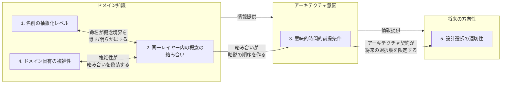
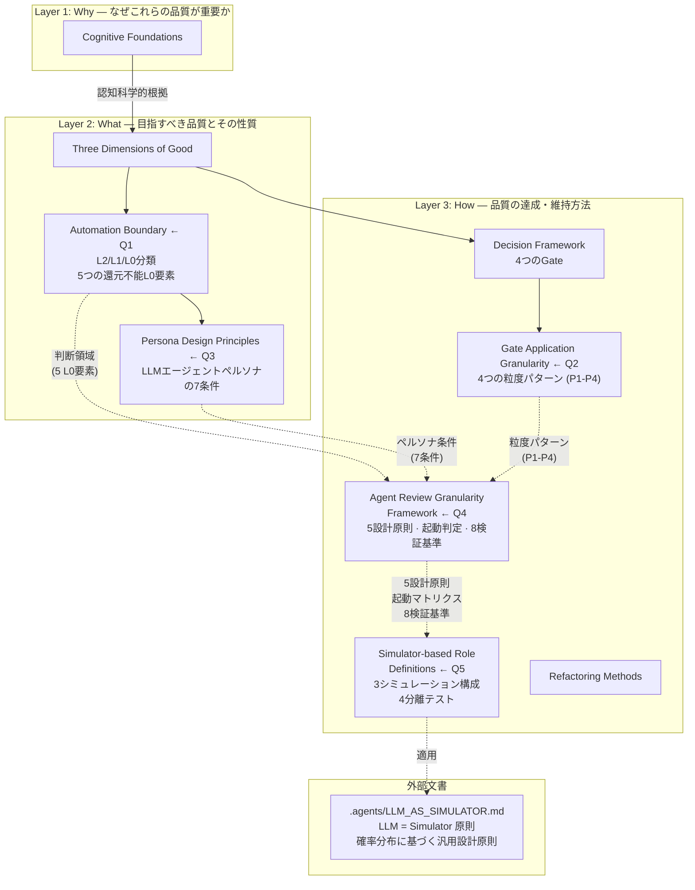

# コード品質の定義：「良い」とは何を意味するか

本文書は「良いコード」の意味を定義する。あらゆるコードベースにおけるリファクタリング作業の意思決定フレームワークとして機能する。変更がコードを改善するかどうかを評価する際には、本文書を参照されたい。本文書は生きた文書であり、理解が深まるにつれて更新すること。

## 本文書が存在する理由

Martin Fowlerはリファクタリングを「外部から見た振る舞いを変えずに、ソフトウェアの内部構造を変更して、理解しやすく修正しやすくすること」と定義している。しかし「理解しやすい」とは具体的に何を意味するのか。何がコードを「修正しやすく」するのか。本文書は認知科学の研究とソフトウェアエンジニアリングの原則に基づいてこれらの問いに答え、リファクタリングの意思決定を美的感覚ではなく原則に基づくものとする。

Ward Cunninghamのオリジナルの技術的負債メタファーからの重要な洞察：負債はずさんなコードを書くことから生じるのではなく、現在の理解とコードが反映しているものとの間のギャップから生じる。問題についてより多くを学ぶにつれて、コードはその理解を反映するように進化すべきである。本文書はその理解を再利用可能な形で捉える。

## 本文書の構成

「良いコード」を理解するには、複数の分野からの視点が必要である。本文書はそれらを3つのレイヤーと2つの横断的テーマに統合する。

### 3つのレイヤー

「良い」の定義は3つのレイヤーで構築され、それぞれ異なる問いに答える：

| レイヤー                  | 問い                                 | 本文書の内容                                                                           |
| ------------------------- | ------------------------------------ | -------------------------------------------------------------------------------------- |
| **レイヤー1：なぜ**       | なぜ特定のコード品質が重要なのか？   | 認知的基盤 — 人間がコードをどのように読み理解するかに関する認知科学研究に基づく        |
| **レイヤー2：何を**       | コードはどのような品質を持つべきか？ | 「良い」の3次元 — 12以上のソフトウェア品質フレームワークから統合された原則             |
| **レイヤー3：どのように** | それらの品質をどう達成し維持するか？ | 意思決定フレームワーク + リファクタリング手法 — 変更の評価と実行のための実践的プロセス |

レイヤー1はエビデンスの基盤を提供する。レイヤー2は目標を定義する。レイヤー3は手段を提供する。各レイヤーはその下のレイヤーの上に構築される：認知科学（レイヤー1）が品質原則（レイヤー2）を正当化し、それが実践的手法（レイヤー3）に反映される。

### 2つの横断的テーマ

2つのテーマが全3レイヤーを横断する：

**テーマ1：視点 — 誰の視点が「良い」を定義するか？**

コードは異なる人々（またはAI）によって、異なるタイミングで読まれ、書かれ、変更され、保守される。「良い」は誰の視点を取るかに依存する：

- **書き手**は表現のスピードを最適化する — しかしコードは書かれるよりもはるかに多く読まれる
- **読み手**は理解を最適化する — これが主たる対象者である（「誰がコードを読むか」を参照）
- **変更者**は安全な修正を最適化する — コードは予期せぬことなく変更を支援しなければならない
- **保守者**は長期的な持続可能性を最適化する — 今日の便利さが明日の負担になってはならない

Rich Hickeyの「シンプル vs イージー」の区別がここで中心となる：「イージー」は書き手に奉仕し（馴染みがある、便利、手近）、「シンプル」はそれ以外の全員に奉仕する（絡み合っていない、ユニットあたり一つの概念、独立して理解可能）。書き手の便利さと読み手の理解が衝突する場合は、読み手を優先せよ。

**テーマ2：不変条件 — すべての手法に共通する原則**

どのリファクタリング手法や品質フレームワークを適用するかにかかわらず、一定の原則が常に成り立つ：

- **小さなステップ**：すべての変更は検証可能な程度に小さくあるべきである。大きな変更は小さな変更の連続である。
- **振る舞いの保存**：リファクタリングは観察可能な振る舞いを変えてはならない。振る舞いが変わるなら、それはリファクタリングではなくリライトである。
- **常にデプロイ可能**：コードベースはすべての変更後にデプロイ可能な状態であるべきである。「今は壊して後で直す」は決してしない。
- **2つの帽子**（Fowler）：機能を追加しているか、構造を改善しているかのどちらかである。同時に両方を行ってはならない。
- **パターンは出現するもので、押し付けるものではない**（Kerievsky）：抽象化は観察された繰り返しから出現すべきであり（3回ルール）、予想される将来のニーズから生まれるべきではない。

## 誰がコードを読むか

コードは一度書かれるが、何度も読まれる。あらゆるコードベースの「読み手」には以下が含まれる：

1. **将来の保守者**（おそらく元の作者自身、数週間または数ヶ月後、コンテキストが薄れた状態で）
2. **AIアシスタント**（Claude、Copilotなど）コードの修正や拡張を依頼され、コンテキストウィンドウに制約される
3. **新規コントリビューター** コードベースに初めて接する

3者すべてが共通の制約を持つ：**限られたワーキングメモリ**。人間はリハーサルなしで4±1チャンクをワーキングメモリに保持する（Cowan, 2001）。AIアシスタントは有限のコンテキストウィンドウを持つ。新規コントリビューターはコードベースに関する事前スキーマを持たない。

「良いコード」とは、これらの制約を尊重するコードである。

## 認知的基盤

本文書の原則は美的嗜好ではない。人間がコードを処理する方法に基づいている。

### ワーキングメモリがボトルネックである

人間のワーキングメモリはリハーサルなしで約4チャンクを保持する（Cowan, 2001）。同時に意識に保持しなければならないパラメータ、状態変数、抽象化レイヤーのすべてがこれらのスロットを奪い合う。限界を超えると、理解力が低下しエラーが増加する。

実践的帰結：14個のパラメータを持つ関数は全体として理解できない。7つの状態変数と4つのrefを持つコンポーネントは、読み手に11項目を同時に追跡することを要求する。

### チャンキングには慣習が必要

経験豊富な開発者は馴染みのあるパターンを単一のチャンクに圧縮する。「ファクトリーパターン」や「イベントリスナー登録」は数十行ではなく1つのチャンクである。しかしこの圧縮は、コードが認識可能な慣習に従っている場合にのみ機能する（Soloway & Ehrlich, 1984）。

重要な知見：コードがプログラミングの談話規則（慣習）に違反すると、経験豊富な開発者の初心者に対する理解上の優位性が消失する。「巧妙な」非慣習的コードは専門知識を無効化する。

実践的帰結：慣用的なコードは美的感覚の問題ではない。認知的圧縮を可能にすることの問題である。コードベースとそのエコシステムの慣習で確立されたパターンに従え。

### ネストされた構造はコストが高い

研究（Int'l Journal of STEM Education, 2023）は、ネストされた構造が3つの同時的な認知的要求を課すことを示している：内側のレベルの高速なエンコーディング、外側のレベルの堅牢な維持、そしてレベル間の選択的更新である。これが、深くネストされたコードが同じ論理的複雑さを持つフラットなコードよりも不釣り合いに理解しにくい理由である。

実践的帰結：ネストよりもアーリーリターン、ガード節、関数の抽出を好め。ネストの各レベルは認知コストを加算ではなく乗算する。

### コンテキストスイッチは集中力を破壊する

コンテキストスイッチからの回復には平均23分かかる（Gloria Mark, UC Irvine）。以前のコンテキストからのアテンション残留は30〜60分持続する（Sophie Leroy）。読み手が開かなければならないファイル、調べなければならない抽象化、見つけなければならない離れた定義のすべてがコンテキストスイッチである。

実践的帰結：現在のファイルを離れずに理解できるコードは、他のファイルへのナビゲーションを必要とするコードよりも厳密に優れている。情報の局所性が重要である。

### ビーコンが理解を導く

経験豊富な開発者は「ビーコン」— コードの目的を示す認識可能な表面的特徴を使用する（Brooks, 1983; Wiedenbeck, 1986）。スワップ操作はソートを示す。`onDelta`コールバックはイベント処理を示す。明確なビーコンは理解を加速する；ビーコンが不在または誤解を招く場合、遅い行ごとの読解を強いる。

実践的帰結：関数名、変数名、構造的パターンは即座に意図を示すべきである。読み手は実装を読む前に、コードが何をするかについて正しい仮説を形成できるべきである。

## 「良い」の3次元

「良い」は単一の軸ではない。3つの独立した次元を持つ。他を考慮せずに1つだけを改善すると、コード全体としては悪化する可能性がある。

### 次元1：認知的適合性 — 読み手がそれを頭の中に保持できるか？

この次元は問う：単一の開発者（またはAIアシスタント）が、外部の補助、スクロール、ファイルナビゲーションなしにこのコード単位を理解できるか？

原則：

- **ワーキングメモリに収まる**：同時に追跡しなければならない概念の数が人間の限界内にある（おおよそ4〜7項目）。これは以下に適用される：関数のパラメータ、フックの状態変数、コンポーネントの責務、ネストの深さ。

- **局所的に理解可能**：コードの一部を理解するために他のファイルを読む必要がない。コードが何をするかを理解するために必要な情報は、存在しているか命名から明白である。

- **慣習的**：コードはプロジェクトの言語とフレームワークに精通した人にとって認識可能なパターンに従っている。エコシステムに精通した読み手は、一般的な抽象化の構造を予測できるべきである。コードはチャンキングを可能にする。

- **ビーコンが豊富**：名前、パターン、構造が即座に意図を示す。読み手は実装の詳細を読む前に正しい仮説を形成できる。

出典：Miller (1956), Cowan (2001), Soloway & Ehrlich (1984), Brooks (1983), Wiedenbeck (1986), "Code That Fits in Your Head" (Mark Seemann)

### 次元2：構造的健全性 — 構造は変更を支援するか？

この次元は問う：要件が変更されたとき（Lehmanの第一法則によりそうなる）、コード構造はその変更を局所的にするか、それともシステム全体に波及させるか？

原則：

- **単一責務**：各ユニット（モジュール、クラス、関数）は変更理由を1つだけ持つ。表示ロジックが変更されたら、表示モジュールだけが変更される。データ形式が変更されたら、データ処理だけが変更される。

- **低結合**：ユニットは最小限の明確に定義されたインターフェースに依存する。あるユニットの変更が無関係なユニットの変更を強制しない。複数レイヤーにまたがるデータの受け渡しは結合の臭いである。

- **高凝集**：ユニット内のすべてが同じ概念に関連している。プレゼンテーションとデータフェッチの両方を管理するモジュールは凝集度が低い。

- **低粘性**：「正しい」変更が「間違った」変更よりも容易である（Green & Petreの認知的次元）。コード構造は、既存のコンポーネントにボルトで付けるのではなく、正しい場所に新機能を自然に追加できるようにすべきである。

- **シンプル、イージーではなく**：Rich Hickeyの区別に従い — 概念が絡み合っていないコード（シンプル）を、すべてが便利に一箇所にあるコード（イージー）よりも好め。イージーは初期速度を速めるが長期的な進捗は減速する。シンプルは初期速度を遅くするが長期的な進捗を持続させる。

出典：SOLID (Martin), Simple Made Easy (Hickey), Cognitive Dimensions (Green & Petre), Lehman's Laws, CUPID (North)

### 次元3：進化的適応性 — コードは長期にわたる開発を維持できるか？

この次元は問う：コードベースは持続的な開発速度を支援するか、それとも各変更が前回よりも困難になるか？

原則：

- **テスト可能**：すべてのユニットは手の込んだセットアップなしに単独でテストできる。テストにアプリケーション全体のモック化が必要なら、そのユニットは結合しすぎている。テストはリファクタリングを可能にするセーフティネットとして機能する（Feathers, 2004）。

- **居住可能**：コードベースは開発者が快適に作業できる場所である（Gabriel）。これは以下を意味する：予測可能なファイル配置、一貫したパターン、トラップや驚きがないこと。新規コントリビューターは数分以内に変更すべき場所を見つけられるべきである。

- **エントロピー耐性**：構造が積極的に劣化に抵抗する。新機能には明確で正しい配置場所がある。「成功の落とし穴」原則：正しいことをするのが最も容易な道であるべきである。既存機能に新しいバリアントを追加する際に、開発者が5つのファイルに触れる必要があってはならない。

- **段階的に改善可能**：ボーイスカウトルールをリスクなく適用できる。小さな改善を通常の開発中に安全に行うことができ、エントロピーの蓄積を防ぐ。

出典：Working Effectively with Legacy Code (Feathers), Patterns of Software (Gabriel), Pit of Success (Mariani), Lehman's Laws, Software Entropy

## 自動化の境界

3つの次元は「良い」の意味を定義する。しかしすべての品質属性を同じ方法で評価できるわけではない。自動化ツールで測定できるものもあれば、人間またはAIの判断を必要とするものもある。このセクションでは両者の境界をマッピングし、ツールとレビューの労力を最もインパクトのある場所に向ける。

### 3つの検出可能性レベル

すべての品質属性は、自動メトリクスがどれだけ信頼性高く評価できるかに基づいて、3つのレベルのいずれかに分類される：

| レベル               | 定義                                                                                                                                    | 人間/AI判断の役割                                      |
| -------------------- | --------------------------------------------------------------------------------------------------------------------------------------- | ------------------------------------------------------ |
| **L2：直接検出**     | 定量的メトリクスが属性を直接測定する。閾値により偽陽性率が低い実行可能な結果を生成する。                                                | 例外処理のみ（例：高い複雑性が本質的であることの確認） |
| **L1：プロキシ検出** | 間接的メトリクスが属性の存在または不在を示唆する。SN比は変動する；結果は候補を絞り込むが確認はできない。                                | メトリクスにより浮上した候補に対する最終判断           |
| **L0：検出耐性**     | 属性はコードの表面構造から有意味に検出できない。判断に必要な情報はコードの外部 — ドメイン仕様、アーキテクチャ意図、将来計画に存在する。 | 主たる判断者。依拠すべきメトリクス入力なし。           |

### 次元別レベルマップ

#### 次元1：認知的適合性

| 属性                           | レベル | メトリクス / プロキシ                                 | 例                                                                                                                   |
| ------------------------------ | ------ | ----------------------------------------------------- | -------------------------------------------------------------------------------------------------------------------- |
| ワーキングメモリ負荷           | L2     | 認知的複雑度（SonarSource）、パラメータ数、ネスト深度 | 14個のパラメータを持つ関数はワーキングメモリの限界を超える — メトリクスが直接フラグを立てる                          |
| ビーコンの正確性               | L1     | 名前接頭辞と実装の不一致（型 + 制御フロー分析）       | `getUser()`がデータベースの状態を変更する — `get`接頭辞は副作用なしを暗示；静的分析が不一致を検出                    |
| ビーコンのドメイン整合性       | L1\*   | ドメイン用語集の参照（\* 用語集の存在が必要）         | 保険ドメインで`calculatePremium`ではなく`calculateAmount`を使用 — 用語集参照が用語の不一致を捕捉                     |
| ビーコンのパターンシグナリング | L1     | 既知パターンテンプレートと命名の不一致                | コードはObserver構造に従うが慣習的な`onXxx()`命名の代わりに`notify()`を使用 — テンプレートマッチングがギャップを検出 |
| ビーコンの抽象化レベル         | L0     | —                                                     | `processData`は抽象的すぎるが、*適切な*レベルを決定するにはそのドメインコンテキストにおける関数の責務の理解が必要    |
| 慣習性（リンターカバー）       | L2     | リンタールール（eslint-plugin-react-hooksなど）       | コンポーネント本体の外で`useState`を使用 — リンターが直接捕捉                                                        |
| 慣習性（リンター外）           | L0     | —                                                     | 「カスタムフックは副作用ロジックをカプセル化すべき」はエコシステムの慣習だが、それを強制するリンタールールはない     |

#### 次元2：構造的健全性

| 属性                           | レベル | メトリクス / プロキシ                             | 例                                                                                                                                                                          |
| ------------------------------ | ------ | ------------------------------------------------- | --------------------------------------------------------------------------------------------------------------------------------------------------------------------------- |
| 結合                           | L1     | 求心/遠心結合（Ca/Ce）、不安定性指標              | モジュールのCe=12 — メトリクスが高い外向き依存を検出するが、各依存が必要かどうかは設計理解が必要                                                                            |
| 凝集                           | L1     | LCOM（メソッドの凝集欠如度）                      | ユーティリティモジュールの高いLCOMスコア — メトリクスがフラグを立てるが、ユーティリティモジュールは設計上意図的に低凝集                                                     |
| 依存関係の循環                 | L2     | 依存グラフにおける循環検出                        | モジュール A → B → C → A — ツールが循環を直接検出                                                                                                                           |
| レイヤー間の絡み合い           | L1     | インポートの異質性分析                            | Reactコンポーネントが`react`と`prisma`の両方をインポート — レイヤー間インポートがレイヤー混在を示唆                                                                         |
| 同一レイヤー内の概念の絡み合い | L0     | —                                                 | 認証ロジックとプロフィール表示ロジックが1つのコンポーネントに共存。両方とも`User`型を使用するため、インポートは均質に見える。ドメイン境界の理解のみが絡み合いを明らかにする |
| 時間的絡み合い（構造的）       | L1     | null チェック、初期化順序の静的分析               | `initialize()`の前に`config.value`にアクセス — null安全性分析が構造的前提条件を検出                                                                                         |
| 時間的絡み合い（意味的）       | L0     | —                                                 | `configure()`は`start()`の前に呼ばれなければならないが、両関数とも同じ型を受け入れ、もう一方なしでもクラッシュしない — 順序要件は静的分析に見えない意味的契約               |
| 共有可変状態の絡み合い         | L1     | 状態アクセスパターン分析（書き込み/読み取り追跡） | モジュールレベルの変数が`handleLogin()`で書き込まれ`renderProfile()`で読み取られる — 変更追跡が暗黙の結合を識別                                                             |

#### 次元3：進化的適応性

| 属性                 | レベル | メトリクス / プロキシ                                                       | 例                                                                                                                                                                                |
| -------------------- | ------ | --------------------------------------------------------------------------- | --------------------------------------------------------------------------------------------------------------------------------------------------------------------------------- |
| テストカバレッジ     | L2     | 行/ブランチ/関数カバレッジ                                                  | 決済モジュールのブランチカバレッジ30% — メトリクスがギャップを直接報告                                                                                                            |
| テスト品質           | L0     | —                                                                           | 行カバレッジ100%だがすべてのアサーションが`expect(result).toBeDefined()` — カバレッジメトリクスは有意義なアサーションと些末なものを区別できない                                   |
| 居住可能性           | L1     | ファイル配置の一貫性、命名パターンの規則性                                  | テストファイルが`__tests__/`、`src/test/`、ルートに散在 — 不整合メトリクスが散らばったパターンをフラグ                                                                            |
| エントロピー耐性     | L1     | 機能あたりの変更ファイル数の傾向（git履歴）、ショットガンサージェリーの頻度 | 新しいAPIエンドポイントの追加に先月は12ファイルの変更が必要だったが、6ヶ月前は4ファイル — 傾向分析が劣化を検出                                                                    |
| 技術的制約の複雑性   | L1     | コメントマーカー検出（`workaround`、`hack`、`FIXME`、`polyfill`）           | `// workaround for Safari bug #12345` — マーカー検索が既知の技術的負債を識別                                                                                                      |
| 歴史的蓄積の複雑性   | L1     | チャーン × 複雑度（ホットスポット分析）、git blame著者分布                  | 15人の著者により2年かけて積み上がった400行の関数 — ホットスポット分析が蓄積された複雑性をフラグ                                                                                   |
| ドメイン固有の複雑性 | L0     | —                                                                           | 47の条件分岐を持つ税計算。仕様自体がこの分岐を必要とする — 複雑性が削減可能かどうかはメトリクスでは判断できない                                                                   |
| 設計選択の検出       | L1     | 参照数分析                                                                  | 汎用的な`Repository<T>`クラスが`Repository<User>`のみでインスタンス化される — 単一インスタンス化の検出が時期尚早な抽象化の可能性をフラグ                                          |
| 設計選択の判断       | L0     | —                                                                           | 単一インスタンスの`Repository<T>`はチームが来四半期に`Repository<Order>`を追加する予定があるため存在する — 抽象化が時期尚早かどうかはメトリクスでは予測できない将来の方向性に依存 |

### 還元不能なL0：人間/AI判断を必要とする5つの要素

すべてのL0属性を分解した後、プロキシ検出可能なコンポーネントにさらに還元できない5つの要素が残る。これらは自動メトリクスが有用な入力を提供しない判断領域である。

| #   | 要素                                    | 必要な知識                                           | 検出が失敗する理由                                                                                                                                                                                                                                                            |
| --- | --------------------------------------- | ---------------------------------------------------- | ----------------------------------------------------------------------------------------------------------------------------------------------------------------------------------------------------------------------------------------------------------------------------- |
| 1   | **名前の抽象化レベル** (1b)             | ドメイン：このコードの責務は何か？                   | `processData`は抽象的すぎるが、*適切な*名前はそのドメインにおける関数の意味に依存する。決済モジュールは`processData`ではなく`settleTransaction`を使うべきだが、これにはドメインの語彙とその中での関数の役割の理解が必要。                                                     |
| 2   | **同一レイヤー内の概念の絡み合い** (2b) | ドメイン：概念の境界はどこか？                       | 認証とプロフィール管理の両方が`User`エンティティを操作する。それらが1つのモジュールに属するか2つに属するかは、「ユーザーアイデンティティ」と「ユーザープロフィール」が独立したドメイン概念かどうかに依存する — ドメイン知識のみが答えられる問い。                             |
| 3   | **意味的時間的前提条件** (2c)           | アーキテクチャ：操作間にどのような契約が存在するか？ | `configure()`は`start()`に先行しなければならないが、両方とも独立して有効な入力を受け入れる。順序要件は意味的契約 — 例えば`start()`は`configure()`が設定する設定状態を読み取るが、状態自体は常に有効なデフォルトに初期化される。型エラーもnullアクセスも制約を明らかにしない。 |
| 4   | **ドメイン固有の複雑性** (3a)           | ドメイン：仕様自体がこの程度に複雑なのか？           | 47の分岐を持つ保険料計算は、単に47の規制ルールを反映しているかもしれない。あるいは保険料計算とリスク評価を混同しているかもしれない。コードをドメイン仕様と比較することのみがどちらかを判断できる。                                                                            |
| 5   | **設計選択の適切性** (3d)               | 将来：どのような変更が計画されているか？             | 1つの戦略しか持たない`PaymentStrategyFactory`は、時期尚早な抽象化か先見的な設計のいずれかである。区別は新しい支払い方法が計画されているかどうかに完全に依存する — コードではなくロードマップに存在する情報。                                                                  |

### 還元不能なL0要素間の関係

5つの要素は独立していない。必要な外部知識のタイプによって3つのグループにクラスタ化され、これらのグループは依存関係の連鎖を形成する。



**ドメイン知識**は基盤である。問題ドメインの理解なしには、アーキテクチャ意図も将来の方向性も評価できない：

- 要素1と2は密結合している：命名の選択（1）は概念境界（2）を隠すことも明らかにすることもできる。モジュールを`UserService`と命名することは認証とプロフィールロジックの絡み合いを隠す。`AuthService`と`ProfileService`にリネームすると境界の問題が明示化される。同様に、要素4は要素2と相互作用する：ドメインの複雑性は概念の絡み合いを偽装できる。保険料計算とリスク評価を混ぜた200行の関数は、実際には2つの分離可能なドメイン概念が絡み合っているにもかかわらず「ドメインが複雑なだけだ」と見えるかもしれない。

**アーキテクチャ意図**はドメイン知識の上に構築される。要素3の意味的前提条件は、概念の絡み合い（要素2）の帰結として生じることが多い：認証とプロフィール管理がモジュールを共有する場合、それらの間の暗黙の順序依存関係は、共有する状態がモジュール内部であるため見えなくなる。

**将来の方向性**はアーキテクチャ意図の上に構築される。設計選択が時期尚早か（要素5）は、計画された変更に対してのみ判断でき、その変更自体はドメイン理解に基づくアーキテクチャ上の決定を反映する。

**Q4（ペルソナ設計）への含意**：依存関係の連鎖は、ドメイン知識の判断を担うペルソナが存在しなければならず、他の判断領域に情報を提供しなければならないことを意味する。ドメイン知識（要素1、2、4）へのアクセスなしに設計選択の適切性（要素5）を判断するペルソナは効果的に機能できない。

## ペルソナ設計原則

自動化の境界セクションは、L0の判断には人間またはAIペルソナが主たる判断者として必要であることを確立した。このセクションでは、そのようなペルソナが効果的に機能する条件を定義し、人間の認知メカニズムとLLMエージェントの対応物を区別する。

### ペルソナが機能する理由：3つの認知メカニズム

研究は、「シニアエンジニアならこれは複雑すぎると言うだろうか？」のようなプロンプトがなぜ判断品質を改善するかを説明する3つのメカニズムを特定している：

#### メカニズム1：自己距離化

Kross et al. (2014)は、三人称思考が自我防衛的推論からの心理的距離を作り出すことで判断を改善することを発見した。

- **一人称**（「私はこれを複雑にしすぎているか？」）は自己防衛を引き起こす。抽象化レイヤーの設計に2日を費やした開発者は、その投資を正当化するバイアスを持つ。
- **三人称**（「シニアエンジニアはこれを複雑すぎると言うだろうか？」）はその感情的投資からの距離を作り、より客観的な評価を可能にする。

Trope & Libermanの解釈レベル理論（2010）は第二の効果を追加する：心理的距離が大きいほど、より高次で抽象的な思考が促進される。自分のコードを評価する開発者は実装の詳細に注目しがちである（「この変数名は良いか？」）。シニアエンジニアのペルソナを採用すると、注意が構造的な懸念にシフトする（「この責務分割は適切か？」）。これはL0の判断が本質的に構造的であることに直接関連する。

#### メカニズム2：単一焦点効果

Gawandeの _The Checklist Manifesto_ (2009)は、チェックリストの長さとコンプライアンス率の間に逆U字型の関係があることを実証した。約7項目を超えると、コンプライアンスが急激に低下する — ワーキングメモリの限界（Cowan, 2001）と一致する。

単一の質問（「これは複雑すぎるか？」）はほぼ100%のコンプライアンスを達成する。判断基準はペルソナに暗黙的にエンコードされ、明示的に列挙されない。20項目のコードレビューチェックリストは注意をすべての項目に分散させ、個々の項目の検出率を低下させる。

しかし、これにはコストがある：単一の質問は**検出率**を最大化するが**診断精度**を低下させる。「複雑すぎる」は認知的適合性の問題（頭に保持すべきことが多すぎる）、構造的健全性の問題（変更がシステム全体に波及する）、または進化的適応性の問題（このパターンはスケールしない）を意味しうる。単一焦点のプロンプトではどれかを区別できない。

#### メカニズム3：視点統合

本文書のテーマ1は4つの視点を定義する：書き手、読み手、変更者、保守者。「シニアエンジニア」ペルソナは4つすべてを1つに統合する。この統合の有効性はタスクに依存する：

| タスク                         | 統合効果                                                  | 例                                                                                                                                             |
| ------------------------------ | --------------------------------------------------------- | ---------------------------------------------------------------------------------------------------------------------------------------------- |
| **スクリーニング**（問題検出） | 有効 — 1つの質問でほとんどの問題を捕捉                    | 「これは複雑すぎるか？」で14個のpropsと7つの状態変数を持つ200行のReactコンポーネントに問題があることを検出                                     |
| **診断**（分類と根本原因）     | 情報が失われる — どの視点が違反されているかを区別できない | 同じコンポーネント：読み手の問題か（追跡すべきことが多すぎる）、変更者の問題か（修正が波及する）、保守者の問題か（新機能の明確な場所がない）？ |
| **処方**（何をすべきかの決定） | 不十分 — 異なる視点が異なるアクションを示唆               | 読み手の視点はパラメータオブジェクトの抽出を示唆；変更者の視点は責務の分割を示唆；保守者の視点はアーキテクチャの再考を示唆                     |

### 人間の認知からLLMエージェントへ

上記の3つのメカニズムは人間の認知科学に基づいている。LLMエージェントは根本的に異なる認知アーキテクチャを持つ。各メカニズムはLLMへの適用可能性を再検討しなければならない — そして最近の実証研究は、マッピングが単純ではないことを明らかにしている。

#### 自己距離化 → 明示的基準（ペルソナ名ではなく）

LLMには自我がないため、自己防衛バイアスは存在しない。自然な仮説は、ペルソナプロンプトが出力分布をトレーニングデータ中のペルソナに関連するパターンの方向にシフトさせるというものである。しかし、**実証研究はこの仮定に疑問を呈する**：

- Zheng et al. (2024)は4つのLLMファミリーで162のペルソナを2,410の事実に関する質問でテストした。**ペルソナプロンプトはペルソナなしのベースラインに対して一貫した改善を示さなかった**。ペルソナの性別、タイプ、ドメインには若干の効果があったが、「最適なペルソナ」の特定はランダムな選択よりも良くなかった。
- Basil, Mollick et al. (2025)は大学院レベルの理科・工学の質問で6つのモデルを評価した。**ドメイン専門家ペルソナ（例：「あなたは物理学の専門家です」）は性能に有意な効果を示さなかった**。不一致な専門家ペルソナでさえ、わずかな差異しか生じなかった。
- Kim et al. (2024)は、ロールプレイプロンプトが「両刃の剣」であることを示した — ロールプレイと中立プロンプトのアンサンブル（Jekyll & Hydeフレームワーク）はGPT-4で12の推論データセットにおいて精度を9.98%改善したが、**個別のペルソナは中立プロンプトを確実には上回らなかった**。

**重要な注意点**：これらの研究は事実の正確性と推論タスクに焦点を当てていた。コード品質の判断は、「正解」がコンテキストと基準に依存する評価的タスクである。ペルソナ効果をコードレビュー品質に対して具体的にテストした実証研究はない。したがって、エビデンスはペルソナがコード品質に無用であることを証明しているのではなく — **ペルソナ名だけでは不十分**であることを証明している。

**初期分析との重要な違い**：元のフレーミング（「パターン活性化」）は効果を過大評価していた。エビデンスはより弱い主張を支持する：ペルソナは特定の評価スタイルへのプライミングとなりうるが、判断品質の主要な駆動因子は**明示的な基準の指定**であり、ペルソナのラベルではない。

**設計上の含意**：ペルソナ名に頼るな。判断基準を明示的に記述せよ。「シニアエンジニアとして評価せよ」ではなく、「各モジュールが変更理由を1つだけ持つか、依存関係が一方向に流れているか、命名がドメイン語彙を反映しているかを評価せよ」と指定せよ。ペルソナ名は弱いプライマーとして機能しうるが、実際の仕事をするのは基準である。

#### 単一焦点 → 指示遵守限界（実証的境界付き）

LLMには4±1のワーキングメモリ制約がないが、現在では実証的によく特徴づけられた指示遵守の劣化を示す：

- **IFScale (Jaroslawicz et al., 2025)** は10から500の指示にスケールし、3つの劣化パターンを特定した：
  - **閾値減衰**：推論モデル（o3、Gemini 2.5 Pro）は約150指示までほぼ完璧な性能を維持し、その後急激に低下
  - **線形減衰**：GPT-4.1、Claude Sonnet 4 — 指示数に比例した定常的な低下
  - **指数減衰**：GPT-4o、Llama 4 Scout — 急速な初期低下
  - 最高性能のモデルでさえ500指示で**68%の精度**しか達成しなかった
  - **初頭バイアスは普遍的**：プロンプトの早い方に提示された指示は遅い方よりも確実に遵守される。高い認知負荷下では、エラータイプが「不正確な修正」から「省略」にシフトする — モデルは単に指示をスキップする

- **InFoBench (Qin et al., ACL 2024)** は複雑な指示を原子的要件に分解した。GPT-4は**単純で曖昧でない指示に対してわずか約80%のコンプライアンス**しか達成しなかった；小規模モデルは50%以下だった。

- **The Instruction Gap (2025)** はエンタープライズRAGシナリオにおいて、長い知識スニペットが指示とアテンションを奪い合い、ブランドボイス要件、レスポンス形式ルール、コンテンツ境界へのコンプライアンスが著しく劣化することを示した。

さらに、**位置効果**が問題を複合化する：

- **Lost in the Middle (Liu et al., TACL 2024)** はU字型のパフォーマンス曲線を実証した：コンテキストの先頭と末尾の情報は効果的に利用されるが、**中間に位置する情報は著しく過小利用される**。これはロングコンテキスト向けに明示的にトレーニングされたモデルでも成り立つ。
- **Found in the Middle (Hsieh et al., 2024)** はこれをトランスフォーマーアーキテクチャに固有のアテンションバイアスに帰した。キャリブレーション技術によりRAG性能が最大15ポイント改善した。

**初期分析との重要な違い**：初期のフレーミングは現象を正しく特定したが、定量的境界が不足していた。現在分かっていること：Claudeファミリーモデルは線形減衰を示す；初頭バイアスは普遍的；位置効果は指示の数だけでなく配置も重要であることを意味する。

**設計上の含意**：

1. エージェントあたりの評価基準を制限する — 基準が少ないほど基準あたりの遵守率が高い
2. 最も重要な基準をプロンプトの**先頭**に配置する（初頭バイアス）
3. ドメイン知識を注入する際は、コンテキストの**先頭または末尾**に配置し、中間には配置しない（U字型利用曲線）
4. モデルごとの正確な閾値は実験的に決定すべきだが、原則は実証的に検証されている

#### 視点統合 → フェーズ分離（マルチエージェントのエビデンス付き）

人間の場合、視点間の切り替えにはコンテキストスイッチのコスト（Gloria Markによると回復に約23分）がかかる。視点を1つのペルソナに統合するとこのコストを回避できる。LLMの場合、コンテキストスイッチはほぼ無料であり — マルチエージェント研究は分解の利点のエビデンスを提供する：

- **MetaGPT (Hong et al., ICLR 2024)** は標準作業手順を特化された役割（プロダクトマネージャー、アーキテクト、エンジニア）を持つプロンプトシーケンスにエンコードした。**100%のタスク完了率**と実行可能性スコア3.9/4.0を達成し、ChatDevの2.1/4.0と比較された。重要な設計選択：エージェントは自由形式の対話ではなく**構造化された文書と図**を通じてコミュニケーションし、無関係な情報と省略を防ぐ。
- **ChatDev (Qian et al., ACL 2024)** は特化されたエージェント（アナリスト、コーダー、テスター）間のチャットベースの調整を使用した。品質スコアはベースラインの0.1523から0.3953に改善した。自己協調ではpass@1でベースラインに対して30-47%の改善を示した。

**重要な違い**：統合の主な利点（コンテキストスイッチコストの回避）はLLMには適用されない。マルチエージェントのエビデンスは、構造化されたコミュニケーションを伴う役割分解が**測定可能な品質改善**をもたらすことを示している。

**設計上の含意**：LLMエージェントは統合されたペルソナよりも分解されたペルソナを好むべきである。スクリーニング、診断、処方を別々のフェーズとして実行するか、チーム内の別々のエージェントに割り当てよ。MetaGPTの、構造化されたアーティファクトが自由形式の対話を上回るという知見は、Agent Teams設計に特に関連する。

#### 追加的制約：外部フィードバック要件

LLMの自己評価に関する研究は、人間の認知分析には存在しない根本的な限界を明らかにする：

- **Huang et al. (ICLR 2024)** は、**LLMは外部フィードバックなしに推論を自己修正できない**ことを実証した。「固有的自己修正」— モデルが自身の出力を評価し改善する — は推論タスクにおいて実際にパフォーマンスを**低下させる**。核心的な問題：LLMは自身の回答の正確性を信頼性をもって評価できない。
- **Zheng et al. (NeurIPS 2023)** はGPT-4の審査員としての評価が人間の選好と**80%以上の一致**を達成することを示した — これは人間同士の一致率に匹敵する。しかし、これは**他のモデルの出力**を判断するものであり、自己評価ではない。位置バイアス、冗長性バイアス、自己強化バイアスが限界として特定された。

**設計上の含意**：単一のエージェントがコード品質の判断を生成し評価の両方を行うべきではない。スクリーニングエージェントの発見は、自己レビューではなく、別の診断エージェントによって検証されるべきである。これはフェーズ分離の条件を強化し、新しい制約を追加する：**エージェント間検証** — 各判断フェーズは、判断されるアーティファクトを生成したエージェントとは異なるエージェントによって実行されるべきである。

### 効果的なLLMエージェントペルソナの7つの条件

認知メカニズムと上記の実証的エビデンスを統合し、LLMエージェントペルソナは以下の7つの条件すべてが満たされたとき効果的に機能する：

| #   | 条件                         | 定義                                                                                                                                                 | 実証的根拠                                                                                                                                            | 違反時の結果                                                                                                | 例                                                                                                                                                                                      |
| --- | ---------------------------- | ---------------------------------------------------------------------------------------------------------------------------------------------------- | ----------------------------------------------------------------------------------------------------------------------------------------------------- | ----------------------------------------------------------------------------------------------------------- | --------------------------------------------------------------------------------------------------------------------------------------------------------------------------------------- |
| 1   | **ペルソナ名より明示的基準** | 判断基準がプロンプト内で明示的に定義される。ペルソナ名はせいぜい弱いプライマーとして機能する — 判断品質を駆動するのはペルソナラベルではなく基準      | Zheng et al. (2024): 162のペルソナが一貫した改善を示さず。Basil et al. (2025): 専門家ペルソナは事実タスクに有意な効果なし                             | LLMが汎用的な評価を適用し、プロジェクト固有の品質問題を見逃す。ペルソナ名が判断品質に対する偽りの確信を生む | 「シニアエンジニアとして評価せよ」（研究により非効果的）vs.「各モジュールが変更理由を1つだけ持ち、命名がドメイン語彙を反映しているかを評価せよ」（効果的 — 明示的基準）                 |
| 2   | **指示遵守限界**             | エージェントあたりの同時評価基準数をモデルの遵守劣化閾値以下に保つ。重要な基準をプロンプトの先頭に配置                                               | IFScale (2025): Claudeモデルの線形減衰；普遍的な初頭バイアス；500指示で68%の精度上限                                                                  | 重要な基準が暗黙的に省略される（不正確な適用ではなく — 文字通りスキップされる）指示数の増加に伴い           | 15の評価基準を持つエージェントが、副作用のない`get*`関数のチェックを省略する。それが12番目の指示だったため — 初頭バイアスがそれを優先度下げした                                         |
| 3   | **フェーズ分離**             | スクリーニング（検出）、診断（分類）、処方（アクション推奨）が別々のフェーズまたは別々のエージェントとして実行される                                 | ChatDev (ACL 2024): 役割分解で30-47%の品質改善。MetaGPT (ICLR 2024): 構造化コミュニケーションが対話を上回る                                           | 問題は検出されるが誤分類され、不正確な修正につながる                                                        | 単一のエージェントが「このコンポーネントは複雑すぎる」を検出し責務の分割（構造的修正）を推奨するが、実際の問題はパラメータが多すぎること（認知的修正 — パラメータオブジェクトの抽出）   |
| 4   | **エージェント間検証**       | 各判断フェーズは、判断されるアーティファクトを生成したエージェントとは異なるエージェントによって実行される。エージェントは自身の出力を自己評価しない | Huang et al. (ICLR 2024): 固有的自己修正が推論性能を低下。Zheng et al. (NeurIPS 2023): エージェント間評価で80%以上の人間との一致                      | 単一のエージェントがコード品質の判断を生成し自己検証する。もっともらしいが未検証の結論を生む                | スクリーニングエージェントが5つの問題をフラグし、次に自己検証で「はい、これらはすべて本当の問題です」— 別の診断エージェントなら捕捉したであろう2つの偽陽性を見逃す                      |
| 5   | **スコープ指示**             | 評価スコープ（関数 / モジュール / システム）がペルソナの抽象化レベルを通じてではなく、パラメータとして直接指定される                                 | （解釈レベル理論の適応から導出 — 直接的なLLM研究はないが、暗黙的な指示より明示的な指示が優れることを示す指示遵守研究と一致）                          | エージェントが誤った抽象化レベルで評価する                                                                  | アーキテクチャの結合を評価するよう指示されたエージェントが、代わりに個々の関数内の変数命名品質を報告する                                                                                |
| 6   | **知識注入設計**             | 各L0要素について、必要な外部知識が特定され、コンテキストの**先頭または末尾**に（中間ではなく）適切な粒度で注入される                                 | Liu et al. (TACL 2024): U字型利用曲線 — 中間に位置する情報が著しく過小利用。Hsieh et al. (2024): アテンションキャリブレーションで性能が15ポイント改善 | エージェントはコンテキスト内に必要な知識を持つが、位置的アテンションバイアスのため利用に失敗する            | 長いシステムプロンプトの中間に注入されたドメイン仕様は実質的に無視される；エージェントは提供された規制ルールを参照せずに`calculatePremium`を判断する                                    |
| 7   | **構造化コミュニケーション** | エージェントは自由形式の対話ではなく、構造化されたアーティファクト（文書、型付きレポート、チェックリスト）を通じてコミュニケーションする             | MetaGPT (ICLR 2024): 構造化文書が実行可能性3.9/4.0を達成 vs. ChatDevの対話ベース2.1/4.0                                                               | エージェント間の自由形式の対話が無関係な情報と省略を導入し、調整品質を低下させる                            | スクリーニングエージェントが診断エージェントに問題を説明する散文の段落を送信；診断エージェントが1つの問題を見逃す。場所、次元、重大度の型付きフィールドを持つ構造化レポートがこれを防ぐ |

### 還元不能なL0要素との接続

7つの条件は各L0要素に対して具体的な含意を持つ：

| L0要素                            | 必要な条件                                   | 注入すべき知識（配置：コンテキストの先頭または末尾）                                                     |
| --------------------------------- | -------------------------------------------- | -------------------------------------------------------------------------------------------------------- |
| 1. 名前の抽象化レベル             | 明示的基準 + 知識注入                        | ドメイン用語集、モジュール責務定義                                                                       |
| 2. 同一レイヤー内の概念の絡み合い | フェーズ分離 + エージェント間検証 + 知識注入 | 概念境界を含むドメインモデル（例：「ユーザーアイデンティティ」と「ユーザープロフィール」は独立した概念） |
| 3. 意味的時間的前提条件           | スコープ指示 + 知識注入                      | アーキテクチャ決定記録、API契約、操作順序仕様                                                            |
| 4. ドメイン固有の複雑性           | 知識注入（重要） + エージェント間検証        | ドメイン仕様 — エージェントはコードの分岐を仕様要件と比較しなければならない                              |
| 5. 設計選択の適切性               | 知識注入 + フェーズ分離                      | プロダクトロードマップ、計画された機能追加、アーキテクチャ進化戦略                                       |

### 本セクションの実証的参考文献

- Zheng, M. et al. (2024). "When 'A Helpful Assistant' Is Not Really Helpful: Personas in System Prompts Do Not Improve Performances of Large Language Models." arXiv:2311.10054v3.
- Basil, S., Mollick, E.R. et al. (2025). "Playing Pretend: Expert Personas Don't Improve Factual Accuracy." SSRN:5879722.
- Kim et al. (2024). "Persona is a Double-Edged Sword." OpenReview.
- Jaroslawicz, D. et al. (2025). "How Many Instructions Can LLMs Follow at Once?" (IFScale). arXiv:2507.11538.
- Qin et al. (2024). "InFoBench: Evaluating Instruction Following Ability in Large Language Models." ACL Findings.
- Liu, N. et al. (2024). "Lost in the Middle: How Language Models Use Long Contexts." TACL.
- Hsieh et al. (2024). "Found in the Middle: Calibrating Positional Attention Bias Improves Long Context Utilization." arXiv:2406.16008.
- Hong et al. (2024). "MetaGPT: Meta Programming for a Multi-Agent Collaborative Framework." ICLR.
- Qian et al. (2024). "ChatDev: Communicative Agents for Software Development." ACL.
- Huang, J. et al. (2024). "Large Language Models Cannot Self-Correct Reasoning Yet." ICLR.
- Zheng, L. et al. (2023). "Judging LLM-as-a-Judge with MT-Bench and Chatbot Arena." NeurIPS.

## 意思決定フレームワーク

リファクタリングがコードを改善するかどうかを評価する際は、以下の問いを順に適用せよ：

### ゲート1：振る舞いを保存しているか？

リファクタリングが観察可能な振る舞いを変更するなら、それはリファクタリングではない。停止せよ。まず現在の振る舞いを特性化するテスト（Feathersの特性化テスト）を書き、その後にリファクタリングせよ。

### ゲート2：認知負荷を削減しているか？

変更後、開発者はより少ない精神的労力で修正されたコードを理解できるか？具体的には：

- 同時に頭に保持すべきことが減ったか？
- ネストが浅くなったか？
- 名前がより意図を表現しているか？
- 他のファイルに移動せずにコードを理解できるか？

リファクタリングが複雑さを削減せずにある場所から別の場所に移動するだけなら（例：一度しか呼ばれない関数を抽出し、抽出元と抽出先の両方の理解が必要になる場合）、それは改善ではないかもしれない。

### ゲート3：構造的健全性を改善しているか？

変更後：

- 各ユニットの変更理由が減ったか？
- ユニット間の依存関係がよりシンプルになったか？
- 次の変更を正しい場所で行うのがより容易になったか？

### ゲート4：持続的な開発を支援しているか？

変更後：

- コードがテストしやすくなったか？
- 新機能の明確な配置場所があるか？
- 新規コントリビューターが道を見つけられるか？

### リファクタリングすべきでない場合

- **YAGNI**：仮定上の将来の要件に向けてリファクタリングしない。現在のコードをより良くするためにリファクタリングし、来るかもしれない変更に備えるためではない。
- **収穫逓減**：めったに変更されないコードをリファクタリングしない。変更頻度の高いコード（ホットパス）を優先せよ。
- **パターンへの時期尚早なリファクタリング**：パターンはコードのニーズから出現すべきであり（Kerievsky）、押し付けるべきではない。重複回数が3回未満なら、抽出は時期尚早かもしれない。

## ゲート適用粒度

意思決定フレームワークは各ゲートで*何を*判断するかを定義する。このセクションは*どのスコープで*判断するか — 各ゲートが適用されるべき粒度を定義する。粒度は固定ではない；ゲートと評価される変更のタイプによって変動する。

### ゲート1：振る舞いの保存 — 粒度

#### 保存すべき振る舞いの5つのタイプ

「振る舞いを保存する」は単一のチェックではない。異なるタイプの振る舞いは異なる検証スコープを必要とする：

| 振る舞いのタイプ                                    | スコープ                              | 検証方法                       | 例                                                             |
| --------------------------------------------------- | ------------------------------------- | ------------------------------ | -------------------------------------------------------------- |
| **値の保存** — 純粋関数のI/O                        | 関数                                  | ユニットテスト                 | `calculateTax(income)`が同じ値を返す                           |
| **副作用の保存** — 状態変更、I/O                    | 関数 + 状態の読み取り側               | ユニットテスト + モック検証    | `saveUser()`がデータベースに同じデータを書き込む               |
| **契約の保存** — 型シグネチャ、API                  | インターフェースレベル                | 型チェック + 契約テスト        | `UserService.getById()`の引数と戻り値の型が不変                |
| **非機能の保存** — パフォーマンス、メモリ           | モジュール + 実行パス                 | ベンチマーク、プロファイリング | Extract Functionがホットパスに関数呼び出しオーバーヘッドを追加 |
| **順序の保存** — イベント発火順序、初期化シーケンス | モジュール + イベントサブスクライバー | 統合テスト + シーケンス検証    | `onMount` → `onFetch` → `onRender`の順序が不変                 |

#### スコープはリファクタリング操作によって変動する

| 操作                             | ゲート1のスコープ                                    | 理由                                                                                                       |
| -------------------------------- | ---------------------------------------------------- | ---------------------------------------------------------------------------------------------------------- |
| 変数のリネーム                   | 関数内                                               | 値の保存のみ。外部の振る舞い変更なし                                                                       |
| 関数の抽出                       | 関数 + すべての呼び出し元                            | 抽出された関数と元の関数の両方が同じ振る舞いを維持する必要がある。呼び出し元に新しい呼び出しサイトが生じる |
| 関数の移動                       | 旧モジュール + 新モジュール + すべての依存先         | インポートパスの変更がすべての依存先に伝播する。契約の保存が必要                                           |
| インターフェースの変更           | インターフェース + すべての実装 + すべての呼び出し元 | 契約変更がすべての実装と使用箇所に影響する。最も広いスコープ                                               |
| 継承のコンポジションへの置き換え | クラス階層全体 + すべての使用箇所                    | 委譲パターンが変わる；暗黙の順序（superの呼び出し順）がシフトする可能性                                    |

#### ゲート1の粒度構造

粒度は2つの変数の関数である：

```
ゲート1のスコープ = f(リファクタリング操作タイプ, 保存すべき振る舞いのタイプ)

最小：関数内（変数のリネーム × 値の保存）
最大：システム全体（インターフェースの変更 × 契約の保存）
実用的デフォルト：変更セット + テストスイート実行
```

テストが存在する場合、ゲート1はL2（自動化）である。テストが存在しない場合、*どの振る舞いのタイプを特性化するか*の決定はL0判断である — コードの呼び出し元が何に依存しているかの理解が必要。

### ゲート2：認知負荷の削減 — 粒度

#### 認知負荷の3つのコンポーネントは異なるスコープを必要とする

認知負荷理論（Sweller, 1988）をコードレビューに適用：

| 負荷コンポーネント                    | 定義                                                   | 評価スコープ                   | 例                                                                                                    |
| ------------------------------------- | ------------------------------------------------------ | ------------------------------ | ----------------------------------------------------------------------------------------------------- |
| **内在的負荷** — 固有のドメイン難易度 | ドメインの概念的複雑さ。コード表現にかかわらず存在する | 変更された関数自体             | 47の条件分岐を持つ税計算は本質的に複雑（L0：ドメイン固有の複雑性）                                    |
| **外在的負荷** — 不必要な認知コスト   | コードの表現と構造が課す不必要な負担                   | 変更された関数 + 命名 + 構造   | `processData`は読み手に意味の推測を強いる。1文字の変数`d`はコンテキストを提供しない                   |
| **関連的負荷** — 有益な学習コスト     | パターン認識とスキーマ構築に寄与する負担               | モジュールレベルの慣習パターン | `useXxx`パターンに従うReactカスタムフックは学習コストがあるが、再利用可能なメンタルスキーマを構築する |

リファクタリングは**外在的負荷**のみを削減すべきである。内在的負荷は削減不能（ドメインの複雑性）。関連的負荷は削減すべきではない（パターン学習を助ける）。

#### 方向性のある1ホップ：含めるべき隣接ノードは操作に依存する

| 方向                                       | 含める場合                                 | 理由                                                                                     | 例                                                                                                                              |
| ------------------------------------------ | ------------------------------------------ | ---------------------------------------------------------------------------------------- | ------------------------------------------------------------------------------------------------------------------------------- |
| **呼び出し元**                             | 関数の抽出、パラメータ変更、戻り値の型変更 | 呼び出しサイトに新しい抽象化またはシグネチャ変更が加わり、呼び出し元の認知負荷が変化する | `processOrder()`から`validatePayment()`を抽出 — `processOrder()`の読み手は新しい抽象化を理解する必要がある                      |
| **呼び出し先**                             | 関数のインライン化、関数の統合             | マージ先が呼び出し先のコンテキストを吸収し、認知負荷が増加する                           | `validatePayment()`を`processOrder()`にインライン化 — `processOrder()`が直接検証ロジックを含むようになる                        |
| **兄弟**（モジュール内の同一レベルの関数） | リネーム、パターン変更                     | モジュール内の命名やパターンの不整合が他の関数の可読性に影響する                         | `getUser`、`fetchProfile`、`loadSettings` — 同じ操作に3つの動詞。`getUser`を`fetchUser`にリネームすると兄弟の整合性が改善される |
| **型共有ピア**                             | 型定義の変更、パラメータオブジェクトの導入 | 型を共有する関数は型が変更されたときに影響を受ける                                       | `UserDTO`にフィールドを追加すると、`UserDTO`を受け取るすべての関数が新しいフィールドを考慮しなければならない                    |

#### 移転 vs. 削減：区別方法

Extract Functionと同様の分解操作を評価する際：

| 判定     | 条件                                                         | 検出方法                                                                                   |
| -------- | ------------------------------------------------------------ | ------------------------------------------------------------------------------------------ |
| **削減** | 変更された関数 + 1ホップ隣接ノード全体の認知負荷の合計が減少 | L2：認知的複雑度の変更前後の合計。ただし「抽象化の理解コスト」はメトリクスに見えない（L0） |
| **移転** | 一方が減少し、他方が同量増加する。正味不変                   | L2：合計は不変だが分布がシフト。L0：抽出されたユニットが独立して理解可能か                 |
| **劣化** | 合計が増加（抽象化のオーバーヘッド > 分解の利益）            | L2：合計が増加。L0：抽出された関数の命名品質がオーバーヘッドを正当化するかを決定           |

重要な洞察：L2メトリクスは認知的複雑度の合計変化を測定できるが、**新しい抽象化を追加するコスト**はメトリクスに表れない。このコストはL0判断に依存する（名前の抽象化レベルは適切か？ = ビーコンの品質）。

#### ゲート2の粒度構造

```
ゲート2のスコープ = 変更された関数 + 方向性のある1ホップ

方向の選択：
  抽出  → 呼び出し元が必要、呼び出し先はオプション
  インライン → 呼び出し先が必要、呼び出し元はオプション
  リネーム → 呼び出し元 + 兄弟が必要
  型変更 → すべての型共有ピア

判断：
  L2（自動）：複雑度合計の変更前後の比較
  L0（判断）：抽象化コスト、命名の適切性、概念の独立性
```

### ゲート3：構造的健全性 — 粒度

#### 6種類の依存関係が1ホップの境界を定義する

「依存グラフの1ホップ」は含まれる依存関係によって異なる：

| 依存関係のタイプ     | 検出方法                       | 1ホップに含めるか？            | 例                                                                            |
| -------------------- | ------------------------------ | ------------------------------ | ----------------------------------------------------------------------------- |
| **静的インポート**   | インポート文の分析（L2）       | 常に                           | `import { UserService } from './services'`                                    |
| **ランタイム（DI）** | DIコンテナ設定の分析（L1）     | 可能な場合                     | `container.resolve(UserService)` — インポートに見えない                       |
| **イベントベース**   | イベント名のgrep（L1）         | 含めるべき（見落としやすい）   | `eventBus.emit('user:created')` → サブスクライバーが暗黙的に依存              |
| **共有状態**         | 状態アクセスパターン分析（L1） | 含める                         | グローバルストアの`user`スライスを読み書きするすべてのモジュール              |
| **契約（型/API）**   | 型定義の参照追跡（L2）         | インターフェース変更時         | `interface UserRepository`を実装するすべてのクラス                            |
| **意味的**           | 検出不能（L0）                 | L0判断により必要に応じて含める | `AuthService`と`ProfileService`が暗黙的に同じ「ユーザーセッション」概念に依存 |

#### 結合の方向が評価の視点を決定する

| 結合の方向       | 評価の問い                             | スコープ                              | 改善基準                                                   |
| ---------------- | -------------------------------------- | ------------------------------------- | ---------------------------------------------------------- |
| **求心（受信）** | この変更は依存先に変更を強制するか？   | 変更されたモジュール + すべての依存先 | 依存先での強制変更の減少（ショットガンサージェリーの削減） |
| **遠心（送信）** | この変更は依存への結合を増加させるか？ | 変更されたモジュール + すべての依存   | 依存の減少、または安定したインターフェースへの移行         |
| **循環**         | 循環は解消されたか？                   | 循環内のすべてのモジュール            | 循環の短縮または排除                                       |

#### 各構造的評価軸は異なるスコープを必要とする

| 評価軸              | 必要なスコープ                                          | 理由                                                                                                                                                                            |
| ------------------- | ------------------------------------------------------- | ------------------------------------------------------------------------------------------------------------------------------------------------------------------------------- |
| 結合（Ca/Ce）の変化 | モジュール + 全方向1ホップ                              | 結合はモジュール間の関係。片方だけを見ては不十分                                                                                                                                |
| 凝集（LCOM）の変化  | モジュール内                                            | 凝集はモジュール内の関係                                                                                                                                                        |
| 依存関係の方向      | モジュール + 1ホップ + モジュールごとの安定性メタデータ | 不安定なモジュールは安定したものに依存すべき（安定依存の原則）。方向の判断には隣接モジュールのCa/Ceが必要                                                                       |
| 循環依存            | サイクル全体（可変長）                                  | 全サイクルを見ずに解消を確認できない。3モジュールの循環 → スコープ3；10モジュールの循環 → スコープ10                                                                            |
| 単一責務            | モジュール + 変更履歴                                   | 「変更の理由」はコードだけでは見えない。Git履歴が「このモジュールはN個の異なる理由で変更された」ことを明らかにする（L1：時間的結合分析）。何が「1つの責務」を構成するかはL0判断 |

#### ゲート3の粒度構造

```
ゲート3のスコープ = 評価軸により変動

結合：     モジュール + 全方向1ホップ（静的 + ランタイム + 共有状態）
凝集：     モジュール内
方向：     モジュール + 1ホップ + 安定性メタデータ
循環：     サイクル全体（可変長、循環検出により自動決定）
責務：     モジュール + git履歴（L0：何が「1つの責務」か）

依存関係の検出：
  L2（自動）：静的インポート、型参照
  L1（プロキシ）：DI設定、イベント名、共有状態アクセス
  L0（判断）：意味的依存関係（暗黙の共有概念）
```

### ゲート4：持続的な開発 — 粒度

ゲート4はゲート1〜3とは異なる：単一の粒度では評価できない。3つの評価ステージに分解され、それぞれが独自のスコープと評価頻度を持つ。

#### ステージ1：変更ごとの評価（関数/モジュールレベル）

すべての変更セットに適用され、ゲート1〜3と同じ頻度。

| サブ属性                 | スコープ                  | 評価の問い                                                                       | 例                                                                                                                                            |
| ------------------------ | ------------------------- | -------------------------------------------------------------------------------- | --------------------------------------------------------------------------------------------------------------------------------------------- |
| **テスト記述性**         | 関数                      | テスト対象の入力と出力は明確か？arrange-act-assertを素直に書けるか？             | 副作用のない純粋関数はテストが容易。グローバル状態に依存する関数は困難                                                                        |
| **セットアップの複雑さ** | モジュール                | テストを実行するのに必要なモック/スタブの数は？                                  | `UserService`のテストに`DatabaseConnection`、`Logger`、`EventBus`、`CacheManager`のモック化が必要 — 4つのモックは高いセットアップ複雑性を示す |
| **テスト保守コスト**     | モジュール + テストコード | プロダクションコードをリファクタリングしたとき、何個のテストファイルが壊れるか？ | 実装の詳細にアサートするテスト（`expect(mock).toHaveBeenCalledWith(...)`）は内部変更のたびに壊れる                                            |
| **「驚きなし」**         | モジュール                | コードは読み手の期待に違反するか？                                               | `getUser()`が副作用としてキャッシュを変更する。`get`接頭辞は読み取り専用の振る舞いを暗示する                                                  |

#### ステージ2：定期的評価（モジュール + 類似モジュール比較）

定期的に（例：スプリントまたはマイルストーンごとに）適用され、変更されたモジュールを類似する既存モジュールと比較する。

| サブ属性                 | スコープ                    | 評価の問い                                     | 例                                                                                                       |
| ------------------------ | --------------------------- | ---------------------------------------------- | -------------------------------------------------------------------------------------------------------- |
| **命名パターンの整合性** | モジュール + 類似モジュール | 類似モジュールは一貫した命名を使用しているか？ | APIハンドラー：`getUsers`、`fetchProducts`、`loadOrders` — 類似モジュール間で同じ操作に3つの異なる動詞   |
| **エラー処理の整合性**   | モジュール + 類似モジュール | エラー処理パターンは予測可能か？               | あるモジュールはtry-catchを使用、別のモジュールはResult型を使用、3つ目は例外を上方に委譲 — 3つのパターン |
| **パターンの再利用性**   | モジュール + 類似モジュール | 既存のパターンを新機能に再利用できるか？       | `UserController`のパターンをコピーして最小限の変更で`ProductController`を作成 → 高い再利用性             |

#### ステージ3：マイルストーン評価（システムレベル）

主要なマイルストーン時またはアーキテクチャ上の決定が行われるときに適用される。

| サブ属性                     | スコープ             | 評価の問い                                                                   | 例                                                                                                                             |
| ---------------------------- | -------------------- | ---------------------------------------------------------------------------- | ------------------------------------------------------------------------------------------------------------------------------ |
| **ファイル配置の予測可能性** | システム             | 初めてのコントリビューターが特定のタイプのコードがどこにあるか予測できるか？ | コンポーネントは`src/components/`、フックは`src/hooks/`、テストは`*.test.tsx`として共存 — 一貫したパターン                     |
| **成功の落とし穴の度合い**   | システム             | 正しいアプローチが最も容易なアプローチか？                                   | リントルールが新しいコンポーネントを正しいディレクトリに導く vs. どのディレクトリでも動くがアーキテクチャ的に正しいのは1つだけ |
| **変更ファイル数の傾向**     | システム（git履歴）  | 機能追加ごとに触れるファイル数が時間とともに増加しているか？                 | 新しいAPIエンドポイント：6ヶ月前は4ファイル、今は12ファイル → エントロピーが増加                                               |
| **劣化シグナルの検出可能性** | 変更セット + git履歴 | 構造的劣化を早期に検出できるか？                                             | チャーン × 複雑度のダッシュボードがホットスポットを深刻化する前に浮上させる                                                    |

#### ゲート4の粒度構造

```
ゲート4のスコープ = 異なる頻度の3つのステージ

ステージ1（変更ごと）：関数/モジュールレベル
  テスト記述性、セットアップの複雑さ、保守コスト、「驚きなし」

ステージ2（スプリントごと）：モジュール + 類似モジュール比較
  命名の整合性、エラー処理の整合性、パターンの再利用性

ステージ3（マイルストーンごと）：システムレベル
  ファイル配置、成功の落とし穴、変更ファイル数の傾向、劣化シグナル
```

### 粒度パターン：Q4への要約

ゲートごとの分析から4つのパターンが出現する：

| パターン                                   | 定義                                                                                                                                            | 使用するゲート                                                               |
| ------------------------------------------ | ----------------------------------------------------------------------------------------------------------------------------------------------- | ---------------------------------------------------------------------------- |
| **P1：変更ポイントのみ**                   | 変更された関数/変数のみ                                                                                                                         | ゲート1（リネーム）、ゲート2（内在的負荷）、ゲート4ステージ1（テスト記述性） |
| **P2：変更ポイント + 方向性のある1ホップ** | 変更ポイント + 操作タイプにより決定される直接隣接ノード（抽出では呼び出し元、インラインでは呼び出し先、リネームでは兄弟、型変更では型共有ピア） | ゲート1（抽出/移動）、ゲート2（外在的負荷）、ゲート3（結合/凝集）            |
| **P3：モジュール + 類似モジュール比較**    | 対象モジュールを類似する既存モジュールとパターンの整合性のために比較                                                                            | ゲート4ステージ2（命名/エラー処理/パターンの整合性）                         |
| **P4：システム全体**                       | コードベース構造全体とトレンド                                                                                                                  | ゲート3（循環依存）、ゲート4ステージ3（居住可能性、エントロピー耐性）        |

### 粒度選択原則

**原則1：粒度はゲートの判断の性質に従う。** 二値判断（ゲート1）は変更セットのスコープが必要。程度の判断（ゲート2）は負荷の移転を検出する最小スコープが必要。関係の判断（ゲート3）はモジュール間のスコープが必要。傾向の判断（ゲート4）は時間的スコープが必要。

**原則2：1ホップの方向はリファクタリング操作タイプにより決定される。** 抽出 → 呼び出し元。インライン → 呼び出し先。リネーム → 兄弟。すべての操作ですべての方向を含める必要はない。

**原則3：ゲート4は1つではなく3つの頻度で運用される。** ステージ1は変更ごと、ステージ2はスプリントごと、ステージ3はマイルストーンごと。これはすべて変更ごとに適用されるゲート1〜3とは異なる。

**原則4：L0判断のスコープはL2メトリクスのスコープと一致する。** L2メトリクスが関数をフラグした場合、L0判断はその関数 + 1ホップを評価する。粒度の不一致（メトリクスが関数を指し、判断がシステムを評価する）は避けるべきである。

**原則5：リファクタリング操作タイプは粒度を決定する入力パラメータである。** 粒度を手動で選択するのではなく、操作タイプ（抽出、インライン、リネーム、移動など）が上記で定義された操作対スコープのマッピングを通じて、各ゲートの適切なスコープを自動的に選択する。

## エージェントレビュー粒度フレームワーク

先行するセクションは、何を判断するか（3つの次元）、何が人間/AI判断を必要とするか（自動化の境界）、LLMエージェントペルソナがどのような条件下で機能するか（ペルソナ設計原則）、どのスコープで判断するか（ゲート適用粒度）を定義した。このセクションはこれらの出力を統合し、**誰が判断するか**、**いつエージェントを起動するか**、**エージェント設計が適切であることをどう検証するか**を決定するフレームワークとする。



3つの解決済みの問いがこのフレームワークに入力される：

- **Q1（自動化の境界）より**：5つの還元不能なL0要素とその依存関係の連鎖（ドメイン知識 → アーキテクチャ意図 → 将来の方向性）がエージェントに割り当てるべき判断領域を定義する
- **Q3（ペルソナ設計原則）より**：効果的なLLMエージェントペルソナの7つの条件がエージェント設計の制約となる
- **Q2（ゲート適用粒度）より**：4つのスコープパターン（P1-P4）と5つの選択原則が各判断を適用すべき粒度を定義する

フレームワークはまた、マルチエージェントシステム研究、コードレビュー研究、認知科学のタスク分解研究からの知見を組み込んでいる。

### 設計原則1：役割分解はL0依存関係の連鎖に従う

L0依存関係の連鎖（自動化の境界セクション）がエージェントの役割境界を決定する。5つのL0要素は3つの知識グループにクラスタ化され、これらのグループは方向性のある依存関係を形成する：

| 知識グループ                 | L0要素                                                                            | エージェント機能 | 必要な入力                                           |
| ---------------------------- | --------------------------------------------------------------------------------- | ---------------- | ---------------------------------------------------- |
| **ドメイン知識（DK）**       | 1. 名前の抽象化レベル、2. 同一レイヤー内の概念の絡み合い、4. ドメイン固有の複雑性 | ドメイン判断     | ドメイン用語集、仕様、概念境界定義                   |
| **アーキテクチャ意図（AI）** | 3. 意味的時間的前提条件                                                           | 構造的判断       | ADR、API契約、操作順序仕様 + DK出力                  |
| **将来の方向性（FD）**       | 5. 設計選択の適切性                                                               | 進化の判断       | プロダクトロードマップ、計画された機能 + DK + AI出力 |

依存関係の連鎖 DK → AI → FD は以下を意味する：

- DKエージェントは独立して動作する（上流依存なし）
- AIエージェントは構造的判断を行う前にDK出力を必要とする
- FDエージェントは設計選択の適切性を判断する前にDKとAIの両方の出力を必要とする

**実証的根拠**：PBR研究（Basili et al. 1996）は、3つの異なる視点（設計者、テスター、ユーザー）がそれぞれ異なる欠陥カテゴリを検出し（個別に20-35%、合算で60-80%）、アドホックレビューを35%上回ることを実証した。L0知識グループはこれに並行する：各グループは根本的に異なる外部知識を必要とし、重複しない判断カバレッジを生む。

**エージェント数の制約**：マルチエージェント研究は、コード関連タスクで3〜5エージェントが最適点であることを一貫して示す（AgentCoder: 3、MapCoder: 4、MetaGPT: 5）。7エージェントを超えると、コミュニケーションオーバーヘッドとエラー増幅が支配的になる — Kim et al. (2025)は独立MASでのエラー増幅が最大17.2倍に達し、逐次タスクの性能がマルチエージェント構成で39-70%劣化したことを発見した。3つの知識グループ + 調整リーダー = 4エージェントであり、実証的に検証された範囲内にある。

### 設計原則2：生成と検証の分離

いかなるエージェントも同じアーティファクトの生成と評価の両方を行うべきではない。この原則は2つの独立した知見から導出される：

- **LLMの自己修正の失敗**：Huang et al. (ICLR 2024)は、固有的自己修正が推論性能を低下させることを実証した。エージェントは自身の判断を信頼性をもって検証できない。
- **AgentCoderの重要な洞察**：AgentCoder (Huang et al. 2024, HumanEval 96.3%)で最も影響力のある設計選択は、テストデザイナーにコードを見せずにテストを生成させたことだった — 独立した生成が確認バイアスを排除する。

**コードレビューエージェントへの適用**：調整リーダーが判断エージェントの出力を検証する。これはリーダー・チームメイト構造においてアーキテクチャ的に自然であり、3〜5エージェントの最適点を超える専用の検証エージェントの追加を避ける。

| フェーズ              | アクター                             | アクション                                                 |
| --------------------- | ------------------------------------ | ---------------------------------------------------------- |
| スクリーニング + 診断 | チームメイト（DK/AI/FDエージェント） | 割り当てられた知識グループ内でL0の問題を検出し分類する     |
| 検証                  | リーダー                             | チームメイトの出力の整合性、偽陽性、矛盾を相互チェックする |
| 処方                  | リーダー                             | 検証された発見を実行可能な推奨事項に統合する               |

### 設計原則3：エージェントあたりの基準数の制限

各エージェントの同時評価基準は、実証的に確立された遵守閾値以下でなければならない。

| 制約の出典                                                           | 推奨限界                           | エビデンス                                   |
| -------------------------------------------------------------------- | ---------------------------------- | -------------------------------------------- |
| チェックリストコンプライアンス (Gawande 2009, Pronovost et al. 2006) | 85-95%のコンプライアンスで5-10項目 | 20以上の項目で40-60%のコンプライアンスに低下 |
| IFScale (Jaroslawicz et al. 2025)                                    | モデル固有；Claudeは線形減衰       | 普遍的な初頭バイアス；500指示で68%の上限     |
| PBR個別視点 (Basili et al. 1996)                                     | 視点あたり3-5の焦点基準            | 各視点が焦点を絞った基準で20-35%を検出       |
| ワーキングメモリ (Cowan 2001)                                        | 4±1チャンク                        | 基本的な認知的制約                           |

**統合**：各エージェントは**最大5〜7基準**を評価すべきである。3つの知識グループにそれぞれ1〜2のL0要素があり、L0要素あたり2〜3の評価基準があるため、各エージェントは3〜6基準を担う — 限界内にある。

**配置ルール**（ペルソナ設計原則、条件2）：最も重要な基準はエージェントのプロンプトの**先頭**に配置しなければならない。普遍的な初頭バイアス（IFScale 2025）は、負荷下では後の方の基準が省略されやすいことを意味する。

### 設計原則4：適応的起動

すべての変更にすべてのエージェントが必要なわけではない。起動の決定はADaPT原則（Prasad et al., NAACL 2024）に従う：タスクが必要とする場合にのみサブエージェントに分解する。

**均一起動に対する適応的起動の実証的根拠**：

- **過剰分解の害**：Kim et al. (2025)は逐次タスクがマルチエージェントシステムで39-70%劣化することを発見。エラー増幅は独立MAS構成で17.2倍に達する。
- **逆U字曲線**：Wu et al. (ICLR 2025)はタスク精度が分解深度に対して逆U字曲線を描くことを実証 — 初期の分解は性能を改善するが、過度の分解はエラー蓄積により性能を低下させる。
- **能力依存の閾値**：高い能力のモデルほど浅い分解でピーク性能に達する（「簡潔性バイアス」）。最適な分解深度はモデルの能力が上がるほど減少する。
- **レビュー疲労の類推**：SmartBear/Cisco研究（2006）はセッションあたり200 LOCが最適なコードレビューであることを発見（2,500レビュー、320万LOC研究）。400 LOCを超えると欠陥検出が急激に低下 — 200-400 LOC/60-90分で70-90%の検出率が、1,000+ LOC/時で平均を大きく下回る。不必要なエージェントの起動は疲労閾値を超えたレビューに類似する。

**起動マトリクス**：リファクタリング操作タイプ（ゲート適用粒度、原則5）がどのエージェントが必要かを決定する：

| 操作タイプ             | スコープパターン | 必要なL0判断                          | 起動するエージェント                  |
| ---------------------- | ---------------- | ------------------------------------- | ------------------------------------- |
| 変数のリネーム         | P1               | 要素1（名前の抽象化レベル）のみ       | リーダーのみ（1-2基準、自己処理可能） |
| 関数の抽出             | P2               | 要素1、2（名前 + 概念境界）           | リーダー + DKチームメイト             |
| 関数の移動             | P2-P3            | 要素2、3（概念境界 + 時間的前提条件） | リーダー + DK + AIチームメイト        |
| インターフェースの変更 | P3-P4            | 要素2、3、5（概念 + 構造 + 設計選択） | すべてのチームメイト                  |
| アーキテクチャ上の決定 | P4               | すべてのL0要素                        | すべてのチームメイト                  |

**適応的ルール**：

1. 操作タイプを決定する
2. 起動マトリクスから最小必要エージェントセットを参照する
3. リーダーが初期スクリーニングを実行する
4. リーダーのスクリーニングが最小セットを超えるL0判断の必要性を明らかにした場合、追加のチームメイトを起動する
5. 変更に関連しないL0要素を持つチームメイトは決して起動しない

**境界ケース — 変数のリネーム**：リネームはP1スコープだが、名前の抽象化レベル（L0要素1）にはドメイン知識が必要である。リーダーは、ドメイン用語集がリーダーのコンテキストに注入されている場合にこれを処理できる（ペルソナ設計原則、条件6）。1〜2基準の単一L0要素に対して専用のDKチームメイトは不要である。

### 設計原則5：構造化コミュニケーションと評価頻度の分離

エージェント間のコミュニケーションは型付きの構造化されたアーティファクトを使用しなければならない — 自由形式の対話ではなく。評価頻度はスコープパターンによって変動する。

**コミュニケーション構造**（ペルソナ設計原則、条件7）：

MetaGPT (Hong et al., ICLR 2024)は構造化文書コミュニケーションで実行可能性3.9/4.0を達成し、ChatDevの対話ベースコミュニケーションの2.1/4.0と比較された。エージェントのレビューレポートは型付きフォーマットを使用すべきである：

```
Report {
  agent:     DK | AI | FD
  scope:     P1 | P2 | P3 | P4
  findings:  Finding[]
}

Finding {
  location:   file:line
  l0_element: 1 | 2 | 3 | 4 | 5
  dimension:  cognitive_fit | structural_integrity | evolutionary_fitness
  severity:   high | medium | low
  evidence:   string  // エージェントが観察したこと
  judgment:   string  // L0判断と推論
}
```

**評価頻度**（ゲート適用粒度、ゲート4）：

| 頻度               | スコープパターン | 評価される内容                                                                   | エージェントの関与                                  |
| ------------------ | ---------------- | -------------------------------------------------------------------------------- | --------------------------------------------------- |
| 変更ごと           | P1、P2           | ゲート1〜3 + ゲート4ステージ1（テスト記述性、セットアップの複雑さ）              | 起動マトリクスがエージェントを決定                  |
| スプリントごと     | P3               | ゲート4ステージ2（命名の整合性、エラー処理の整合性、パターンの再利用性）         | リーダー + モジュール間比較のための関連チームメイト |
| マイルストーンごと | P4               | ゲート4ステージ3（ファイル配置の予測可能性、成功の落とし穴、エントロピーの傾向） | システムレベル評価のためのすべてのチームメイト      |

### 検証基準

これらの基準は、上記原則に基づくエージェントチーム設計が適切に形成されているかを判定する。いずれかの基準に違反する設計はデプロイ前に修正すべきである。

| #   | 基準                                 | 定義                                                                                                           | 違反の症状                                                                                                                                                                                                | 検証方法                                                                                                       |
| --- | ------------------------------------ | -------------------------------------------------------------------------------------------------------------- | --------------------------------------------------------------------------------------------------------------------------------------------------------------------------------------------------------- | -------------------------------------------------------------------------------------------------------------- |
| V1  | **矛盾する判断なし**                 | 単一のエージェントが論理的に矛盾しうる判断を行うことを要求されない                                             | あるエージェントが「この抽象化は時期尚早」（要素5）と結論づけると同時に「ドメインがこの複雑性を必要とする」（要素4）を判断する必要がある — 異なる知識グループの要素が同じエージェントに割り当てられている | 各エージェントの割り当てられたL0要素をレビュー；すべてが同じ知識グループに属することを確認                     |
| V2  | **責務の重複なし**                   | 2つのエージェントが同じL0要素を独立して評価しない                                                              | 2つのエージェントが同じ命名問題について異なる診断を独立して報告し、混乱を生む                                                                                                                             | エージェントの責務割り当てを相互参照；各L0要素が正確に1つのエージェントにマッピングされることを確認            |
| V3  | **基準数が限界内**                   | 各エージェントが同時に評価する基準数が7以下                                                                    | 後の方の基準が暗黙的に省略される（初頭バイアス → 省略エラー、不正確な適用ではなく）                                                                                                                       | エージェントのプロンプトごとに評価基準をカウント                                                               |
| V4  | **生成と検証の分離**                 | 判断を生成するエージェントと検証するエージェントが異なる                                                       | 自己検証された判断がもっともらしいが未チェックの結論を生み、偽陽性率が高くなる                                                                                                                            | エージェント間のデータフローを追跡；自己ループがないことを確認                                                 |
| V5  | **L0依存関係の連鎖が尊重されている** | DKエージェントの出力がAIエージェントに利用可能；DK + AIの出力がFDエージェントに利用可能                        | ドメインコンテキストなしにアーキテクチャ判断が行われる → 誤診断（例：ドメイン仕様が順序を要求するのに「不必要な時間的結合」とする）                                                                       | タスク依存関係の宣言（blockedBy）がDK → AI → FDの連鎖に一致することを検証                                      |
| V6  | **スコープの完全性**                 | 4つのスコープパターン（P1-P4）すべてに少なくとも1つの担当エージェントがいる                                    | P3スコープの問題（モジュール間のパターン不整合）がどのエージェントもモジュール比較をカバーしていないため評価されない                                                                                      | 各スコープパターンを担当エージェントにマッピング                                                               |
| V7  | **適応的起動**                       | 起動されるエージェント数が操作タイプにより変動する；すべての変更にすべてのエージェントが起動されるわけではない | 変数のリネームが4つのエージェントすべてを起動し、3つのエージェントが「問題なし」を報告（コストの浪費）または偽陽性を生成（ノイズ）                                                                        | 代表的な操作タイプで起動マトリクスをテスト；P1操作がP4操作よりも少ないエージェントを起動することを確認         |
| V8  | **構造化コミュニケーション**         | すべてのエージェント間コミュニケーションが自由形式の散文ではなく型付きレポートフォーマットを使用する           | スクリーニングエージェントの散文による問題記述がリーダーの検証中に1つの問題を見逃す原因となる                                                                                                             | コミュニケーションプロトコルの定義を検査；場所、L0要素、次元、重大度、エビデンス、判断の型付きフィールドを確認 |

### 本セクションの実証的参考文献

**マルチエージェントシステム**：

- Kim, D. et al. (2025). "Towards a Science of Scaling Agent Systems." Google Research & MIT. arXiv:2512.08296.
- Li, J. et al. (2024). "More Agents Is All You Need." TMLR. arXiv:2402.05120.
- Huang, D. et al. (2024). "AgentCoder: Multi-Agent-based Code Generation with Iterative Testing and Optimisation." arXiv:2312.13010.
- Park, J.S. et al. (2023). "Generative Agents: Interactive Simulacra of Human Behavior." UIST 2023.

**コードレビュー**：

- Porter, A., Siy, H., Toman, C.A., & Votta, L.G. (1997). "An Experiment to Assess the Cost-Benefits of Code Inspections in Large Scale Software Development." IEEE TSE, 23(6), 329-346.
- Rigby, P.C. & Bird, C. (2013). "Convergent Contemporary Software Peer Review Practices." ESEC/FSE 2013.
- Basili, V.R. et al. (1996). "The Empirical Investigation of Perspective-Based Reading." Empirical Software Engineering, 1(2), 133-164.
- Sadowski, C. et al. (2018). "Modern Code Review: A Case Study at Google." ICSE-SEIP 2018.
- SmartBear/Cisco (2006). "Best Practices for Peer Code Review." (2,500 reviews, 3.2M LOC study)

**認知科学とタスク分解**：

- Gawande, A. (2009). "The Checklist Manifesto." Metropolitan Books.
- Pronovost, P. et al. (2006). "An Intervention to Decrease Catheter-Related Bloodstream Infections." NEJM, 355(26).
- Wu, Y. et al. (2025). "When More is Less." ICLR 2025. arXiv:2502.07266.
- Prasad, A. et al. (2024). "ADaPT: As-Needed Decomposition and Planning with Language Models." NAACL 2024 Findings.
- Chase, W.G. & Simon, H.A. (1973). "Perception in Chess." Cognitive Psychology, 4(1).
- Soloway, E. & Ehrlich, K. (1984). "Empirical Studies of Programming Knowledge." IEEE TSE.

## シミュレーターベースの役割定義

このセクションはQ4のフレームワークをClaude Code Agent Teamsの具体的なエージェント役割定義に変換する。Q5の調査中に重要なリフレーミングが行われた：LLMは**エンティティや実行者**としてではなく**シミュレーター**として扱われるべきである。このリフレーミングは実証研究に基づき、エージェント設計に対して測定可能な帰結を持つ。完全な理論的基盤は**`.agents/LLM_AS_SIMULATOR.md`**に文書化されている。

### なぜシミュレーターフレーミングであり、ペルソナではないのか

Q3はペルソナ名が非効果的であることを確立した（Zheng et al. 2024, Mollick et al. 2025）。Q5はLLMの確率的メカニズムから*なぜ*そうなのかを調査し、以下を発見した：

- **ペルソナ名**は最も浅いレベルで作用する — 最終レイヤーの出力パッケージングのみをナッジする（Kirsanov et al., NAACL 2025 Findings）
- **明示的基準**は出力分布を効果的に制約するが、遵守は数に比例して線形に減衰する（IFScale 2025）
- **少数ショット例**は中間レイヤーの表現を再構築する — 利用可能な最も深い分布シフト（Kirsanov et al. 2025, Agarwal et al. NeurIPS 2024）
- **知識コンテキスト注入**は分布を直接条件付ける：`P(output | criteria + domain_knowledge)`は`P(output | persona_name)`とは根本的に異なる（Ericsson 2025）
- コードレビューに特化して、ペルソナプロンプトの追加はExact Matchを**1〜54%低下**させた（Pornprasit & Tantithamthavorn, IST 2024）

したがって、エージェントは「彼らが何者であるか」ではなく「彼らがどのような評価プロセスをシミュレートするか」として定義される：

| フレーミング             | プロンプトパターン                                   | 分布シフト                   | 実証的支持 |
| ------------------------ | ---------------------------------------------------- | ---------------------------- | ---------- |
| エンティティ（ペルソナ） | 「あなたはドメイン専門家です」                       | 浅い（最終レイヤーのみ）     | 否定的     |
| 実行者（ジョブ）         | 「命名の整合性を評価せよ」                           | 中程度（出力の制約）         | 肯定的     |
| シミュレーター           | 「ドメインに焦点を当てたレビューは何を見つけるか？」 | 深い（コンテキスト条件付け） | 最も強い   |

### チームメイト粒度のための4つの分離テスト

単一のシミュレーションを複数のエージェントに分割すべきはいつか？4つのテストがこれを決定する。これらのテストは**普遍的**であり — コードレビューだけでなく、あらゆるLLMエージェントチーム設計に適用される。

**テスト0：生成と検証の独立性**

出力を生成したのと同じシミュレーションが、それを信頼性をもって検証できるか？できない — エラーを生成したのと同じ条件付き分布はそれを検出できない（Huang et al. ICLR 2024）。LLMは自身の出力に対してわずか10.1%のエラー検出率しか達成しないが、エラーの位置が与えられると29.1%の修正率を達成する（Li et al. 2025）。検証には異なるシミュレーションコンテキストが必要。

> _生成と検証は常に別々のエージェントに置かれなければならない。_

**テスト1：コンテキスト干渉**

シミュレーションAに必要な知識が、同じ場所に配置されたときにシミュレーションBの有効性を薄めるか？ドメイン固有の性能は、コンテキスト上関連するがドメインに無関係な情報にさらされると最大47%劣化する（Knowledge Dilution, NeurIPS 2025 Workshop）。

> _2つのシミュレーションが互いを薄め合う知識コンテキストを必要とする場合、分離せよ。_

**テスト2：分布の互換性**

シミュレーションの基準は出力分布を互換性のある方向にシフトさせるか？同じ入力分布を共有するタスクは相乗的になりうる；相反する分布シフトを必要とするタスクは干渉する（Kirsanov et al. 2025）。非互換な基準：異なる語彙、異なる抽象化レベル、異なる評価フレームワーク。

> _基準が分布非互換である場合、分離せよ。_

**テスト3：アテンション予算**

組み合わされた基準数が遵守閾値を超えるか？Claudeファミリーモデルは線形のアテンション減衰を示す（IFScale 2025）。これはソフトマックス正規化の構造的制約（attention sink研究、ICLR 2024/2025）であり、プロンプトエンジニアリングの問題ではない。

> _組み合わされた基準が7以下を超える場合、分離せよ。_

### Q4のエージェント構造への4つのテストの適用

Q4は3つの知識グループ（DK、AI、FD）+ リーダーを提案した。シミュレーターフレーミングは、知識グループの分類ではなく分離テストを通じてこの構造を検証する：

| 組み合わせ      | テスト0                                           | テスト1（コンテキスト）                                                  | テスト2（互換性）                                                   | テスト3（予算）          | 判定            |
| --------------- | ------------------------------------------------- | ------------------------------------------------------------------------ | ------------------------------------------------------------------- | ------------------------ | --------------- |
| DK + AI         | N/A                                               | ドメイン用語集 vs. API契約 → 異なる抽象化、異なる語彙 → **希薄化リスク** | 「名前は正しいか？」vs.「順序は正しいか？」→ **非互換**             | 6 + 4 = 10 → **7を超過** | 分離            |
| AI + FD         | N/A                                               | API契約 vs. ロードマップ → 異なる時間軸 → **希薄化リスク**               | 「現在の構造は健全か？」vs.「将来拡張可能か？」→ **潜在的に非互換** | 4 + 4 = 8 → **7を超過**  | 分離            |
| DK + FD         | N/A                                               | ドメイン用語集 vs. ロードマップ → **無関係なソース**                     | 「ドメインの正確性」vs.「将来の整合性」→ **非互換**                 | 6 + 4 = 10 → **7を超過** | 分離            |
| 任意 + リーダー | **分離必須** — リーダーはチームメイトの出力を検証 | —                                                                        | —                                                                   | —                        | 分離（テスト0） |

すべての組み合わせが少なくとも1つのテストに不合格。3シミュレーションエージェント + 1リーダーの構造が最小限の実行可能な構成である。

### 3つのシミュレーション定義

各エージェントはペルソナとしてではなく、シミュレーションプロセスとして定義される：

#### シミュレーション1：ドメイン命名と概念レビュー

```
シミュレーション：ドメイン語彙と概念境界が与えられたとき、
              ドメインに焦点を当てたレビューはこの変更に
              どのような命名と概念の問題を特定するか？
コンテキスト：ドメイン用語集、仕様文書、概念境界定義
焦点（6基準以下）：
  1. 変更された各名前は用語集の用語と一致するか？
  2. 各名前の抽象化レベルはモジュールの責務に対して適切か？
  3. 同一モジュール内の概念は独立しているか（絡み合いなし）？
  4. 概念境界は仕様と整合しているか？
  5. 分岐の複雑性はドメイン仕様に帰属できるか？
  6. ドメイン要件を超える不必要な複雑性はないか？
L0要素：  1（名前の抽象化レベル）、2（概念の絡み合い）、4（ドメインの複雑性）
スコープ：  P1〜P2（変更ポイント + 方向性のある1ホップ）
依存：    なし（連鎖の起点）
出力：    Finding[] { location, l0_element, dimension, severity, evidence, judgment }
```

#### シミュレーション2：構造的健全性レビュー

```
シミュレーション：アーキテクチャ決定とAPI契約が与えられたとき、
              アーキテクチャに焦点を当てたレビューはこの変更に
              どのような構造的問題を特定するか？
コンテキスト：ADR、API契約、操作順序仕様 + シミュレーション1の出力
焦点（4基準以下）：
  1. 操作順序の制約はADR/API仕様に根拠を持つか？
  2. 時間的依存関係は明示的に表現されているか？
  3. 契約に捕捉されていない暗黙の前提条件はないか？
  4. 契約の変更が既存の順序保証を破壊しないか？
L0要素：  3（意味的時間的前提条件）
スコープ：  P2〜P3（モジュール + 依存関係）
依存：    シミュレーション1（blockedBy — DK → AI連鎖）
出力：    Finding[] { location, l0_element, dimension, severity, evidence, judgment }
```

#### シミュレーション3：進化の整合性レビュー

```
シミュレーション：プロダクトロードマップと計画された機能が与えられたとき、
              将来を見据えたレビューはこの変更に
              どのような進化のリスクを特定するか？
コンテキスト：プロダクトロードマップ、計画された機能追加 + シミュレーション1・2の出力
焦点（4基準以下）：
  1. 現在の設計はロードマップの方向と整合しているか？
  2. 拡張ポイントは計画された機能追加に対応しているか？
  3. 予想される変更に対して抽象化レベルは適切か？
  4. 変更はYAGNIに違反しているか（過度の将来対応）？
L0要素：  5（設計選択の適切性）
スコープ：  P3〜P4（モジュール比較 + システム）
依存：    シミュレーション1 + 2（blockedBy — DK → AI → FD連鎖）
出力：    Finding[] { location, l0_element, dimension, severity, evidence, judgment }
```

#### リーダー：メタシミュレーションと検証

```
フェーズ1 — メタシミュレーション（適応的起動）：
  変更を分析し、どの評価シミュレーションが必要かを決定する。
  起動マトリクス（Q4、設計原則4）を上限として使用する。

  起動マトリクス：
    変数のリネーム      → P1 → リーダーのみ（シミュレーション1の基準1〜2を直接適用）
    関数の抽出          → P2 → リーダー + シミュレーション1
    関数の移動          → P2-P3 → リーダー + シミュレーション1 + 2
    インターフェースの変更 → P3-P4 → すべてのシミュレーション
    アーキテクチャ上の決定 → P4 → すべてのシミュレーション

フェーズ2 — 検証（生成と検証の分離）：
  シミュレーション出力の矛盾、偽陽性、
  L0要素間の整合性を相互チェックする。

フェーズ3 — 統合：
  検証された発見を実行可能な推奨事項に統合する。
```

### シミュレーター設計のV1-V8検証

| #   | 基準                             | 結果 | エビデンス                                                                     |
| --- | -------------------------------- | ---- | ------------------------------------------------------------------------------ |
| V1  | 矛盾する判断なし                 | 合格 | 各シミュレーションが単一の知識グループから異なるL0要素をカバー                 |
| V2  | 責務の重複なし                   | 合格 | L0要素の割り当てが一意：Sim1={1,2,4}、Sim2={3}、Sim3={5}                       |
| V3  | 基準数が限界内                   | 合格 | Sim1=6、Sim2=4、Sim3=4 — すべて7以下                                           |
| V4  | 生成と検証の分離                 | 合格 | シミュレーションが生成；リーダーが検証。自己評価ループなし                     |
| V5  | L0依存関係の連鎖が尊重されている | 合格 | blockedByがSim1 → Sim2 → Sim3（DK → AI → FD）を強制                            |
| V6  | スコープの完全性                 | 合格 | P1：リーダー直接、P2：Sim1、P2-P3：Sim1+2、P3-P4/P4：すべてのシミュレーション  |
| V7  | 適応的起動                       | 合格 | リネームは1エージェントを起動；アーキテクチャは4すべてを起動。タイプにより変動 |
| V8  | 構造化コミュニケーション         | 合格 | すべてのシミュレーションが型付きFinding[]フォーマットを出力                    |

### 本セクションの実証的参考文献

**LLM as Simulator — 確率分布のメカニズム**：

- Kirsanov et al. (2025). "The Geometry of Prompting." NAACL 2025 Findings. arXiv:2502.08009.
- Agarwal et al. (2024). "Many-Shot In-Context Learning." NeurIPS 2024 Spotlight. arXiv:2404.11018.
- Jaroslawicz, D. et al. (2025). "How Many Instructions Can LLMs Follow at Once?" (IFScale). arXiv:2507.11538.

**ペルソナの非効果性**：

- Zheng, M. et al. (2024). "When 'A Helpful Assistant' Is Not Really Helpful." EMNLP 2024 Findings. arXiv:2311.10054v3.
- Basil, S., Mollick, E.R. et al. (2025). "Playing Pretend: Expert Personas Don't Improve Factual Accuracy." Wharton GAIL / SSRN:5879722.
- Pornprasit, C. & Tantithamthavorn, C. (2024). "Fine-Tuning and Prompt Engineering for LLM-based Code Review Automation." IST. arXiv:2402.00905.
- CoReEval (2025). "Human-Aligned Code Readability Assessment with Large Language Models." arXiv:2510.16579.

**自己修正の失敗と生成・検証の分離**：

- Huang, J. et al. (2024). "Large Language Models Cannot Self-Correct Reasoning Yet." ICLR 2024.
- Tyen et al. (2024). "LLMs cannot find reasoning errors, but can correct them given the error location." ACL 2024 Findings.
- Li et al. (2025). "Decomposing LLM Self-Correction: The Accuracy-Correction Paradox." arXiv:2601.00828.

**知識希薄化とコンテキスト効果**：

- Knowledge Dilution (2025). NeurIPS 2025 Workshop. arXiv:2505.12501.
- Ericsson (2025). "Automated Code Review Using Large Language Models at Ericsson." arXiv:2507.19115.

**マルチエージェントスケーリング**：

- Kim, D. et al. (2025). "Towards a Science of Scaling Agent Systems." Google Research & MIT. arXiv:2512.08296.
- Cemri et al. (2025). "Why Do Multi-Agent LLM Systems Fail?" NeurIPS 2025 Spotlight. arXiv:2503.13657.

## リファクタリング手法

リファクタリングを行う際は、規模に適した手法を選択せよ：

- **小規模で局所的な変更**：Fowlerのカタログを直接適用（Extract Function、Rename Variable、Replace Nested Conditional with Guard Clausesなど）。ボーイスカウトルールを使用：コードを見つけたときよりも良い状態にして去れ。

- **中規模の構造的変更**：Kent Beckの2ステップアプローチを使用：「変更を容易にせよ（警告：これが難しい部分）、次に容易な変更を行え。」準備的リファクタリングと機能追加作業を分離せよ。常に一度に1つの帽子をかぶれ（Fowlerの2つの帽子）。

- **大規模な横断的変更**：ミカドメソッド（目標を設定、試行、失敗時にリバート、前提条件を特定、葉からルートへ解決）またはBranch by Abstraction（抽象化レイヤーを導入、その背後に新しい実装を構築、移行、旧実装を削除）を使用。

- **テストされていないコードへの追加**：Sprout Method/Class（Feathers）を使用：テストされていないコードを修正する代わりに、新しいテスト可能なユニットに新機能を隔離せよ。構造的変更を行う前に、既存の振る舞いに対する特性化テストを書け。

## このフレームワークの適用

リファクタリングを計画する際：

1. 本文書を読んで「良い」の感覚を調整する
2. 変更しようとするコードにおける上記原則の具体的な違反を特定する
3. 各違反について、それがどの次元に影響し、なぜ重要かを明確にする
4. 違反に対処する変更を提案する
5. 変更が意思決定フレームワークの4つのゲートすべてを通過することを検証する
6. 変更の規模に適したリファクタリング手法を適用する

リファクタリングをレビューする際：

1. 振る舞いが保存されていることを検証する（ゲート1）
2. 変更前後の認知負荷を評価する（ゲート2）
3. 変更前後の構造的健全性を評価する（ゲート3）
4. 長期的な持続可能性を考慮する（ゲート4）

## 主要参考文献

### 認知科学

- Miller, G.A. (1956). "The Magical Number Seven, Plus or Minus Two." Psychological Review.
- Cowan, N. (2001). Working memory capacity: ~4 chunks without rehearsal.
- Soloway, E. & Ehrlich, K. (1984). "Empirical Studies of Programming Knowledge." IEEE TSE.
- Brooks, R. (1983). "Towards a Theory of the Comprehension of Computer Programs." IJMMS.
- Wiedenbeck, S. (1986). "Beacons in Computer Program Comprehension." IJMMS.
- Mark, G. (UC Irvine). Context switch recovery: average 23 minutes 15 seconds.
- Leroy, S. "Why Is It So Hard to Do My Work?" Attention residue: 30-60 minutes.
- Int'l J. STEM Education (2023). Nested structures and cognitive load.

### ソフトウェア品質フレームワーク

- ISO/IEC 25010:2023. Software product quality model.
- Lehman, M.M. (1974-1996). Laws of Software Evolution.
- Hickey, R. (2011). "Simple Made Easy." Strange Loop.
- North, D. (2022). "CUPID: For Joyful Coding."
- Gabriel, R. "Patterns of Software." Habitable code.
- Green, T.R.G. & Petre, M. (1989+). Cognitive Dimensions of Notations.
- Mariani, R. (2003). The Pit of Success.
- Beck, K. Four Rules of Simple Design.
- Metz, S. "Practical Object-Oriented Design."

### リファクタリング手法

- Fowler, M. (2018). "Refactoring: Improving the Design of Existing Code." 2nd ed.
- Feathers, M. (2004). "Working Effectively with Legacy Code."
- Kerievsky, J. (2004). "Refactoring to Patterns."
- Seemann, M. (2021). "Code That Fits in Your Head: Heuristics for Software Engineering."
- Cunningham, W. (1992). Technical Debt (original meaning).
- Mikado Method. Large-scale refactoring via dependency graphs.
- Beck, K. "Make the change easy, then make the easy change."

---

## オープンクエスチョン

依存関係：

```
Q1（自動化の境界）──→  「ペルソナに担わせるべき判断領域」──┐
Q2（適用粒度）────→  「判断の適用粒度パターン」──────────┼→ Q4（粒度の枠組み）──→ Q5（Agent Teams設計）
Q3（認知メカニズム）→ 「ペルソナが機能する条件」──────────┘
```

### ~~Q1：本文書の3つの次元のうち、定量的メトリクスで自動的に判定できるものは？~~ 解決済み

**自動化の境界**セクションで解決。主な成果：

- 3つの検出可能性レベルを定義（L2：直接検出、L1：プロキシ検出、L0：検出耐性）
- 3つの次元にわたるすべての品質属性を具体例とともにレベルにマッピング
- L0をサブ要素に分解；いくつかをL1に再分類
- 人間/AI判断を必要とする5つの還元不能なL0要素を特定
- L0要素間の依存関係の連鎖を確立：ドメイン知識 → アーキテクチャ意図 → 将来の方向性

Q4への出力：還元不能なL0リスト（5要素）とL1リスト（メトリクスで浮上した候補に対する最終判断を必要とする9要素）。

### ~~Q2：横断的リファクタリングにおいて、意思決定フレームワークの各ゲートはどの粒度で適用すべきか？~~ 解決済み

**ゲート適用粒度**セクションで解決。主な成果：

- 各ゲートの粒度をサブ構造に分解：ゲート1（5つの振る舞いタイプ × 操作依存のスコープ）、ゲート2（3つの認知負荷コンポーネント + 方向性のある1ホップ + 移転/削減/劣化の検出）、ゲート3（6つの依存関係タイプ × 5つの評価軸、可変スコープ）、ゲート4（異なる頻度の3ステージ評価）
- 4つの粒度パターンを特定：P1（変更ポイントのみ）、P2（変更ポイント + 方向性のある1ホップ）、P3（モジュール + 類似モジュール比較）、P4（システム全体）
- 5つの粒度選択原則を確立。含む：1ホップの方向は操作タイプにより決定、ゲート4は3つの頻度で運用、L0判断のスコープはL2メトリクスのスコープと一致

Q4への出力：4つの粒度パターン（P1-P4）と5つの選択原則。重要な洞察：リファクタリング操作タイプが各ゲートの適切なスコープを自動的に決定する入力パラメータである。

### ~~Q3：「シニアエンジニアならこれは複雑すぎると言うだろうか？」の認知的効果は？~~ 解決済み

**ペルソナ設計原則**セクションで解決。主な成果：

- 3つの人間の認知メカニズムを特定：自己距離化（Kross et al.）、単一焦点効果（Gawande）、視点統合（テーマ1）
- 各メカニズムを実証的エビデンスとともにLLMエージェントへの適用可能性について再検討：自己距離化 → 明示的基準（ペルソナ名はZheng et al. 2024, Basil et al. 2025により非効果的）、単一焦点 → 指示遵守限界（IFScale 2025：Claudeは線形減衰、初頭バイアスは普遍的）、視点統合 → フェーズ分離（MetaGPT/ChatDev：役割分解で30-47%の品質改善）
- Huang et al. (ICLR 2024)に基づくエージェント間検証の制約を追加：LLMは外部フィードバックなしに推論を自己修正できない
- 効果的なLLMエージェントペルソナの7つの条件を定義：ペルソナ名より明示的基準、指示遵守限界、フェーズ分離、エージェント間検証、スコープ指示、知識注入設計、構造化コミュニケーション
- 各還元不能なL0要素を必要な条件と注入すべき知識にマッピング

Q4への出力：7つのLLMエージェントペルソナ条件。主な洞察：(1) ペルソナ名だけでは不十分 — 明示的基準が判断品質を駆動、(2) LLMエージェントはエージェント間検証を伴う分解されたペルソナを好むべき、(3) エージェントは自由形式の対話ではなく構造化されたアーティファクトを通じてコミュニケーションすべき。

### ~~Q4：レビュープロンプトとエージェントペルソナの適切な粒度を決定するフレームワークは？~~ 解決済み

**エージェントレビュー粒度フレームワーク**セクションで解決。主な成果：

- 5つの設計原則を確立：(1) 役割分解はL0依存関係の連鎖に従う（DK → AI → FD = 3知識グループ + リーダー = 4エージェント）、(2) 生成と検証の分離（チームメイトが生成、リーダーが検証）、(3) エージェントあたりの基準数の制限（7以下、チェックリストコンプライアンスとIFScale研究に裏付け）、(4) 操作タイプに基づく適応的起動（ADaPT原則 — すべての変更にすべてのエージェントが必要ではない）、(5) 評価頻度の分離を伴う構造化コミュニケーション（変更ごと / スプリントごと / マイルストーンごと）
- リファクタリング操作タイプを必要なエージェントにマッピングする起動マトリクスを作成：リネーム → リーダーのみ、抽出 → リーダー + DK、移動 → リーダー + DK + AI、インターフェース変更 / アーキテクチャ上の決定 → すべてのチームメイト
- エージェントチーム設計を検証するための8つの検証基準（V1-V8）を定義：矛盾する判断なし、責務の重複なし、基準数が限界内、生成と検証の分離、L0依存関係の連鎖が尊重されている、スコープの完全性、適応的起動、構造化コミュニケーション
- マルチエージェントシステム研究（Kim et al. 2025：3-5エージェントの最適点、過剰分解で17.2倍のエラー増幅；AgentCoder 2024：生成と検証の分離）、コードレビュー研究（Porter et al. 1997：最適レビューアー2人；Basili et al. 1996：3つのPBR視点；SmartBear/Cisco 2006：200 LOCが最適）、タスク分解研究（Wu et al. ICLR 2025：逆U字曲線；ADaPT NAACL 2024：適応的分解）からの知見を統合

Q5への出力：5つの設計原則 + 起動マトリクス + 8つの検証基準

### ~~Q5：Q4のフレームワークをClaude Code Agent Teamsの具体的な役割定義にどう変換するか？~~ 解決済み

**シミュレーターベースの役割定義**セクションで解決。主な成果：

- エージェント設計をエンティティ（ペルソナ）と実行者（ジョブ）から**シミュレーター**フレーミングにリフレーミング。Karpathyの論旨（「LLMをエンティティとしてではなくシミュレーターとして考えよ」）と、ペルソナ名がコードレビューに非効果的であるという実証的エビデンス（Pornprasit 2024：1〜54%のEM低下、Zheng EMNLP 2024、Mollick Wharton 2025）に基づく
- LLMの確率分布メカニズムを調査：ペルソナ名は最終レイヤーの出力パッケージングのみに影響（Kirsanov et al. NAACL 2025）、一方で明示的基準、知識注入、少数ショット例は段階的により深い分布シフトを生む
- チームメイト粒度のための4つの普遍的分離テストを導出：(0) 生成と検証の独立性、(1) コンテキスト干渉 / 知識希薄化、(2) 分布の互換性、(3) アテンション予算が7以下
- Q4の3エージェント + リーダー構造を4つの分離テストを通じて検証（すべての対ごとの組み合わせが少なくとも1つのテストに不合格）
- 3つの具体的なシミュレーション仕様（ドメイン命名/概念レビュー、構造的健全性レビュー、進化の整合性レビュー）+ 適応的起動を持つリーダーのメタシミュレーションを定義
- すべての8つの検証基準（V1-V8）に対して設計を検証：すべて合格
- シミュレーターベースのエージェント設計原則の普遍的リファレンスとして`.agents/LLM_AS_SIMULATOR.md`を作成（コード品質ドメインに依存しない）

---

改訂記録：

- 2026-02-18：初版。12のソフトウェア品質フレームワーク、10の認知科学研究領域、12のリファクタリング手法の体系的調査に基づき作成。「良い」の3次元を特定：認知的適合性、構造的健全性、進化的適応性。4つのゲートを持つ意思決定フレームワークを確立。
- 2026-02-18：プロジェクト間での再利用のために汎用化。「本文書の構成」セクション（3レイヤー + 2横断的テーマ）を追加。プロジェクト固有のアンチパターンを削除（REACT_PATTERNS.mdに移動）。技術固有の用語を汎用的な同等物に置き換え。
- 2026-02-22：「オープンクエスチョン」セクションを再構成。重複する生のメモを、明示的な依存グラフと問い間の入出力契約を持つ5つの独立した研究質問（Q1-Q5）に置き換え。
- 2026-02-22：「3つの次元」と「意思決定フレームワーク」の間に「自動化の境界」セクションを追加。Q1（自動化の境界）を調査：3つの検出可能性レベル（L2/L1/L0）を定義、3つの次元にわたるすべての品質属性を具体例とともにレベルにマッピング、初期L0項目をサブ要素に分解（いくつかをL1に再分類）、5つの還元不能なL0要素を特定、それらの依存関係の連鎖（ドメイン知識 → アーキテクチャ意図 → 将来の方向性）を分析。
- 2026-02-22：「自動化の境界」と「意思決定フレームワーク」の間に「ペルソナ設計原則」セクションを追加。Q3（認知メカニズム）を調査：3つの人間の認知メカニズム（自己距離化、単一焦点、視点統合）を特定、各メカニズムを実証的エビデンス（11論文引用）とともにLLMエージェントへの適用可能性について再検討。初期分析からの重要な修正：ペルソナ名だけでは非効果的（Zheng et al. 2024, Basil et al. 2025）— 明示的基準が判断品質を駆動。エージェント間検証の制約（Huang et al. ICLR 2024）と構造化コミュニケーション条件（MetaGPT ICLR 2024）を追加。最終出力：効果的なLLMエージェントペルソナの7つの条件（初期の6つから拡張）。
- 2026-02-22：「意思決定フレームワーク」と「リファクタリング手法」の間に「ゲート適用粒度」セクションを追加。Q2（適用粒度）を調査：各ゲートを粒度のサブ構造に分解、4つの粒度パターン（P1-P4）を特定、5つの選択原則を確立。主な知見：粒度は固定ではなくゲートとリファクタリング操作タイプにより変動；ゲート4は異なる頻度の3ステージ評価が必要；1ホップの方向は操作に依存。
- 2026-02-22：「ゲート適用粒度」と「リファクタリング手法」の間に「エージェントレビュー粒度フレームワーク」セクションを追加。Q4（粒度フレームワーク）を調査：Q1（5つのL0要素 + 依存関係の連鎖）、Q2（4つのスコープパターンP1-P4）、Q3（7つのペルソナ条件）を、マルチエージェントシステム（Kim et al. 2025, AgentCoder 2024）、コードレビュー（Porter et al. 1997, Basili et al. 1996, SmartBear/Cisco 2006）、タスク分解（Wu et al. ICLR 2025, ADaPT NAACL 2024）の新しい研究とともに統合。5つの設計原則（L0依存関係の連鎖による役割分解、生成と検証の分離、基準数の制限が7以下、操作タイプによる適応的起動、頻度分離を伴う構造化コミュニケーション）を確立。操作タイプを必要なエージェントにマッピングする起動マトリクスを作成。エージェントチーム設計を検証するための8つの検証基準（V1-V8）を定義。文書全体のセクション関係図（mermaid）を追加し、レイヤー1/2/3（Why/What/How）構造とQ1+Q2+Q3 → Q4の統合フローを示す。
- 2026-02-22：「エージェントレビュー粒度フレームワーク」と「リファクタリング手法」の間に「シミュレーターベースの役割定義」セクションを追加。Q5（具体的な役割定義）を調査：Karpathyの論旨と実証的エビデンス（Kirsanov NAACL 2025, Pornprasit IST 2024, Zheng EMNLP 2024, Mollick Wharton 2025）に基づきエンティティ/実行者からシミュレーターフレーミングにリフレーミング。LLMの確率分布メカニズムからチームメイト粒度のための4つの普遍的分離テストを導出。Q4の3+1エージェント構造を分離テストを通じて検証。3つのシミュレーション仕様 + リーダーのメタシミュレーションを定義。シミュレーターベースのエージェント設計原則の独立した普遍的リファレンスとして`.agents/LLM_AS_SIMULATOR.md`を作成。mermaid図をQ5セクションと外部文書参照で更新。5つのオープンクエスチョンがすべて解決（Q1-Q5 解決済み）。
